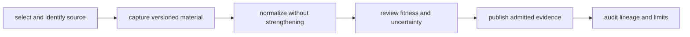
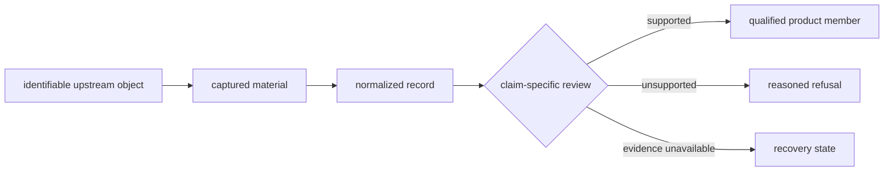
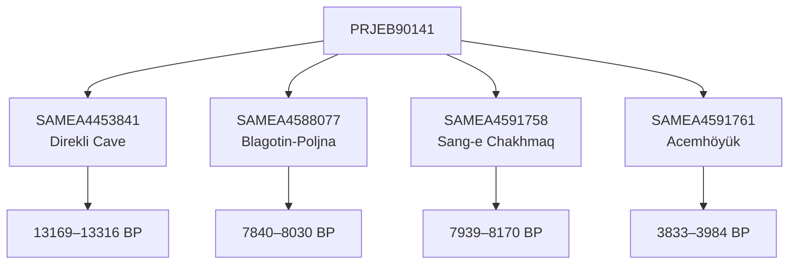

# Data System

Pollenomics is a multi-domain evidence system with a single publication
lineage. Pollen, archaeology, hydrography, boundaries, human ancient DNA,
animal ancient DNA, and field observations retain separate scientific roles
while contributing to governed geographic publications.

## Evidence Lifecycle

The lifecycle is represented in machine-readable contracts and checked-in
artifacts. It supports forward questions—what can be published from this
source?—and reverse questions—what evidence supports this visible result?

## Current Governed Snapshot

The checked-in `v66` collection summary identifies seven collector-managed
families: AADR, boundaries, LandClim, Neotoma, RAÄ, SEAD, and SVAR. Animal
ancient DNA is the eighth contracted family, but it follows a literature,
archive-project, supplement, and sample curation path rather than the uniform
collector path.

The Nordic publication illustrates why these counts must remain separate:

| Published surface | Current members | Meaning |
| --- | ---: | --- |
| AADR human aDNA | 1,231 samples | release-pinned human sample metadata selected for four Nordic countries |
| LandClim | 492 site sequences | primary pollen and vegetation context |
| Neotoma | 200 sites | palaeoecological site context with explicit time postures |
| SEAD | 2,172 mapped sites | environmental-archaeology context; 23 additional reviewed rows lack country assignment |
| animal aDNA | 2 Nordic localities | admitted animal points in this regional product, not the size of the global animal evidence base |
| fieldwork | 1 documented location | a checked-in observation at Lyngsjön, not a regional sampling census |
| REVEALS | 88 grid cells | modelled pollen context |
| RAÄ | 106 density cells | Sweden-specific archaeology density context |
| boundaries | 4 country polygons | geographic framing only |

The rows are not additive measures of “total evidence.” They have different
observation units, denominators, geographic reach, and evidential roles. The
bundle manifest records membership; the source and evidence records determine
what each member can support.

## Boundary Outputs

| Boundary | Input question | Durable output |
| --- | --- | --- |
| selection | Is the source relevant, identifiable, accessible, and licensable for its intended role? | source identity and selection rationale |
| capture | Which exact material was acquired, from where, and when? | raw artifact, retrieval metadata, and content identity |
| normalization | Which stable repository fields preserve the source record? | normalized record plus transformation and null semantics |
| review | What can this record support at its actual precision? | coverage, conflict, fitness, and recovery surfaces |
| publication | Which reviewed records belong to this product and geography? | manifest, layers, tables, contract, and caveats |
| audit | Can a visible or missing member be explained? | traceability, subset validation, exclusions, and refusal |

A successful boundary does not imply success at the next boundary. Capture can
complete while extraction remains incomplete; normalization can complete while
locality remains unresolved; review can complete with a defensible refusal.

## One Evidence Transaction

An evidence transaction begins with an identifiable upstream object and ends
with either a qualified product member or an explicit non-publication outcome.
The intermediate records are not disposable preparation files; together they
preserve the scientific reasoning behind the outcome.

| Transaction state | Durable fact | Reader-safe conclusion |
| --- | --- | --- |
| selected | source identity, intended role, access, and license are known | the source is relevant enough to pursue |
| captured | exact material and retrieval context are recorded | this is the material the repository received |
| normalized | source meaning is represented under declared fields | records can be inspected consistently without claiming fitness |
| reviewed | identity, coverage, precision, conflict, and comparability are evaluated | the record has a claim-specific evidence posture |
| admitted | a named product contract accepts or qualifies the record | the record may appear in that product at the declared strength |
| refused or deferred | the failed rule or missing evidence is recorded | non-publication is explainable and revisable |

The transaction never infers success from pipeline completion. A technically
successful capture can still end in refusal when scientific ownership,
precision, or comparability is inadequate.

## Cardinality Is Scientific Meaning

Project `PRJEB90141` contributes four recovered goat sample identities in the
current curated species view. They resolve to four localities—Direkli Cave,
Blagotin-Poljna, Sang-e Chakhmaq, and Acemhöyük—and retain four sample-owned
chronology intervals. The project accession connects the records; it does not
collapse them into one project point or one project date.

This one-to-many relation is not implementation detail. A project-level join
would assign the wrong place or time to at least three samples; a locality
aggregation that discarded sample membership would make the published point
impossible to trace back to the physical or analytical unit.

## System References

| Question | Reference |
| --- | --- |
| How do all evidence families and tracked roots fit together? | [Data system overview](data-system-overview.md) |
| Which file governs a fact repeated across outputs? | [Data architecture handbook](data-architecture-handbook.md) |
| How do unlike domains appear together without becoming equivalent? | [Pollenomics publication model](pollenomics-publication-model.md) |
| How does a publication resolve to provenance? | [Provenance and publication linkage](provenance-and-publication-linkage.md) |
| Why was a source selected and what happens during refresh? | [Source selection and refresh](source-selection-and-refresh.md) |
| How are coverage and durable identifiers represented? | [Coverage and naming](coverage-and-naming.md) |
| Which evidence dimensions are strong, contextual, or incomplete? | [Cross-domain evidence matrix](cross-domain-evidence-matrix.md) |
| Why does animal aDNA require project- and sample-level recovery? | [Animal ancient-DNA evidence](animal-ancient-dna-evidence.md) |
| Where do the governing artifacts live? | [Data directory layout](data-directory-layout.md) |

## Read By Question

| Reader question | Begin with | Then inspect |
| --- | --- | --- |
| Why is a marker visible? | product manifest and point traceability | governing evidence row, admission posture, and source locator |
| Why is a known record absent? | exclusions, refusals, and product scope | missing or conflicted identity, place, time, coordinate, or geography evidence |
| What does a count measure? | artifact schema and denominator | source coverage, normalized population, and product membership separately |
| Can two layers be compared? | evidence roles and observation units | spatial precision, temporal posture, scope, and comparison rule |
| Can an export be reused elsewhere? | portable record identifiers and provenance | license, source version, qualifications, and destination assumptions |

## Authority Boundaries

- Source captures govern acquired identity and provenance.
- Normalized records govern repository-owned representation.
- Review surfaces govern scientific fitness, uncertainty, and refusal.
- Publication manifests govern the selected output and its members.
- A downstream report never becomes the authority for an upstream sample,
  locality, chronology, coordinate, or source claim.

## Cross-Domain Interpretation

The system does not reduce all evidence to one measure. A temporal interval,
pollen sequence, archaeology record, lake polygon, administrative boundary,
and ancient-DNA sample carry different units and uncertainty. Publication
preserves those differences through source roles, temporal semantics,
coordinate posture, layer labeling, and visible caveats.

For claim-level inspection, continue to [Sources](../sources/index.md),
[Evidence](../evidence/index.md), or [Publications](../publications/index.md).
