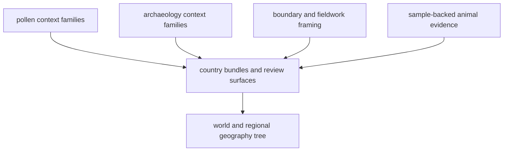

# Pollenomics Publication Model

`bijux-pollenomics` should eventually publish a pollenomics story first and an
animal aDNA recovery story second. That requires a publication model that keeps
pollen context, archaeology context, framing, and sample-backed evidence in one
coherent system without pretending they are equally mature.

## Publication Model

## Current Publication Classes

| Layer type | Current posture | Why it matters |
| --- | --- | --- |
| Pollen context | first-class tracked context | keeps the repository pollenomics-first |
| Archaeology context | explicit supporting context | broadens interpretation without pretending to be pollen or samples |
| Boundary and fieldwork framing | explicit framing | keeps map and visit interpretation honest |
| Animal aDNA | partial sample-owned recovery | valuable, but still thinner than the rest of the repository mission |

## Reader Anchors

- [Data system overview](data-system-overview.md)
- [Cross-domain evidence matrix](../../../report/repository_cross_domain_evidence_matrix.md)
- [Output surface classes](../outputs/output-surface-classes.md)

## Boundary

The repository should never let the mere existence of one atlas bundle imply
that every domain is equally deep or equally publication-ready.
