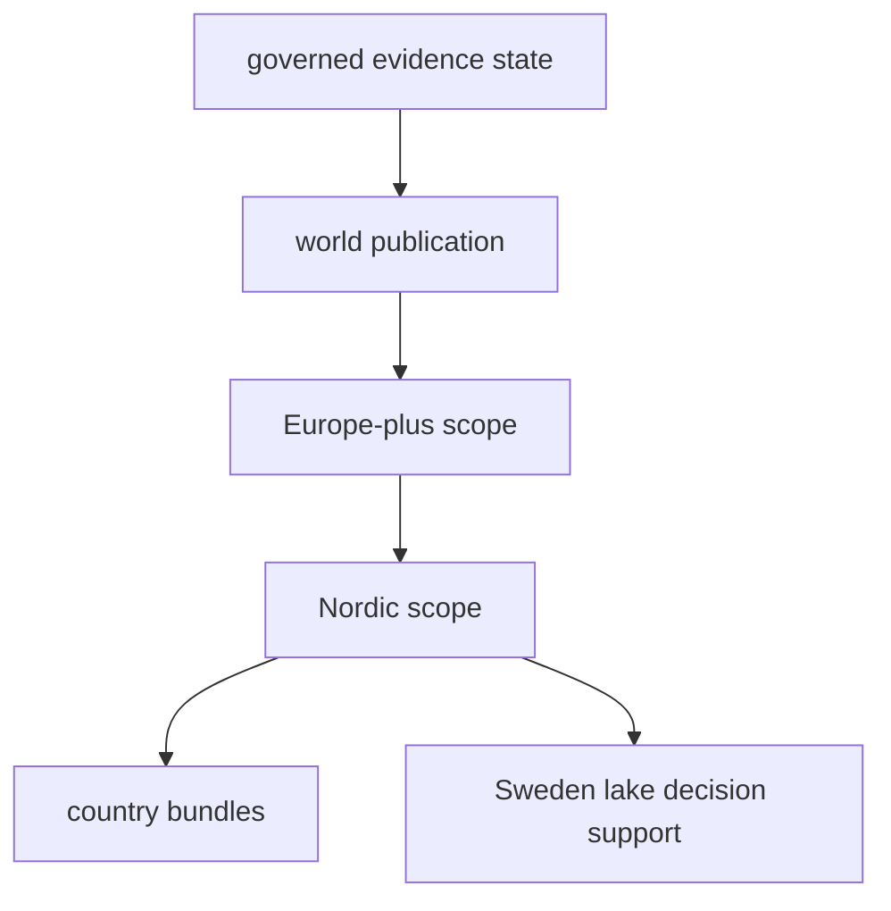

# Pollenomics Publication Model

Publications combine unlike evidence without declaring it equivalent. Every
layer has a role, every product has a scope, and every visible feature remains
downstream of an admission decision.

The model deliberately separates three questions:

1. **Is the source represented faithfully?** — acquisition, identifiers, and
   normalization answer this.
2. **Is the record fit for a declared use?** — evidence review and admission
   answer this.
3. **Is the product internally coherent?** — manifests, traceability, release
   checks, and rendered outputs answer this.

A positive answer at one boundary does not imply a positive answer at the
next. This is why a normalized row can remain excluded, and why a coherent
map can still carry an explicit non-reference-grade posture.

## Evidence Roles

| Role | Examples | Supports | Does not support alone |
| --- | --- | --- | --- |
| direct evidence | admitted human and animal aDNA samples, direct field observation | a source-backed record at its declared place and time posture | regional completeness or causation |
| scientific context | LandClim, Neotoma, SEAD, RAÄ | environmental or archaeology setting | sample identity or automatic temporal overlap |
| geographic framing | boundaries and SVAR lake registry | scope, filtering, lake identity, and map extent | scientific association |
| decision support | lake rankings and sensitivity scenarios | reproducible prioritization under declared inputs | sampling readiness or optimal coring location |
| accountability | caveats, exclusions, drift reviews, traceability reports | why evidence is present, qualified, or absent | a stronger claim than the governing record |

## Scope Inheritance

```mermaid
flowchart TB
    Evidence["governed evidence state"] --> World["world publication"]
    World --> Europe["Europe-plus scope"]
    Europe --> Nordic["Nordic scope"]
    Nordic --> Countries["country bundles"]
    Nordic --> Lakes["Sweden lake decision support"]
```

The hierarchy selects records; it does not clone truth. A country bundle is a
filtered descendant of broader evidence state and cannot legitimately carry a
stronger locality, chronology, coordinate, or source claim. Specialized lake
products retain their scenario inputs and remain attached to the same Nordic
publication family.

## Publication Admission

Normalization makes a record consistent enough to review. It does not make the
record universally publishable. Admission is evaluated against a named
product:

1. confirm source and record identity;
2. evaluate the evidence dimensions required by the product;
3. apply geographic and domain scope;
4. admit, qualify, or exclude with a recorded reason;
5. emit membership and traceability alongside presentation.

Filtering in a browser changes visibility after publication. It cannot admit
an excluded record or alter its evidence role.

## Product Contract

Every publication resolves six elements:

| Element | Reader-facing meaning |
| --- | --- |
| scope | geography, source families, species, and scenarios considered |
| membership | stable identifiers actually included in the product |
| roles | direct evidence, context, framing, decision support, or accountability |
| semantics | spatial precision, temporal posture, units, and null meaning |
| traceability | joins from visible objects back to governed evidence and sources |
| release posture | checks passed, claims refused, and known limitations |

The world bundle is the broad product assembly. Europe-plus, Nordic, country,
and lake-decision products inherit its evidence semantics while applying
narrower membership or a specialized decision contract. A descendant product
can be more selective; it cannot silently strengthen its ancestors' facts.

## Release Gates Preserve Honest Claims

Release checks test the relationship between evidence and publication rather
than declaring the underlying science complete. For animal evidence, the
current gate confirms that published points retain required traceability,
blocked sample-site and chronology rows do not leak into exact outputs, and
contextual chronology is not rendered as numeric time. The same gate refuses
a reference-grade claim because project recovery remains incomplete.

That combination is intentional: a product can be valid for its declared
membership and still decline a broader completeness claim. Passing integrity
checks means the output says no more than its governed evidence supports.

## Reading Mixed-Domain Outputs

Interpret the layer before interpreting proximity. Two nearby points can have
different chronology postures, spatial precision, source maturity, and
scientific roles. The map supports comparison by keeping those differences
visible; it does not erase them.

Continue to the [cross-domain evidence matrix](cross-domain-evidence-matrix.md)
for maturity by family, [published reports](../publications/reports.md) for the
output tree, and [geographic evidence surfaces](../publications/maps.md) for map
behavior.
