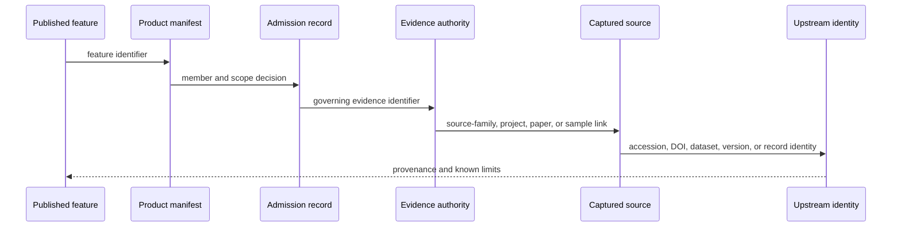
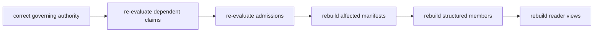

# Provenance And Publication Linkage

Provenance connects a public claim to the identities and decisions that make
it defensible. It includes more than a citation: acquisition context,
normalization, evidence ownership, admission, product membership, and visible
qualification must remain linked.

## Provenance Model

A reusable publication record should carry or resolve to:

| Component | Minimum information |
| --- | --- |
| public identity | stable feature or table-row identifier and evidence role |
| product identity | manifest, version, geography, and membership decision |
| governing evidence | stable normalized, sample, site, or context record identifier |
| spatial claim | reported locality, coordinate basis, confidence, and mapping posture |
| temporal claim | original wording, bounds when supported, evidence class, and comparability posture |
| source lineage | source family plus dataset version, accession, DOI, artifact, and locator as applicable |
| qualification | caveat, conflict, exclusion relationship, or review outcome material to interpretation |

The packet is a graph, not a flattened citation string. Some components can be
embedded in a public row; others resolve through stable identifiers. What
matters is that the joins survive export and that each identifier retains its
object type.

A citation without the evidence identifier and locator can establish relevance
but not which record or wording supported the published claim. A coordinate
without its basis can establish geometry but not spatial precision.

The model therefore preserves three kinds of provenance at once: source
provenance identifies captured origin; transformation provenance explains how
repository-owned meaning was produced; decision provenance explains why that
meaning was admitted, qualified, or refused for one product. Product lineage
is incomplete when any of the three becomes an untyped filename or copied
value.

## Preparation Provenance

Publication provenance begins during source preparation. A defensible
normalized row retains the decisions that created it, including rows that did
not survive preparation.

| Preparation concern | Provenance required |
| --- | --- |
| selection | why this source, release, panel, project, paper, or supplement entered scope |
| acquisition | retrieval identity, date, method, response or artifact, digest, and terms posture |
| extraction | artifact member, sheet, table, row, field, selector, or endpoint that supplied the value |
| normalization | source expression, target representation, rule, unit, precision, and null treatment |
| identity resolution | source-native identities, aliases, governed identity, collision review, and merge or split basis |
| exclusion | known source member, failed boundary, reason, and possible recovery condition |
| accounting | discovered, captured, parsed, normalized, reviewed, and admitted populations with stable units |

This packet prevents a clean normalized table from hiding parser loss,
selection bias, unresolved identifiers, or substituted context. Counts alone
cannot supply it: two preparations can emit the same number of rows while
selecting different members or assigning different meanings.

## Claim Chain

| Link | Establishes | Does not establish |
| --- | --- | --- |
| feature → manifest | the object belongs to this product | fitness for every product |
| manifest → admission | the scope, rule, and posture used | universal scientific acceptance |
| admission → evidence | the record that owns the claim | that every copied field is authoritative |
| evidence → capture | the acquired material used in curation | source completeness |
| capture → upstream identity | recoverable external origin and retrieval context | permanent upstream availability |

## Identifiers Keep Their Meaning

A dataset version, archive project accession, paper DOI, source sample label,
repository sample identifier, site identifier, evidence-row identifier, and
map-feature identifier describe different objects. Linkage relates them
without forcing them into one synthetic identity.

That distinction matters when:

- one paper describes several archive projects;
- one project contains multiple source samples;
- a sample label is reused or formatted differently across supplements;
- several samples share a site but not a chronology;
- one evidence row appears in several geographic products;
- a published feature is a comparator rather than direct evidence.

### Relations Need Their Own Identity

Two objects do not become traceable merely because both identifiers occur in
one row. The relation between them retains a type, supporting locator or
derivation, method, precision, posture, and revision.

| Relation | Minimum provenance |
| --- | --- |
| paper describes project | paper identity, project accession, and captured association |
| project contains sample | project-owned sample row and source-native label or accession |
| sample belongs to site | sample-site evidence, locality class, and conflict posture |
| claim supersedes claim | predecessor, successor, governing subject, decision reason, and revision |
| point falls within country | coordinate claim, boundary snapshot, predicate, and product scope |
| evidence enters product | governed evidence identity, admission rule, role, qualification, and manifest member |

The relation identity makes a changed join distinguishable from a changed
object. A sample can keep the same stable identity while its site relation is
corrected; a coordinate can remain unchanged while its product membership
changes under a revised scope.

## Fact Ownership

Downstream products repeat useful fields, but each recurring fact has one
governing surface. The fact-ownership registry records that authority and the
surfaces that may carry derived copies. When copies disagree, correction
starts at the authority and descendants are regenerated.

Representative ownership boundaries include project inventory, paper
inventory, sample identity, sample-site linkage, locality evidence,
chronology evidence, species-normalized records, and atlas admission.

`data/source_fact_ownership_registry.json` publishes the cross-family
ownership map. `data/source_spatiotemporal_posture_registry.json` publishes the
corresponding limits on spatial and temporal use. Together they answer two
different questions: **where does this value come from?** and **what claim can
this value support?**

## Spatial And Temporal Lineage

A coordinate retains both value and basis. Source-supplied, named-site
resolved, approximate, substituted, and region-only geography are different
claims even when each can be encoded as geometry. Exact-point publication is
refused when the evidence does not own that precision.

Chronology retains reported text, normalized interval where supported,
evidence class, precision, and source owner. Project dates and paper dates do
not become sample chronology through proximity in the provenance graph.

## Coordinate Policy

A coordinate claim retains value, reference system, source or resolution
method, linked locality, precision posture, and evidence owner. Publication
may project the value for display, but it may not strengthen its support.

| Coordinate posture | Permitted representation | Required qualification |
| --- | --- | --- |
| source supplied and sample linked | exact point when the product admits it | retain source locator and stated precision |
| resolved named site | point at the governed site geometry | identify the resolution method and site relation |
| approximate named place | qualified point when the product permits approximation | expose approximate posture and basis |
| region only | region or non-point representation | do not render a centroid as sample precision |
| unresolved or conflicting | no exact point | retain the conflict, exclusion, and recovery condition |

Country membership and distance are derived relations over this coordinate
claim and a versioned boundary or comparator. They require their own method,
scope, and revision; coordinate presence alone does not make either relation
authoritative.

## Broken Links

| Broken relation | Reader interpretation |
| --- | --- |
| feature absent from its manifest | the visible object has no proven membership in that product |
| member without admission decision | the product does not explain why the object was selected |
| admission without governing evidence | the scientific claim cannot be traced and must not be reused |
| evidence without captured source identity | origin and source wording cannot be recovered |
| point without coordinate basis | geometry does not justify exact-location interpretation |
| downstream fact disagreeing with authority | use the governing record and treat the copied value as stale |

### Locate Provenance Debt

An incomplete chain is repaired at the boundary where information first
disappears:

| Missing link | Evidence still available | Required recovery |
| --- | --- | --- |
| source debt | repository value or product member, but no upstream object and locator | recover capture identity, source expression, and acquisition context |
| transformation debt | source object and descendant exist, but the mapping is unexplained | recover parser, normalization, unit, null, precision, and relation rules |
| decision debt | governed evidence exists, but membership or qualification has no reason | recover claim dimension, proposed use, rule, disposition, and reviewer evidence |
| product debt | decision exists, but a visible object has no manifest member identity | recover product, version, scope, member relation, and content identity |
| presentation debt | manifested member exists, but the view drops a material caveat or role | correct the producer and regenerate the descendant |

Do not compensate for upstream debt by adding confident prose downstream. A
better caption cannot recover a missing source locator, and a manifest cannot
explain an undocumented normalization decision.

## Audit In Both Directions

```mermaid
flowchart LR
    Public["public feature"] --> Product["manifest and admission"]
    Product --> Evidence["governing evidence record"]
    Evidence --> Capture["captured artifact and locator"]
    Capture --> Upstream["upstream identity"]
    Upstream -. refresh .-> Capture
    Capture -. transformation review .-> Evidence
    Evidence -. impact review .-> Product
    Product -. rendered membership .-> Public
```

Backward reading asks, “what supports this visible claim?” Forward reading
asks, “where does this governed record appear?” A trustworthy publication
system supports both traversals. The first makes a result inspectable; the
second reveals whether the same evidence is reused under different scopes or
roles.

### Change Impact Traversal

A correction follows fact ownership forward; it is not patched independently
into every visible copy:

| Governing correction | First review | Descendants that may need regeneration |
| --- | --- | --- |
| captured source member or release identity | member equivalence, schema, license, and content diff | normalized family records, coverage, and every consuming product |
| sample merge or split | project sample master and identity ambiguity decision | site links, chronology links, species views, point candidates, and product membership |
| locality or coordinate claim | source locator, place relation, method, and precision | GeoJSON geometry, country containment, distance relations, maps, and warnings |
| chronology claim | reported wording, dating basis, normalization, and conflict posture | temporal review, comparison eligibility, popups, and derived analysis |
| admission rule | evidence-role and product-scope contract | manifests, exclusions, traceability, counts, tables, and renderings |

The absence of a downstream change is also a result: it should be explained by
stable membership, unchanged fitness, or product scope. Visual similarity
alone does not prove that a source correction had no publication consequence.

## Audit One Claim

Begin with a feature or table-row identifier in a world, regional, or country
bundle. Confirm membership and evidence role, follow the evidence-row and
sample identifiers, inspect locality and chronology authorities, then recover
the source family, project, paper, supplement, dataset, or archive identity.

The audit is complete only when the public wording remains within the weakest
material link in that chain.

For an animal point, that usually means checking the feature row, publication
manifest, point-admission evidence, project-owned sample and site records,
locality and chronology packets, coordinate provenance, paper or supplement
locator, and archive project. For a pollen or archaeology context feature, the
chain is shorter but still retains source-family identity, normalized record,
temporal posture, product membership, and caveats.

## A Concrete Trace

Consider an animal point in `world_animal_localities.geojson`. Its feature
identifier resolves through the world bundle and point-traceability export to
an admitted atlas evidence row. That row resolves to the governed sample and
site records, locality and chronology evidence, and then to a paper,
supplement, and archive project where those exist. Coordinate provenance tells
the reader whether the point was source-supplied, recovered from supplementary
material, approximately geocoded, substituted, or refused.

The visible point is therefore the end of a decision chain, not the source of
truth. Removing the feature from a map does not remove the sample from the
evidence base. If the GeoJSON and locality packet disagree, the locality
packet remains the authority and the visible geometry is stale.

## Compare Three Provenance Shapes

| Public object | Provenance shape | Material qualification |
| --- | --- | --- |
| AADR Nordic sample | Nordic bundle → AADR sample row → panel file → `v66` release manifest → Dataverse identity | panel membership and geographic selection do not create genotype analysis |
| Neotoma pollen site | Nordic bundle → normalized site → temporal review → Neotoma site identity | site-level coverage span is not a sample-event date |
| SEAD context point | Nordic bundle → normalized site → legibility and temporal review → SEAD site page | current inventory has no captured dating, period, or bibliography rows |
| animal atlas point | scope bundle → point traceability → admission row → sample, site, locality, chronology, and coordinate evidence → project, paper, supplement, and archive identity | every link has independent precision and can qualify or refuse publication |

The shapes are intentionally unlike. A short chain is not automatically weak,
and a long chain is not automatically strong. Strength depends on whether the
links needed for the proposed claim are present and proportionate.

## Portability Test

A publication extract remains interpretable outside this repository when a
reader can answer all of the following from the extract and its linked
manifests:

1. Which product and release included this object?
2. What role did the object play: direct evidence, comparison, context, or
   framing?
3. Which governed record owns its identity, locality, chronology, and source
   lineage?
4. Which transformation or admission decision produced the published form?
5. Which limitation changes how the object may be compared or mapped?

If any answer depends only on a filename, prose memory, or an untyped copied
value, the provenance chain is incomplete. The
[object and relation model](../database/object-and-relation-model.md) defines
the database identities that this provenance packet must preserve.
