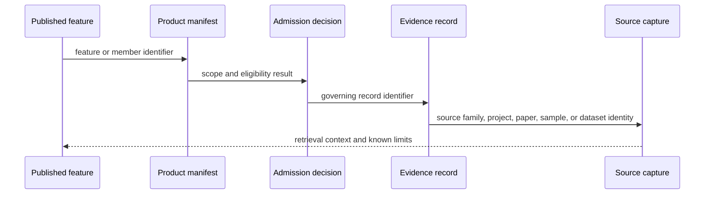

# Provenance And Publication Linkage

Provenance is the complete path from upstream identity to public use. It
includes acquisition, normalization, evidence decisions, publication
membership, and the identifiers that connect those layers.

## Traceability Chain

Each transition answers a different question:

| Link | Question answered |
| --- | --- |
| feature → manifest | Did this object belong to the published product? |
| manifest → decision | Which scope and rule admitted it? |
| decision → evidence | Which record owns the scientific claim? |
| evidence → capture | Which acquired source supports that record? |

## Identifier Discipline

A project accession, paper DOI, sample identifier, site identifier,
evidence-row identifier, and map-feature identifier are not interchangeable.
Linkage records their relationships without collapsing them into one synthetic
key. This is especially important when one paper covers several projects, one
project contains several sites, or one site contains several samples with
different chronologies.

## Coordinate Lineage

A published coordinate retains its basis and evidence owner. Source-supplied,
named-site resolved, approximate, substituted, and region-only geography
support different uses. Region-only animal evidence is not promoted to an
exact point, and a renderer cannot strengthen a coordinate that evidence review
kept qualified.

## Broken-Link Outcomes

| Missing link | Required outcome |
| --- | --- |
| publication member has no admission decision | publication contract failure |
| admission decision has no governing evidence record | traceability failure and exclusion |
| evidence record lacks source identity | provenance failure and recovery work |
| coordinate lacks basis or owner | exact-point refusal |
| downstream copy disagrees with its authority | correct the governing record and regenerate descendants |

The principal inspection surfaces are
`data/source_fact_ownership_registry.json`,
`data/evidence_artifact_contracts.json`, world and regional point-traceability
reports, and country bundle manifests. Together they let a reader challenge one
claim without treating the entire repository as an indivisible black box.
