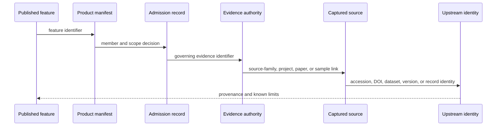

# Provenance And Publication Linkage

Provenance connects a public claim to the identities and decisions that make
it defensible. It includes more than a citation: acquisition context,
normalization, evidence ownership, admission, product membership, and visible
qualification must remain linked.

## Minimum Provenance Packet

A reusable publication record should carry or resolve to:

| Component | Minimum information |
| --- | --- |
| public identity | stable feature or table-row identifier and evidence role |
| product identity | manifest, version, geography, and membership decision |
| governing evidence | stable normalized, sample, site, or context record identifier |
| spatial claim | reported locality, coordinate basis, confidence, and mapping posture |
| temporal claim | original wording, bounds when supported, evidence class, and comparability posture |
| source lineage | source family plus dataset version, accession, DOI, artifact, and locator as applicable |
| qualification | caveat, conflict, exclusion relationship, or review outcome material to interpretation |

A citation without the evidence identifier and locator can establish relevance
but not which record or wording supported the published claim. A coordinate
without its basis can establish geometry but not spatial precision.

## Claim Chain

| Link | Establishes | Does not establish |
| --- | --- | --- |
| feature → manifest | the object belongs to this product | fitness for every product |
| manifest → admission | the scope, rule, and posture used | universal scientific acceptance |
| admission → evidence | the record that owns the claim | that every copied field is authoritative |
| evidence → capture | the acquired material used in curation | source completeness |
| capture → upstream identity | recoverable external origin and retrieval context | permanent upstream availability |

## Identifiers Keep Their Meaning

A dataset version, archive project accession, paper DOI, source sample label,
repository sample identifier, site identifier, evidence-row identifier, and
map-feature identifier describe different objects. Linkage relates them
without forcing them into one synthetic identity.

That distinction matters when:

- one paper describes several archive projects;
- one project contains multiple source samples;
- a sample label is reused or formatted differently across supplements;
- several samples share a site but not a chronology;
- one evidence row appears in several geographic products;
- a published feature is a comparator rather than direct evidence.

## Fact Ownership

Downstream products repeat useful fields, but each recurring fact has one
governing surface. The fact-ownership registry records that authority and the
surfaces that may carry derived copies. When copies disagree, correction
starts at the authority and descendants are regenerated.

Representative ownership boundaries include project inventory, paper
inventory, sample identity, sample-site linkage, locality evidence,
chronology evidence, species-normalized records, and atlas admission.

## Spatial And Temporal Lineage

A coordinate retains both value and basis. Source-supplied, named-site
resolved, approximate, substituted, and region-only geography are different
claims even when each can be encoded as geometry. Exact-point publication is
refused when the evidence does not own that precision.

Chronology retains reported text, normalized interval where supported,
evidence class, precision, and source owner. Project dates and paper dates do
not become sample chronology through proximity in the provenance graph.

## Broken Links

| Broken relation | Required outcome |
| --- | --- |
| feature absent from its manifest | publication integrity failure |
| member without admission decision | product-contract failure |
| admission without governing evidence | traceability failure and exclusion |
| evidence without captured source identity | provenance failure and recovery work |
| point without coordinate basis | exact-point refusal |
| downstream fact disagreeing with authority | correct authority, then regenerate descendants |

## Audit In Both Directions

```mermaid
flowchart LR
    Public["public feature"] --> Product["manifest and admission"]
    Product --> Evidence["governing evidence record"]
    Evidence --> Capture["captured artifact and locator"]
    Capture --> Upstream["upstream identity"]
    Upstream -. refresh .-> Capture
    Capture -. transformation review .-> Evidence
    Evidence -. impact review .-> Product
    Product -. rendered membership .-> Public
```

Backward audit asks, “what supports this visible claim?” Forward impact review
asks, “which claims may change if this source or curation decision changes?” A
trustworthy publication system must support both traversals. Backward links
make a result inspectable; forward links make correction and refresh safe.

## Audit One Claim

Begin with a feature or table-row identifier in a world, regional, or country
bundle. Confirm membership and evidence role, follow the evidence-row and
sample identifiers, inspect locality and chronology authorities, then recover
the source family, project, paper, supplement, dataset, or archive identity.

The audit is complete only when the public wording remains within the weakest
material link in that chain.

For an animal point, that usually means checking the feature row, publication
manifest, point-admission evidence, project-owned sample and site records,
locality and chronology packets, coordinate provenance, paper or supplement
locator, and archive project. For a pollen or archaeology context feature, the
chain is shorter but still retains source-family identity, normalized record,
temporal posture, product membership, and caveats.
