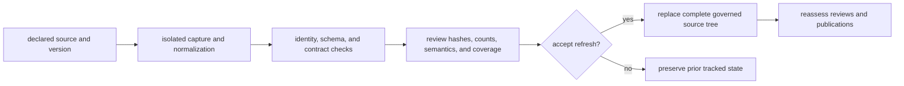

# Source Selection And Refresh

A source enters the governed system because it can answer a declared question,
its identity and use conditions can be preserved, and its records can be
reviewed without inventing missing evidence. Discovery alone is not admission.

## Selection Criteria

| Criterion | Required answer |
| --- | --- |
| scientific role | Is the source direct evidence, scientific context, geographic framing, or sampling context? |
| provenance | Can version, retrieval, license, and source identity be recorded? |
| recoverability | Can the relevant records, supplements, or API results be captured reproducibly? |
| semantics | Can place, time, taxonomy, and identifiers be represented without false precision? |
| publication use | Which named products may consume the source, and under which limits? |
| sustainability | Can refresh and failure behavior be maintained without private state? |

A scientifically relevant paper can remain tracked but unpublished when its
sample-bearing supplement is missing. A boundary source can be widely
published as framing while remaining explicitly non-evidentiary.

## Refresh Transaction

Staging prevents a failed acquisition from leaving a partial tracked tree. It
does not make a successful refresh scientifically neutral.

## Change Classification

| Change | Consequence |
| --- | --- |
| byte-only or packaging change | verify normalized identity before claiming no evidence change |
| new or removed records | review coverage, denominators, and publication membership |
| changed locality or chronology | rerun fitness, conflict, and point-admission review |
| changed source version or license posture | update provenance and assess continued publication eligibility |
| newly recovered supplement | revisit sample identity, completeness, and downstream claims |

Refresh cadence can differ across source families. Public breadth remains
limited by the actual maturity of each family, not by the date of the most
recent successful collector run.
