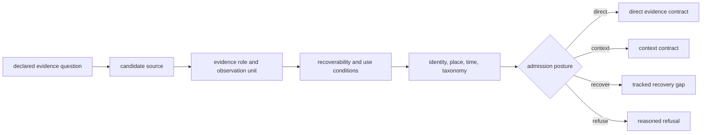
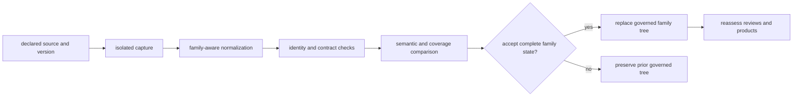
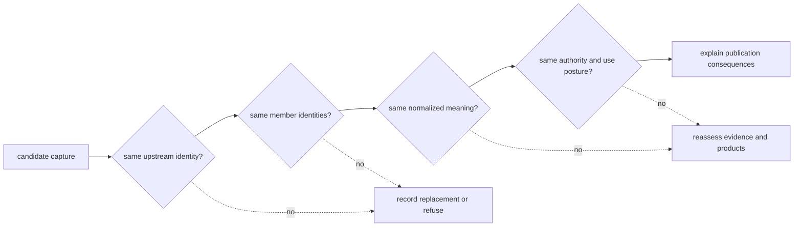
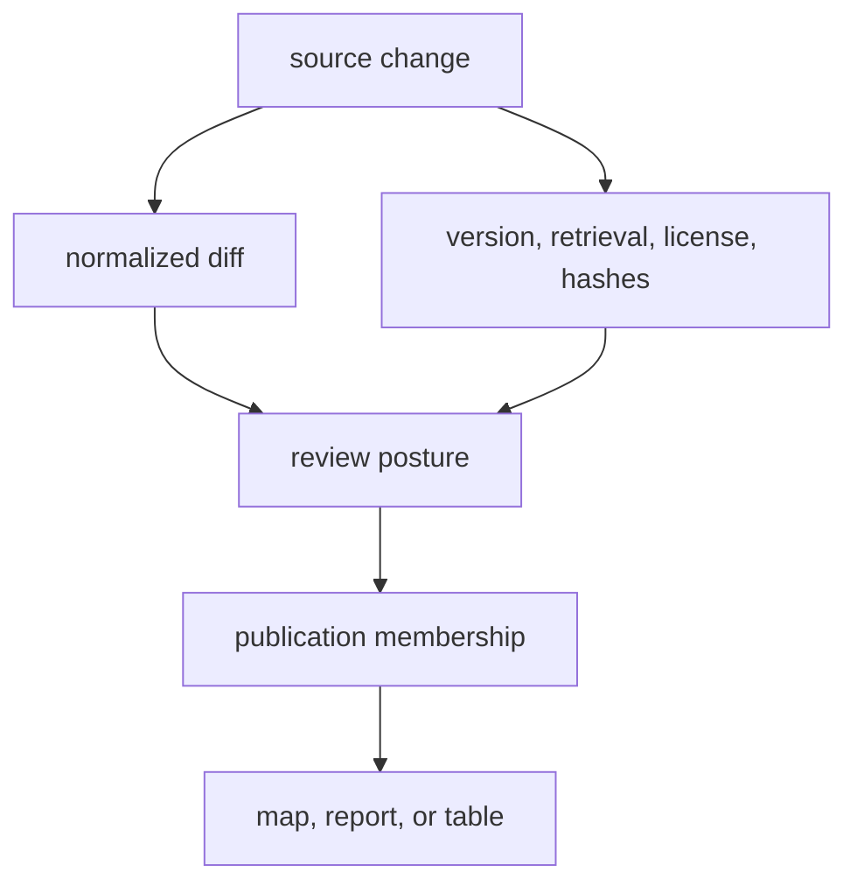

# Source Selection And Refresh

A source enters Bijux Pollenomics because it answers a declared question and
can retain identity, use conditions, semantics, and limits through curation.
Discovery is not admission, and a successful refresh is not evidence that the
source's meaning stayed unchanged.

## Selection Rules

| Criterion | Required answer |
| --- | --- |
| scientific role | Is the source direct evidence, context, sampling context, or geographic framing? |
| identity | Can its dataset, release, accession, DOI, record, or other upstream identity be preserved? |
| access and use | Can retrieval context, license posture, and relevant restrictions be recorded? |
| recoverability | Can the required payload, table, supplement, or API response be captured reproducibly? |
| semantics | Can place, time, taxonomy, and identifiers be represented without false precision? |
| reviewability | Can ambiguity, missingness, conflict, and exclusions remain explicit? |
| publication role | Which products may consume it, and under which precision and scope? |
| sustainability | Can refresh and failure behavior be maintained without private untracked authority? |

A source may be scientifically important while remaining in recovery or
context-only posture. Admission records that distinction instead of forcing a
binary “available” label.

## Selection Record

A defensible selection records the question before the source. It names the
target object and evidence role, explains why the source is suitable, identifies
known alternatives or gaps, and states the conditions under which the source
would be demoted or replaced. This prevents familiarity, convenient access, or
large row counts from becoming unstated selection policy.

For literature-backed animal evidence, selection also distinguishes four
levels that are often collapsed: a project is known; its paper is identified;
its supporting material is recovered; and sample-owned locality and chronology
are supported. Progress at one level does not imply completion of the next.

The selected family has a named evidence owner and a named preparation owner.
The evidence owner is accountable for observation-unit meaning, authority,
bias, and permitted claims. The preparation owner is accountable for capture,
normalization, validation, and replacement behavior. One person or component
may hold both responsibilities, but the decision record keeps them explicit so
that operational success cannot stand in for scientific acceptance.

## Selection Bias Remains Visible

The collected families are a governed evidence portfolio, not proof that every
relevant source ecosystem has been captured. Selection records therefore retain
the denominator and bias introduced by access, jurisdiction, language,
digitization, publication practice, and source-specific preservation.

| Selection condition | Potential bias | Required qualification |
| --- | --- | --- |
| API or bulk access is available | easily retrievable sources may dominate | distinguish convenience from scientific priority |
| one national registry is mature | national density can look regionally representative | keep jurisdiction explicit |
| supplements are recoverable for some projects | recovered projects can look biologically dominant | report expected and recovered project/sample denominators |
| chronology is numeric in one family | numeric records can outrank relevant contextual evidence | preserve temporal role instead of rewarding format alone |
| stable coordinates are available | mappable evidence can displace important broad-area records | keep unresolved and non-point evidence visible |

A new source is admitted because it fills a declared evidentiary role under a
reviewable contract, not merely because it increases coverage or produces a
denser map. Known alternatives and uncaptured ecosystems remain part of the
selection boundary.

## Refresh Lifecycle

Staging protects the prior coherent tree from partial acquisition. Acceptance
requires more than a nonzero row count: expected assets, identity, hashes,
schema, semantics, and family contract must agree.

Replacement is atomic at the owned family-tree boundary. A candidate is built
in an isolated sibling tree; the previous tree is moved to a recovery sibling;
the candidate is promoted; and a failed promotion restores the previous tree.
After successful promotion the recovery sibling is removed. This protects one
owned tree from acquisition and promotion failure. It is not a transaction
across several source families, the review database, and published products;
those downstream surfaces are reassessed through explicit propagation records.

## Refresh Acceptance Evidence

| Layer | Evidence to compare |
| --- | --- |
| source | dataset identity, release, retrieval route, response context, license posture, and hashes |
| capture | expected versus recovered assets and any access or parsing refusal |
| normalization | stable member identities, field semantics, geometry, chronology, taxonomy, and missingness |
| coverage | denominators, added and removed members, conflicts, and precision classes |
| curation | changed linkage, governing fact owner, qualifications, and open recovery work |
| publication | affected admission decisions, bundle membership, warnings, and exclusions |

An accepted refresh can legitimately produce no publication change. That
outcome is meaningful when the record shows that changed source material did
not alter normalized meaning or did not satisfy a product contract.

### Refresh Proves Replacement, Not Equivalence

Acceptance establishes that the candidate can replace the governed family
state. Equivalence is a narrower conclusion that must be demonstrated for the
dimension in which it is claimed. The same source label can identify different
bytes; identical row counts can conceal member replacement; and unchanged
members can acquire different locality, chronology, taxonomy, or use posture.

A comparison packet separates those possibilities:

| Comparison | Evidence | Conclusion it permits |
| --- | --- | --- |
| acquisition | upstream identity, release, retrieval route, response context, and digest | whether the captured object is the same object |
| population | stable member identities plus added, removed, merged, and split sets | whether the governed population is equivalent |
| semantics | field mappings, nulls, units, precision, and normalized value diffs | whether retained members mean the same thing |
| authority | license, source role, fact ownership, and provenance-edge changes | whether the same uses remain defensible |
| consequence | review, admission, manifest, exclusion, and presentation diffs | whether publication posture is unchanged |

An accepted refresh may therefore be non-equivalent and still correct: new
members, repaired identities, or stronger evidence can justify replacement
when their consequences are explicit. Conversely, matching checksums for a
repackaged derivative do not establish semantic equivalence unless the
derivation and governed member population are also reconciled.

## Classify The Change

| Observed change | Required interpretation |
| --- | --- |
| byte or packaging only | demonstrate unchanged normalized meaning before calling it neutral |
| upstream version or retrieval route | update provenance and assess comparability |
| new records | review denominators, coverage, conflicts, and product membership |
| removed records | distinguish upstream removal, corrected duplication, scope change, and collection failure |
| changed locality or chronology | rerun evidence fitness and point-admission review |
| changed taxonomy or identifiers | review joins, species ownership, and downstream traceability |
| changed license or access posture | reassess continued capture and publication eligibility |
| newly recovered supplement | revisit sample identity, completeness, place, time, and affected products |

Deletion is evidence that requires a reason. A lower count cannot be accepted
as harmless merely because the new files pass structural validation.

### Refuse A Refresh When Meaning Cannot Be Reconciled

Keep the last governed snapshot when a candidate refresh cannot answer any of
these questions:

| Unresolved condition | Why replacement is unsafe |
| --- | --- |
| upstream members cannot be matched to retained identities | additions, removals, merges, and splits cannot be distinguished |
| schema change has no semantic mapping | field continuity, null meaning, units, or precision are unknown |
| retrieval identity or terms are incomplete | origin, reproducibility, or permitted reuse cannot be established |
| normalization succeeds only by dropping rejected rows silently | the source population and missingness denominator are lost |
| review inputs changed but decisions were not re-evaluated | publication posture may refer to superseded evidence |
| product membership changed without causal attribution | evidence, boundary, rule, and rendering changes are conflated |

A refresh refusal is not a claim that the upstream release is defective. It
means the repository cannot yet replace its governed state without losing an
authority or explanatory link.

## Propagation

The absence of a downstream diff is itself a result to explain. It may mean
the changed records remain outside product scope, were excluded by the same
rule, or did not alter normalized meaning.

## Demotion And Retirement

A source can move to a narrower role when access, semantics, or maintenance no
longer support its current use. Existing provenance and review history remain
visible; public products are reassessed; and replacement sources do not
silently inherit the retired source's authority.

Refresh cadence therefore does not determine maturity. A recently collected
context layer may support less than an older, well-curated direct-evidence
record, and an unavailable supplement may remain the decisive gap in an
otherwise current project.

Replacement never erases provenance. The superseding source receives its own
identity and selection record; affected normalized records and products retain
the chain needed to distinguish a source substitution from newly discovered
scientific evidence.

## Migration Pressure

A source schema, access route, identifier system, licence posture, or
observation model can change without announcing a new scientific meaning.
Migration pressure is the set of differences that the existing preparation
contract can no longer absorb safely.

| Pressure | Required response |
| --- | --- |
| renamed or split fields | map source expressions explicitly and review null, precision, and unit semantics |
| changed native identifiers | publish equivalence, merge, split, and collision decisions before replacing stable identities |
| new endpoint or archive packaging | preserve the new retrieval identity and prove member equivalence |
| changed spatial or temporal model | revise the family contract and re-evaluate comparison and publication fitness |
| discontinued access or restrictive terms | retain the last governed snapshot and narrow refresh or redistribution claims |
| replacement source | create a new source identity and selection decision; never inherit authority silently |

A migration is complete only when source, normalized, review, and publication
populations reconcile by identity. Matching totals or a structurally valid
schema does not prove unchanged meaning.
