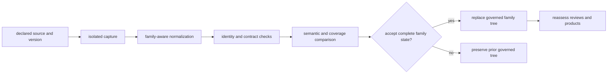
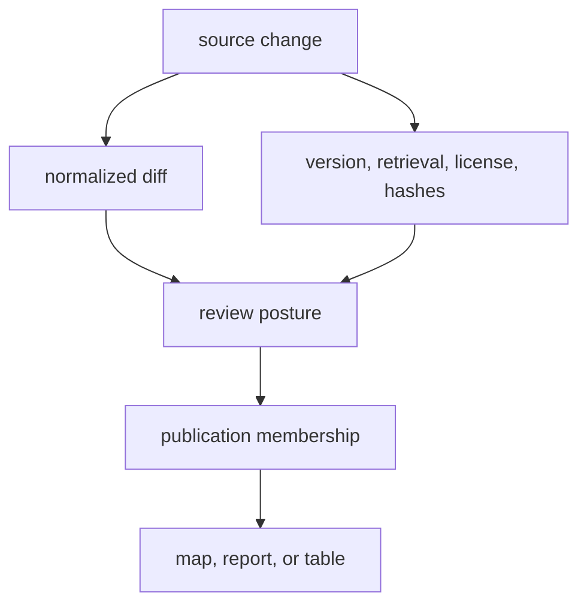

# Source Selection And Refresh

A source enters Bijux Pollenomics because it answers a declared question and
can retain identity, use conditions, semantics, and limits through curation.
Discovery is not admission, and a successful refresh is not evidence that the
source's meaning stayed unchanged.

## Admission Criteria

| Criterion | Required answer |
| --- | --- |
| scientific role | Is the source direct evidence, context, sampling context, or geographic framing? |
| identity | Can its dataset, release, accession, DOI, record, or other upstream identity be preserved? |
| access and use | Can retrieval context, license posture, and relevant restrictions be recorded? |
| recoverability | Can the required payload, table, supplement, or API response be captured reproducibly? |
| semantics | Can place, time, taxonomy, and identifiers be represented without false precision? |
| reviewability | Can ambiguity, missingness, conflict, and exclusions remain explicit? |
| publication role | Which products may consume it, and under which precision and scope? |
| sustainability | Can refresh and failure behavior be maintained without private untracked authority? |

A source may be scientifically important while remaining in recovery or
context-only posture. Admission records that distinction instead of forcing a
binary “available” label.

## Refresh Transaction

Staging protects the prior coherent tree from partial acquisition. Acceptance
requires more than a nonzero row count: expected assets, identity, hashes,
schema, semantics, and family contract must agree.

## Classify The Change

| Observed change | Required interpretation |
| --- | --- |
| byte or packaging only | demonstrate unchanged normalized meaning before calling it neutral |
| upstream version or retrieval route | update provenance and assess comparability |
| new records | review denominators, coverage, conflicts, and product membership |
| removed records | distinguish upstream removal, corrected duplication, scope change, and collection failure |
| changed locality or chronology | rerun evidence fitness and point-admission review |
| changed taxonomy or identifiers | review joins, species ownership, and downstream traceability |
| changed license or access posture | reassess continued capture and publication eligibility |
| newly recovered supplement | revisit sample identity, completeness, place, time, and affected products |

Deletion is evidence that requires a reason. A lower count cannot be accepted
as harmless merely because the new files pass structural validation.

## Propagation

The absence of a downstream diff is itself a result to explain. It may mean
the changed records remain outside product scope, were excluded by the same
rule, or did not alter normalized meaning.

## Demotion And Retirement

A source can move to a narrower role when access, semantics, or maintenance no
longer support its current use. Existing provenance and review history remain
visible; public products are reassessed; and replacement sources do not
silently inherit the retired source's authority.

Refresh cadence therefore does not determine maturity. A recently collected
context layer may support less than an older, well-curated direct-evidence
record, and an unavailable supplement may remain the decisive gap in an
otherwise current project.
