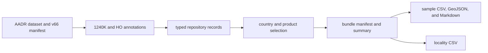

# AADR Exports

AADR exports provide release-pinned human ancient-DNA evidence for country and
regional products. They preserve the distinction between the upstream release,
its annotation panels, repository selection, and the rows admitted to each
geographic bundle.

## Release Identity

The checked-in manifest identifies:

| Property | Value |
| --- | --- |
| persistent dataset identity | `doi:10.7910/DVN/FFIDCW` |
| requested release | `v66` |
| Dataverse release | `10.0` |
| release timestamp | `2026-04-13T04:33:11Z` |
| captured annotation panels | `1240K` and `HO` |

`data/aadr/v66/release_manifest.json` also records the Dataverse file
identifiers, filenames, sizes, and MD5 digests. This packet establishes which
upstream objects the repository captured; the `v66` directory name alone is
not sufficient release provenance.

The 1240K annotation file contains **23,250 data rows** and the HO annotation
file contains **27,755 data rows**, excluding their headers. These are panel
rows, not two disjoint censuses of unique people. Samples can occur across
panels, so adding the counts would manufacture a false individual total.

## From Release To Country Product

Each Nordic country product carries a versioned bundle, summary, sample table,
sample GeoJSON, human-readable sample view, and locality export. The bundle is
the membership authority. A row present in the captured release is not
automatically a member of every geography.

## Reading The Exports

| Surface | Use it for | Do not infer |
| --- | --- | --- |
| release manifest | upstream identity and file integrity | geographic admission |
| sample CSV | structured admitted sample rows | unique-person totals across panels without identity review |
| sample GeoJSON | admitted spatial view at declared precision | exact excavation coordinates from display alone |
| locality CSV | locality-oriented grouping and inspection | one-to-one equivalence between locality and sample |
| summary JSON | product counts and scope summary | source completeness |
| bundle JSON | versioned artifact membership and relationships | scientific authority independent of its evidence rows |

Human aDNA is a direct-evidence family within its declared sample contract,
but it does not settle locality or chronology conflicts in animal evidence,
validate pollen chronology, or turn nearby archaeology context into a causal
relationship.

## Audit Or Reuse A Row

Carry the country bundle, sample identifier, panel and release identity,
structured row, locality information, spatial and temporal semantics, and
source citation together. Before combining country exports, deduplicate by the
governed sample identity rather than by coordinates, labels, or panel-row
counts.

The captured release material lives under `data/aadr/v66/`. Continue to
[AADR source guidance](../sources/aadr.md) for collection and normalization,
[reports](reports.md) for bundle structure, and [maps](maps.md) for spatial
interpretation.
