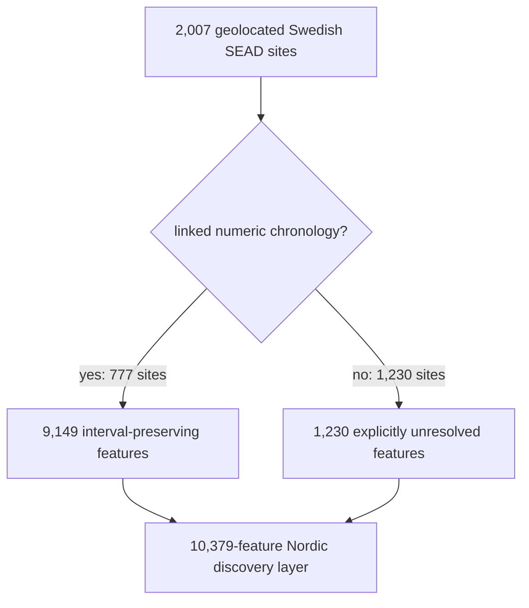
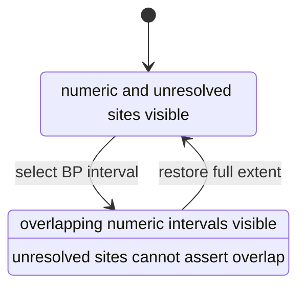

# Sweden Archaeology Site Discovery

The Sweden archaeology discovery surface answers a practical question: *which
SEAD sites can I inspect in Sweden, and what temporal and bibliographic support
does this repository currently hold for each one?* It publishes every
geolocated Swedish SEAD site rather than only the best-dated subset.

The result is a discovery aid, not a league table of archaeological
importance. Its order measures readiness for repository-based investigation.
It says nothing about present excavation activity, preservation quality,
research urgency, or the historical significance of a place.

## Complete Population

| Discovery population | Count |
| --- | ---: |
| Swedish SEAD sites | 2,007 |
| sites with linked numeric chronology | 777 |
| sites with unresolved chronology | 1,230 |
| sites with linked bibliography | 1,122 |
| linked numeric map features | 9,149 |
| explicitly unresolved map features | 1,230 |
| total map features | 10,379 |

One site can contribute several numeric features because each feature keeps a
real grouped SEAD chronology interval. A site without eligible numeric
chronology contributes one unresolved feature. Thus the site denominator is
2,007 while the map-feature denominator is 10,379.

## What “Discovery Readiness” Means

Every site enters one of four transparent tiers:

1. chronology and bibliography ready;
2. chronology ready;
3. bibliography ready; or
4. inventory only.

Within a tier, sites are ordered by chronology-kind breadth, represented
chronology source-record count, bibliography count, dataset count, then stable
name and SEAD identifier. The order helps a reader find sites for which the
repository can already support a deeper evidence review.

It must not be relabelled “best sites,” “most important sites,” or “active
sites.” A low-ranked site may be archaeologically exceptional but poorly
represented by the captured relations. A high-ranked site may simply have a
deep digital record.

## Why RAÄ Does Not Supply Missing Sites Or Dates

The RAÄ artifact in this repository is a one-degree density surface. It can
answer “how many published RAÄ records fall in this coarse cell?” It cannot
identify which RAÄ records coincide with a SEAD point, establish a site's
registry identity, or date that site.

Each discovery-registry row therefore carries the local RAÄ cell count only as
`raa_density_context_count`. That field:

- never changes discovery rank;
- never creates a site;
- never resolves chronology; and
- never establishes current archaeological activity.

This refusal is intentional. Joining two source families by visual proximity
would create an apparently concrete archaeology record whose identity and time
neither source supplied.

## How Time Works

A numeric feature keeps the exact `time_start_bp`, `time_end_bp`, midpoint,
label, evidence class, uncertainty, and provenance locator from its normalized
SEAD chronology feature. The discovery generator does not widen, average, or
infer that interval.

An unresolved feature keeps null numeric fields and the comparability posture
`unresolved`. At the full time extent it remains visible, so the map still
supports spatial discovery. Under a narrowed BP window it cannot claim
overlap. Its disappearance means “temporal eligibility unknown,” not “the site
did not exist.”

## Choose The Right Companion

| Question | Artifact |
| --- | --- |
| inspect the complete ranking contract and registry | `data/sead/derived/sweden_archaeology_site_discovery.json` |
| sort or analyze one row per site | `data/sead/derived/sweden_archaeology_site_discovery.csv` |
| navigate actual intervals and unresolved sites on a map | `data/sead/derived/sweden_archaeology_site_discovery.geojson` |
| read a compact coverage and interpretation summary | `data/sead/derived/sweden_archaeology_site_discovery.md` |
| audit captured linked rows behind a site | `data/sead/raw/nordic_sites.json` |

The four discovery companions are staged together in the Nordic Atlas bundle.
The original normalized SEAD site and temporal layers remain governed source
products, but the Atlas uses the discovery GeoJSON instead of loading those
two overlapping layers alongside it.

## A Safe Investigation Workflow

1. Start with the complete discovery layer and choose a place or time window.
2. Record the stable discovery feature ID and SEAD site ID from the popup.
3. Inspect the site's readiness tier, linked chronology kinds, bibliography
   count, and unresolved warnings.
4. Follow the SEAD source URL and raw captured relations before making a
   record-level claim.
5. Treat RAÄ density as regional context unless a separately governed
   record-level RAÄ acquisition supplies identities and chronology.
6. State whether the result concerns a site, a linked chronology interval, or
   the repository's current evidence readiness.

## Claims The Surface Refuses

The discovery surface does not establish:

- that a site is currently excavated, sampled, endangered, or actively
  researched;
- that ranking position measures archaeological value;
- that every record at a site belongs to each displayed interval;
- that an unresolved site is absent from a selected period;
- that RAÄ density represents past population or activity; or
- that a nearby lake, pollen sequence, aDNA sample, SEAD site, and RAÄ cell
  share one historical cause.

Continue with the [SEAD handbook](../sources/sead-handbook.md) for the
observation-unit model, [SEAD exports](sead-exports.md) for source products,
[RAÄ exports](raa-exports.md) for the density boundary, and [maps](maps.md) for
cross-layer interpretation.
