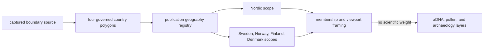
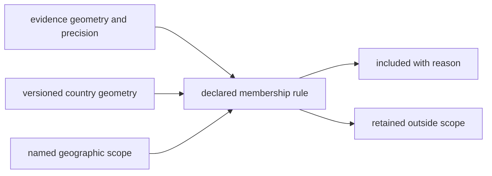

# Boundary Exports

Boundary exports define the geographic framing used by Nordic and country
products. They make scope selection reproducible while remaining explicitly
outside the scientific evidence weighting.

## Current Governed Surface

`data/boundaries/normalized/nordic_country_boundaries.geojson` contains four
MultiPolygon features:

| Country | Publication use |
| --- | --- |
| Sweden | country membership, map framing, and Nordic composition |
| Norway | country membership, map framing, and Nordic composition |
| Finland | country membership, map framing, and Nordic composition |
| Denmark | country membership, map framing, and Nordic composition |

The collection summary pins the boundary family to collection version `v66`,
retrieval date `2026-06-22`, acquisition method `collector_pipeline`, and
captured and normalized SHA-256 digests. Those values identify the geometry
state used by publication; they do not assign historical meaning to the
polygons.



## Scope Is A Product Decision

A feature can be selected into a country bundle because its declared geometry
falls within the governed country scope. That membership decision does not
prove historical nationality, cultural affiliation, or source completeness.
Modern country geometry is publication framing applied to evidence whose own
locality and chronology remain independently governed.

Boundary changes can alter membership without changing the scientific source
record. Release comparison therefore distinguishes **geometry-driven scope
change** from **evidence change**. The feature identifier and parent-child
subset validation reveal which interpretation applies.

### Membership Is A Recomputable Relation

Country membership is not copied into source evidence as permanent truth. It
is derived from three versioned inputs:

```text
membership = evidence geometry + boundary geometry + selection rule
```

| Input change | What changed | What did not necessarily change |
| --- | --- | --- |
| evidence coordinate corrected | the record's spatial claim | boundary or scientific identity |
| boundary geometry replaced | publication scope geometry | source locality, chronology, or taxonomy |
| containment rule revised | product selection semantics | captured source bytes |
| product country list revised | declared publication scope | validity of records outside that scope |



This separation explains why a record can move between country products
without a new scientific observation. A release note must identify which of
the three inputs changed instead of reporting every membership change as new
or removed evidence.

## Edge And Precision Cases

- A point near a border retains its coordinate provenance and precision; the
  boundary does not make an approximate point exact.
- A broad regional locality cannot be forced into country membership merely
  because a representative coordinate falls inside a polygon.
- Offshore, disputed, or changed geometry requires an explicit product rule;
  visual containment is not a substitute.
- Absence from a country bundle can mean out of scope even when the evidence
  remains present in a broader product.

## Reuse Contract

Carry the boundary GeoJSON, collection version and hashes, country identifiers,
geometry role, publication geography registry, and selection rule with any
scope-derived extract. Keep boundary features in the framing role; do not add
them to evidence counts, ranking weights, or historical inference.

Continue to [boundary source guidance](../sources/boundaries.md) for collection
identity, [maps](maps.md) for rendering behavior, and [reports](reports.md) for
scope lineage.
