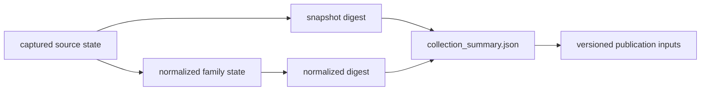

# Collection Summary

`data/collection_summary.json` identifies the collected state from which
publication begins. It records the collection version, generation date,
source roots, acquisition metadata, and hashes for captured and normalized
material.

The checked-in summary names collection version **v66**, generated on
**2026-06-22**, and seven collected families: AADR, boundaries, LandClim,
Neotoma, RAÄ, SEAD, and SVAR. These are collection members. Animal ancient-DNA
curation has its own project, paper, supplement, and sample governance under
`data/adna/` and is not made complete merely by this seven-family summary.

## Recorded Contract

| Field | Meaning | Reader use |
| --- | --- | --- |
| `generated_on` | date the summary was assembled | distinguish collection time from publication time |
| `version` | shared collection label | join source and publication surfaces from the same state |
| `collected_sources` | source families included by the collector | establish collection breadth, not evidence completeness |
| `source_output_roots` | governed location of each family | locate the family tree without guessing |
| `source_metadata` | version, licence posture, retrieval date, method | interpret origin and reuse constraints |
| `source_hashes` | captured and normalized content digests | detect changed collection content |
| `source_provenance` | family name, role, roots, and digests | connect family identity to stored state |
| `source_replacement_rules` | family-specific refresh and replacement behavior | distinguish additive acquisition from governed replacement |
| `source_traceability` | source identity and stored artifact linkage | recover the acquisition basis for a family |
| `contract_artifacts` | machine-readable contracts derived for the collection | locate the semantics used by downstream consumers |

The summary also carries family-scale counts such as LandClim sites and grid
cells, Neotoma points, RAÄ heritage and total sites, SEAD points, and SVAR
lakes. These counts identify the assembled state; their exact observation
units and temporal semantics remain governed by the family contracts.

## Interpreting Change

A changed snapshot digest means captured source content changed. A changed
normalized digest means the normalized family state changed. A new report with
unchanged collection hashes may reflect a new scope, contract, or presentation
over the same collected state. These are different kinds of change and should
not be described as equivalent data growth.

The summary does not measure sample admissibility, coordinate quality,
chronology precision, or geographic completeness. An empty or small normalized
digest can coexist with a tracked source family, and a collected family can be
absent from a particular product because its publication rules do not pass.

## Verify A Collection Identity

Use the summary as a join point rather than as a narrative status badge:

1. match the publication's collection version to `version`;
2. confirm the family appears in `collected_sources`;
3. locate its governed tree through `source_output_roots`;
4. read its acquisition version, licence posture, date, and method in
   `source_metadata`;
5. compare the captured and normalized digests in `source_hashes`; and
6. follow the family contract for observation units, precision, and permitted
   publication roles.

A bundle that cites v66 but cannot resolve the relevant source root and digest
has an incomplete collection link. A matching digest establishes content
identity, not scientific fitness; admission and caveat surfaces provide that
separate decision.

Use the [source family matrix](../sources/source-family-matrix.md) for evidence
roles, the [cross-domain matrix](../overview/cross-domain-evidence-matrix.md)
for comparability, and [publication limits](limits.md) for what remains outside
the visible products.
