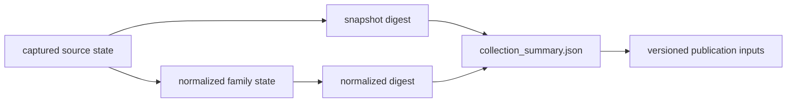

# Collection Summary

`data/collection_summary.json` identifies the collected state from which
publication begins. It records the collection version, generation date,
source roots, acquisition metadata, and hashes for captured and normalized
material.

## Recorded Contract

| Field | Meaning | Reader use |
| --- | --- | --- |
| `generated_on` | date the summary was assembled | distinguish collection time from publication time |
| `version` | shared collection label | join source and publication surfaces from the same state |
| `collected_sources` | source families included by the collector | establish collection breadth, not evidence completeness |
| `source_output_roots` | governed location of each family | locate the family tree without guessing |
| `source_metadata` | version, licence posture, retrieval date, method | interpret origin and reuse constraints |
| `source_hashes` | captured and normalized content digests | detect changed collection content |
| `source_provenance` | family name, role, roots, and digests | connect family identity to stored state |

## Interpreting Change

A changed snapshot digest means captured source content changed. A changed
normalized digest means the normalized family state changed. A new report with
unchanged collection hashes may reflect a new scope, contract, or presentation
over the same collected state. These are different kinds of change and should
not be described as equivalent data growth.

The summary does not measure sample admissibility, coordinate quality,
chronology precision, or geographic completeness. An empty or small normalized
digest can coexist with a tracked source family, and a collected family can be
absent from a particular product because its publication rules do not pass.

Use the [source family matrix](../sources/source-family-matrix.md) for evidence
roles, the [cross-domain matrix](../overview/cross-domain-evidence-matrix.md)
for comparability, and [publication limits](limits.md) for what remains outside
the visible products.
