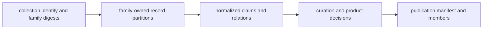
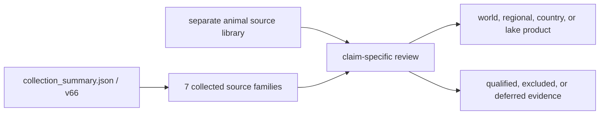
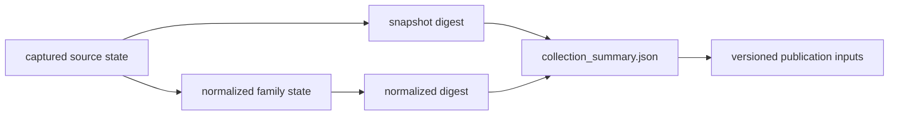

# Collection Summary

`data/collection_summary.json` identifies the collected state from which
publication begins. It records the collection version, generation date,
source roots, acquisition metadata, and hashes for captured and normalized
material.

The checked-in summary names collection version **v66**, generated on
**2026-06-22**, and seven collected families: AADR, boundaries, LandClim,
Neotoma, RAÄ, SEAD, and SVAR. These are collection members. Animal ancient-DNA
curation has its own project, paper, supplement, and sample governance under
`data/adna/` and is not made complete merely by this seven-family summary.

## Recorded Contract

| Field | Meaning | Reader use |
| --- | --- | --- |
| `generated_on` | date the summary was assembled | distinguish collection time from publication time |
| `version` | shared collection label | join source and publication surfaces from the same state |
| `collected_sources` | source families included by the collector | establish collection breadth, not evidence completeness |
| `source_output_roots` | governed location of each family | locate the family tree without guessing |
| `source_metadata` | version, licence posture, retrieval date, method | interpret origin and reuse constraints |
| `source_hashes` | captured and normalized content digests | detect changed collection content |
| `source_provenance` | family name, role, roots, and digests | connect family identity to stored state |
| `source_replacement_rules` | family-specific refresh and replacement behavior | distinguish additive acquisition from governed replacement |
| `source_traceability` | source identity and stored artifact linkage | recover the acquisition basis for a family |
| `contract_artifacts` | machine-readable contracts derived for the collection | locate the semantics used by downstream consumers |

The summary also carries family-scale counts such as LandClim sites and grid
cells, Neotoma points, RAÄ heritage and total sites, SEAD points, and SVAR
lakes. These counts identify the assembled state; their exact observation
units and temporal semantics remain governed by the family contracts.

### A Digest Can Identify Empty Content

A content digest proves identity of the bytes or logical member stream that
was hashed; it does not prove that the stream contains governed records. The
current AADR `normalized_sha256` is
`e3b0c44298fc1c149afbf4c8996fb92427ae41e4649b934ca495991b7852b855`, the
SHA-256 digest of an empty byte stream. The dedicated evidence-stage matrix
accordingly reports the AADR normalized stage as missing.

This is not a hash failure. It is a meaningful receipt for absence at that
boundary and must not be described as a populated normalized dataset.

| Digest observation | Additional evidence required before interpretation |
| --- | --- |
| digest changed | member-identity and semantic diff |
| digest unchanged | proof that the same hashing scope and member ordering were used |
| digest identifies empty content | expected-member accounting and an explicit missing or valid-empty decision |
| digest is absent | acquisition or preparation outcome explaining why content identity is unavailable |

A scientifically valid empty result is possible only when the expected source
population, query or extraction scope, and zero-member outcome are themselves
governed. Otherwise empty content is a missing preparation state, not evidence
that the upstream population is empty.

### Collection Header, Not Record Catalogue

The summary behaves as a collection-level transaction header. It identifies
the source partitions and their captured and normalized content state, but it
does not enumerate every governed object, relation, conflict, or publication
member.

| Question | Correct authority |
| --- | --- |
| Which collected source roots belong to this state? | collection summary |
| Which source-native or normalized records exist? | family-owned captured and normalized partitions |
| Which value owns a sample, locality, chronology, or coordinate fact? | fact-ownership registry and governing evidence record |
| Which records passed one product contract? | product admission and bundle manifest |
| Which visible rows and exclusions belong together? | publication bundle and review companions |

Treating the summary as a record catalogue would make its family counts appear
scientifically comparable and would hide animal curation that is governed
outside the seven collector-managed roots.

## Collection Membership Is Not Publication Membership

The `v66` summary records seven collector-managed families:

| Collection member | Collected root | Publication decision still required |
| --- | --- | --- |
| AADR | `data/aadr` | release-row identity, deduplication, geography, and product scope |
| boundaries | `data/boundaries` | geometry version and named scope relation |
| LandClim | `data/landclim` | site-sequence versus grid-cell role and temporal posture |
| Neotoma | `data/neotoma` | site identity and temporal comparability class |
| RAÄ | `data/raa` | selected classification, aggregation grid, and Sweden-only role |
| SEAD | `data/sead` | four-country membership and context-only temporal posture |
| SVAR | `data/svar` | lake identity and candidate-product eligibility |

Animal aDNA is governed separately under `data/adna/`. Its 40-project intake,
868 recovered rows, and 234 admitted point features must not be inferred from
`collected_sources`. Conversely, the seven-family collection summary does not
grant any member automatic map or report admission.

The publication asks a narrower question than collection: which reviewed
members, from which authorities, satisfy this named product? That question is
answered by the product manifest and evidence rows, not by the collection list.

## Interpreting Change

A changed snapshot digest means captured source content changed. A changed
normalized digest means the normalized family state changed. A new report with
unchanged collection hashes may reflect a new scope, contract, or presentation
over the same collected state. These are different kinds of change and should
not be described as equivalent data growth.

The summary does not measure sample admissibility, coordinate quality,
chronology precision, or geographic completeness. An empty or small normalized
digest can coexist with a tracked source family, and a collected family can be
absent from a particular product because its publication rules do not pass.

### Three Identities To Compare

| Identity | Governing surface | Change it can reveal |
| --- | --- | --- |
| collection identity | version, source metadata, and hashes in `collection_summary.json` | captured or normalized family state changed |
| evidence identity | stable normalized, sample, site, and review records | interpretation, precision, conflict, or curation changed |
| publication identity | scope, version, member inventory, and contract in the bundle | admission, geography, caveat, or presentation membership changed |

The shared label `v66` is necessary but not sufficient to prove that two files
belong to one coherent publication. Their manifest membership, governing
identifiers, and hashes must also resolve. A later product can legitimately
reuse an unchanged collection while applying a revised review or scope rule;
that is a publication change over the same captured state, not a new source
release.

## Verify A Collection Identity

Use the summary as a join point rather than as a narrative status badge:

1. match the publication's collection version to `version`;
2. confirm the family appears in `collected_sources`;
3. locate its governed tree through `source_output_roots`;
4. read its acquisition version, licence posture, date, and method in
   `source_metadata`;
5. compare the captured and normalized digests in `source_hashes`; and
6. follow the family contract for observation units, precision, and permitted
   publication roles.

A bundle that cites v66 but cannot resolve the relevant source root and digest
has an incomplete collection link. A matching digest establishes content
identity, not scientific fitness; admission and caveat surfaces provide that
separate decision.

Use the [source family matrix](../sources/source-family-matrix.md) for evidence
roles, the [cross-domain matrix](../overview/cross-domain-evidence-matrix.md)
for comparability, and [publication limits](limits.md) for what remains outside
the visible products. The [evidence database](../database/index.md) explains
how collection identity relates to governed records and projections.
