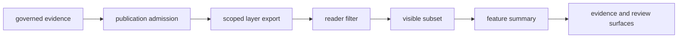
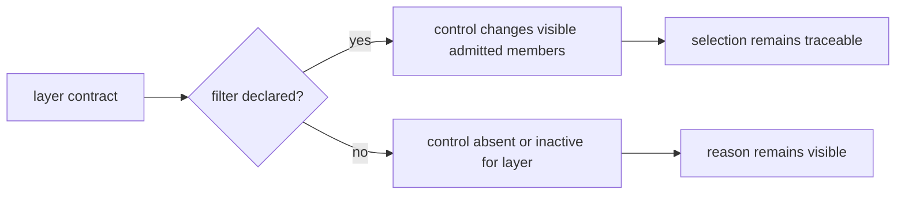
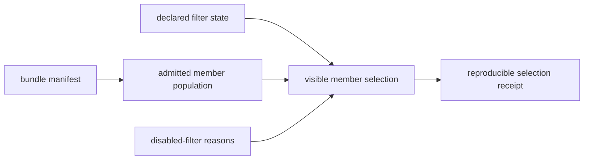

# Filters And Popups

Filters and popups are the map's first explanation layer. They reveal the
active selection and summarize already admitted features; they do not decide
which evidence is eligible to publish.

That matters because the map changes by scope. World, Europe-plus, Nordic, and
country views do not all show the same layers, and a popup is not allowed to
quietly inflate a thin record into a confident story.

## Interaction Boundary

Everything to the right of the scoped export is a view operation. A filter can
reduce the visible set but cannot admit a new record. A popup can summarize a
feature but cannot strengthen its locality, chronology, coordinate, or
citation posture.

## Orientation At A Glance

- which countries are active in one scope
- which point layers remain visible after geography filtering
- why Nordic-only context overlays disappear when you move back to world
  or Europe-plus
- whether animal points belong to the world surface only or to narrower derived
  views
- whether a country bundle is derived from the world surface directly or
  through a regional parent

These signals keep geographic selection inspectable: a scope change is an
evidence selection, not merely a change in zoom.

## Filter Semantics

| Filter | Changes | Does not change |
| --- | --- | --- |
| geography | the eligible features visible within a declared product scope | source identity or evidence strength |
| layer | which evidence roles are displayed together | the role assigned to each layer |
| feature attributes | the visible subset of an admitted layer | admission status or the denominator of the source collection |

World, regional, and country maps are related publications with explicit
lineage. Selecting a country inside an existing product is not equivalent to
opening that country's governed bundle unless the manifest and contract say so.

### The World Contract Shows Which Filters Apply

Filter eligibility is declared per layer. In the current world contract:

| Layer | Country filter | Time filter | Why |
| --- | --- | --- | --- |
| AADR | yes | yes | release rows carry country and admitted temporal fields |
| goat | yes | yes | admitted goat features carry scope and numeric time posture |
| horse | yes | yes | admitted horse features carry scope and numeric time posture |
| dromedary context | yes | no | the single feature is project-anchored context and must not enter numeric time filtering |
| boundaries | yes | no | polygons frame scope and carry no scientific chronology |

A disabled time filter is not missing interface work when the layer contract
forbids numeric temporal selection. Enabling it by substituting contextual
dates would change the evidence claim, not merely improve interaction.

### Five States Behind A Missing Marker

| State | Meaning | Where to resolve it |
| --- | --- | --- |
| hidden by active filter | the admitted member remains in the open bundle | filter state and layer controls |
| outside the open scope | the record may belong to a parent, sibling, or other geographic product | parent and child manifests |
| refused by admission | governed evidence exists but does not satisfy this product contract | refusal and exclusion surfaces |
| unresolved in curation | source material exists but identity, place, time, or provenance is not settled | evidence review and conflict ledgers |
| absent from capture | the repository has no governed row in the checked-in source state | source inventory and recovery review |

These states are not interchangeable. Only the first is reversed by a browser
control; the others require a different product or a change in governed
evidence.

### Retain A Selection Receipt

A screenshot records appearance but not the governed population or the exact
selection that produced it. A reproducible reader selection retains:

| Receipt field | Required value |
| --- | --- |
| product identity | world, regional, or country bundle and its manifest identity |
| admitted population | layer member IDs before browser filtering |
| active scope | geography and parent-product lineage declared by the open product |
| filter state | enabled layers and exact geography, time, and attribute predicates |
| unavailable controls | filters disabled by the layer contract and the reason |
| visible result | stable member IDs after filtering, grouped by evidence role |
| qualifications | warnings or caveats that materially constrain interpretation |

Visible counts are selection counts, not source-family denominators. Report
both when coverage matters—for example, “12 of 234 admitted animal publication
points are visible under this filter”—and keep the member IDs so equal counts
with different membership remain distinguishable.

## Popup Contract

A useful popup identifies the source family and evidence role, shows the stable
feature identity, preserves coordinate and temporal qualifications, states the
active geographic scope, and provides a route to narrower evidence. Fields
that are not supported remain absent or visibly qualified; they are not filled
from a broader project or nearby contextual feature.

| Popup element | Minimum meaning to preserve |
| --- | --- |
| identity | stable feature identifier and source-native or evidence identifier |
| role | direct evidence, environmental context, archaeology context, decision support, or framing |
| place | coordinate basis, confidence or geometry semantics, and locality label |
| time | admitted interval, qualified context, or explicit unresolved posture |
| scope | open product and the member's inclusion posture |
| audit route | link or identifiers sufficient to locate the narrower evidence surface |

A compact popup may omit nonessential descriptive fields. It must not omit a
qualification whose absence would materially strengthen the apparent claim.

### Popup Claims For Mixed Animal Identity

The goat feature for Direkli1-2 can name a final sample identifier,
supplementary-table coordinate, and sample-owned chronology. The Wadi Halfa
dromedary feature cannot use the same template: its identity is provisional,
its coordinate is an approximate named-place geocode, and its sample row is not
yet recoverable.

The two features may share marker styling, but their popups must not share an
unqualified “sample” assertion. Presentation that erases this difference
would make the dromedary point appear stronger than its traceability record.

## Interpretive Guardrails

- A hidden point is not negative evidence; it may be outside the active filter,
  outside the bundle, refused by admission, or absent from capture.
- A contextual layer remains context when selected beside direct evidence.
- Marker placement and popup formatting do not increase source precision.
- A numeric-looking label is comparable only when the governing temporal
  semantics permit that comparison.

## Follow The Evidence Link

Move from the popup to the evidence and review surfaces when:

- a visible point looks more precise than expected
- one layer disappears between scopes and the change matters
- you need chronology, locality, or provenance rather than a compact label
- the public wording sounds stronger than the evidence probably allows

## Evidence Routes

- use [maps](maps.md) for the wider scope picture
- use [point rules](point-rules.md) for why a point can publish at all
- use [map inputs](map-inputs.md) for the files behind the visible result
- use [limits](limits.md) when the honest answer may be blockage or weakness

## Nordic Atlas Behavior

The Nordic atlas inherits these filtering rules from the wider publication
geography contract. Nordic-only context overlays disappear outside their
declared scope because their evidence contract is regional, not because the
browser discarded valid world evidence. Its popups preserve that scope and
caveat posture alongside the visible feature.
