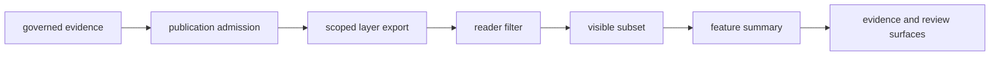

# Filters and popups

Filters and popups are the map's first explanation layer. They reveal the
active selection and summarize already admitted features; they do not decide
which evidence is eligible to publish.

That matters because the map changes by scope. World, Europe-plus, Nordic, and
country views do not all show the same layers, and a popup is not allowed to
quietly inflate a thin record into a confident story.

## Interaction Boundary

Everything to the right of the scoped export is a view operation. A filter can
reduce the visible set but cannot admit a new record. A popup can summarize a
feature but cannot strengthen its locality, chronology, coordinate, or
citation posture.

## Orientation At A Glance

- which countries are active in one scope
- which point layers remain visible after geography filtering
- why Nordic-only context overlays disappear when you move back to world
  or Europe-plus
- whether animal points belong to the world surface only or to narrower derived
  views
- whether a country bundle is derived from the world surface directly or
  through a regional parent

These signals keep geographic selection inspectable: a scope change is an
evidence selection, not merely a change in zoom.

## Filter Semantics

| Filter | Changes | Does not change |
| --- | --- | --- |
| geography | the eligible features visible within a declared product scope | source identity or evidence strength |
| layer | which evidence roles are displayed together | the role assigned to each layer |
| feature attributes | the visible subset of an admitted layer | admission status or the denominator of the source collection |

World, regional, and country maps are related publications with explicit
lineage. Selecting a country inside an existing product is not equivalent to
opening that country's governed bundle unless the manifest and contract say so.

## Popup Contract

A useful popup identifies the source family and evidence role, shows the stable
feature identity, preserves coordinate and temporal qualifications, states the
active geographic scope, and provides a route to narrower evidence. Fields
that are not supported remain absent or visibly qualified; they are not filled
from a broader project or nearby contextual feature.

## Interpretive Guardrails

- A hidden point is not negative evidence; it may be outside the active filter,
  outside the bundle, refused by admission, or absent from capture.
- A contextual layer remains context when selected beside direct evidence.
- Marker placement and popup formatting do not increase source precision.
- A numeric-looking label is comparable only when the governing temporal
  semantics permit that comparison.

## Follow The Evidence Link

Move from the popup to the evidence and review surfaces when:

- a visible point looks more precise than expected
- one layer disappears between scopes and the change matters
- you need chronology, locality, or provenance rather than a compact label
- the public wording sounds stronger than the evidence probably allows

## Evidence Routes

- use [maps](maps.md) for the wider scope picture
- use [point rules](point-rules.md) for why a point can publish at all
- use [map inputs](map-inputs.md) for the files behind the visible result
- use [limits](limits.md) when the honest answer may be blockage or weakness

## Nordic Atlas Behavior

The Nordic atlas inherits these filtering rules from the wider publication
geography contract. Nordic-only context overlays disappear outside their
declared scope because their evidence contract is regional, not because the
browser discarded valid world evidence. Its popups preserve that scope and
caveat posture alongside the visible feature.
