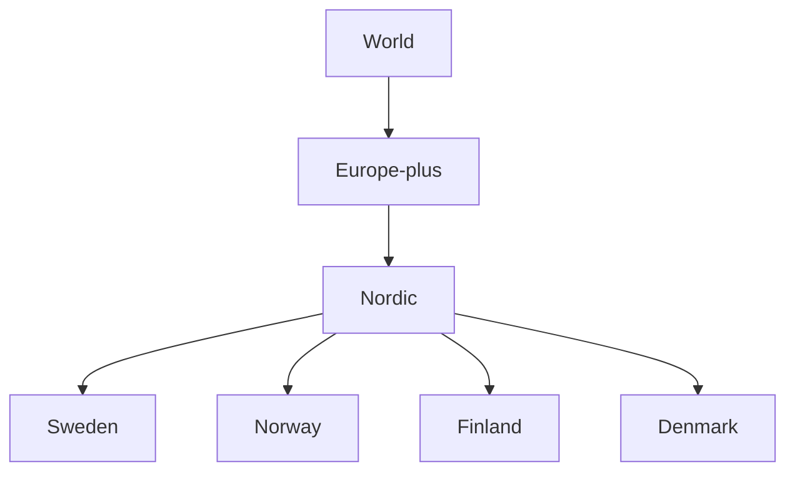
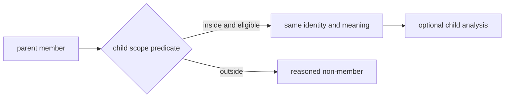
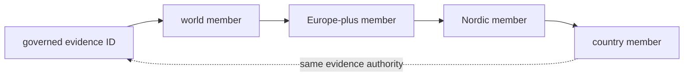

# Geographic Publication Lineage

World, Europe-plus, Nordic, and country products are related selections over
one governed evidence state. Their relationship is part of the publication
contract: a narrower geography can remove members by scope, but it cannot
change the identity, evidence role, precision, or source meaning of a member
inherited from its parent.

## The Scope Graph

`docs/report/publication_geography_registry.json` names these scopes, their
parents, directories, and country membership. The registry governs scope
identity; bundle manifests govern the files and members published for one
version of a scope.

| Scope | Parent | Governing entry point |
| --- | --- | --- |
| world | none | `docs/report/world/world_bundle.json` |
| Europe-plus | world | `docs/report/regions/europe-plus/europe-plus_bundle.json` |
| Nordic | Europe-plus | `docs/report/regions/nordic/nordic_bundle.json` |
| Sweden, Norway, Finland, Denmark | Nordic | country bundle and report directory under `docs/report/countries/` |

The hierarchy describes product lineage, not scientific containment. A member
can be absent from a child because its evidence lies outside the child scope
or because that child publishes a narrower product family. Absence must still
resolve to an explicit scope, admission, or product-contract reason.

## What A Child Product May Change

| Child operation | Allowed | Not allowed |
| --- | --- | --- |
| geographic selection | retain members whose governed geography satisfies the child scope | alter coordinates to force containment |
| product inventory | omit parent artifacts that are outside the child product contract | silently drop required warnings or traceability companions |
| presentation | choose child-specific title, framing, labels, and default viewport | change evidence role or precision |
| aggregation | calculate child counts from child member identities | copy a parent total or add unlike observation units |
| qualification | add a narrower child-specific warning | remove a qualification inherited from governing evidence |
| analytic sidecar | derive a ranking or summary under an explicit child contract | make the derived result the authority for upstream facts |

## Subset Validation

`docs/report/publication_geography_subset_validation.json` checks each child
against its parent for country, animal, and human populations. A passing row
establishes that the checked identity sets obey the declared subset relation.
It does not establish source completeness, independent observations, or equal
evidence maturity across layers.

| Validation result | Meaning |
| --- | --- |
| country subset passes | child country membership is permitted by its parent scope |
| animal subset passes | child animal members resolve within the parent animal population |
| human subset passes | child AADR members resolve within the parent human population |
| all pass | lineage is structurally coherent for those checked populations |

The validation operates on identities rather than counts alone. Equal totals
can hide member replacement, while different totals are expected when a child
is a proper subset.

## Trace A Member Across Scopes

For a member visible in more than one product:

1. record the stable source or evidence identity in the broadest product;
2. locate the same identity in each child manifest or traceability surface;
3. confirm that role, locality, coordinate basis, temporal posture, and
   qualification are unchanged;
4. record the child scope decision that retains it; and
5. inspect child-specific analysis separately from inherited evidence.

A new feature identifier may represent product-local rendering while the
underlying evidence identity remains stable. Preserve both identities rather
than assuming a label or coordinate is sufficient to join products.

## Explain Absence From A Child Scope

Check absence in this order:

| Check | Question |
| --- | --- |
| parent membership | did the evidence belong to the immediate parent product? |
| governed geography | does the evidence satisfy the child boundary at its declared precision? |
| child product type | does this child publish the relevant evidence family and role? |
| admission | did a child-specific rule exclude or defer the record? |
| manifest | is the expected structured member present in the product inventory? |
| rendering | is the member hidden only by a browser filter or default layer state? |

“Not on the country map” cannot distinguish these states. A complete absence
claim names the expected identity, parent, child, failed or inapplicable
predicate, and governing record.

## Country Products Are More Than Clipped Maps

A country directory can contain AADR samples, animal evidence, citations,
warnings, contextual sources, rankings, fieldwork preparation, and scientific
review. Those members share geography but not observation unit or authority.

Country publication therefore has two independent responsibilities:

- preserve parent evidence meaning and subset lineage; and
- declare which country-specific products and analytical sidecars exist.

A country count is reproducible only when it names the product member family,
version, numerator identities, eligible denominator, and exclusions. The
country label alone is not a population definition.

## Compare Countries Without Double Counting

Country products are disjoint only for the particular membership relation
being tested. The same evidence can still appear in regional and world
products, and one source object can contribute several typed records.

Before combining countries:

- select one observation unit and evidence role;
- use stable governed identities, not display labels;
- verify country assignment and boundary version;
- preserve qualifications and unresolved states;
- deduplicate shared upstream objects where the analytical question requires
  independence; and
- state whether excluded, outside-scope, and unrecovered records belong in the
  denominator.

## Cite A Geographic Result

Retain the publication version, scope key, parent scope, bundle manifest,
stable member or aggregate identity, source-family role, observation unit,
governing evidence link, and material qualification. For a cross-scope claim,
also retain the subset-validation row and the exact scopes compared.

Continue with [reports](reports.md), [maps](maps.md), [point publication
rules](point-rules.md), and the [Nordic Evidence Atlas](../../nordic-atlas/index.md).
