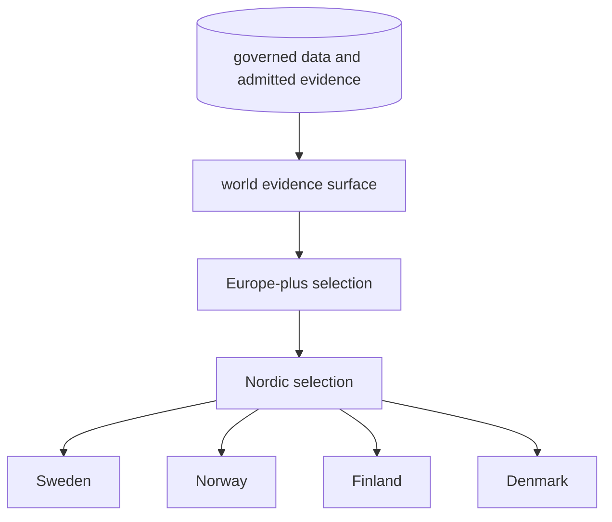
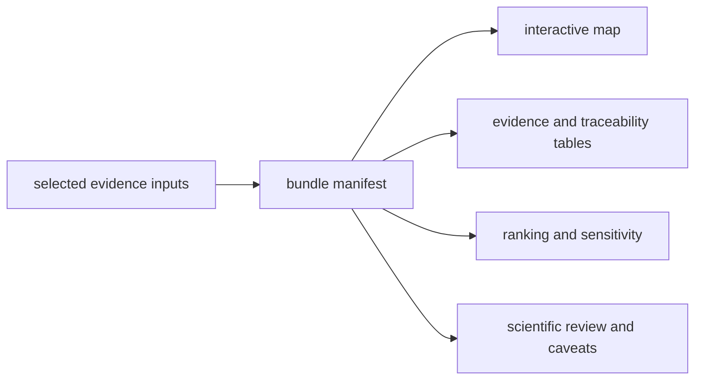

# Evidence Publications

Pollenomics publications are derived, versioned views over the governed data
state. Reports, maps, evidence tables, ranking outputs, and caveat surfaces are
assembled together so a visual result can be inspected alongside its inputs,
traceability, and scientific review.

## Geographic Lineage

The hierarchy is a lineage and subset contract. Regional and country outputs
are narrower selections over shared evidence; they are not separately curated
databases. Subset validation detects rows that appear in a child without a
governed parent or that change meaning between scopes.

## Publication Bundle

A geographic bundle can include:

- a manifest and summary;
- an interactive map document and local map assets;
- source-family GeoJSON layers;
- animal evidence and point-traceability tables;
- a map publication contract;
- candidate-site rankings and sensitivity results;
- a ranking-engine manifest; and
- scientific review in machine-readable and narrative forms.

The map is one consumer of the bundle, not the bundle's authority.

## Publication Gates

Animal publication checks currently enforce that:

- published points retain sample, site, coordinate, and citation support;
- sample-site disagreement is not flattened into one project locality;
- blocked sample-site rows do not publish as exact sites;
- unresolved or conflicting chronology does not enter country or atlas output;
- project-level locality substitution does not masquerade as sample evidence;
- broad chronology does not publish as a numeric time window; and
- contextual temporal rows remain distinguishable from numeric comparisons.

Passing these safeguards permits the qualified publication surface. It does
not authorize a reference-grade or final-release claim; those stronger claims
have separate evidence requirements.

## Choose A Publication

- [Reports](reports.md) provide scope-oriented narrative and inventories.
- [Maps](maps.md) provide visual exploration across evidence families.
- [Map inputs](map-inputs.md) identify the source files behind visible layers.
- [Point rules](point-rules.md) explain eligibility and coordinate posture.
- [Filters and popups](filters-and-popups.md) explain interactive selection and
  displayed metadata.
- [Publication types](publication-types.md) distinguish scientific evidence,
  context, framing, and review surfaces.
- [Collection summary](collection-summary.md) binds publications to the
  collected source state.
- [Limits](limits.md) records the boundaries that remain after a bundle passes
  its structural checks.

The generated [report portal](../../../report/index.md) provides direct access
to world, regional, country, review, and caveat outputs.

## Reuse Rule

Reuse the smallest surface that supports the claim. A map screenshot is enough
to illustrate layout, but not to support a sample-level scientific assertion.
For that, retain the evidence row, source lineage, locality and chronology
posture, coordinate basis, bundle version, and applicable caveats.
