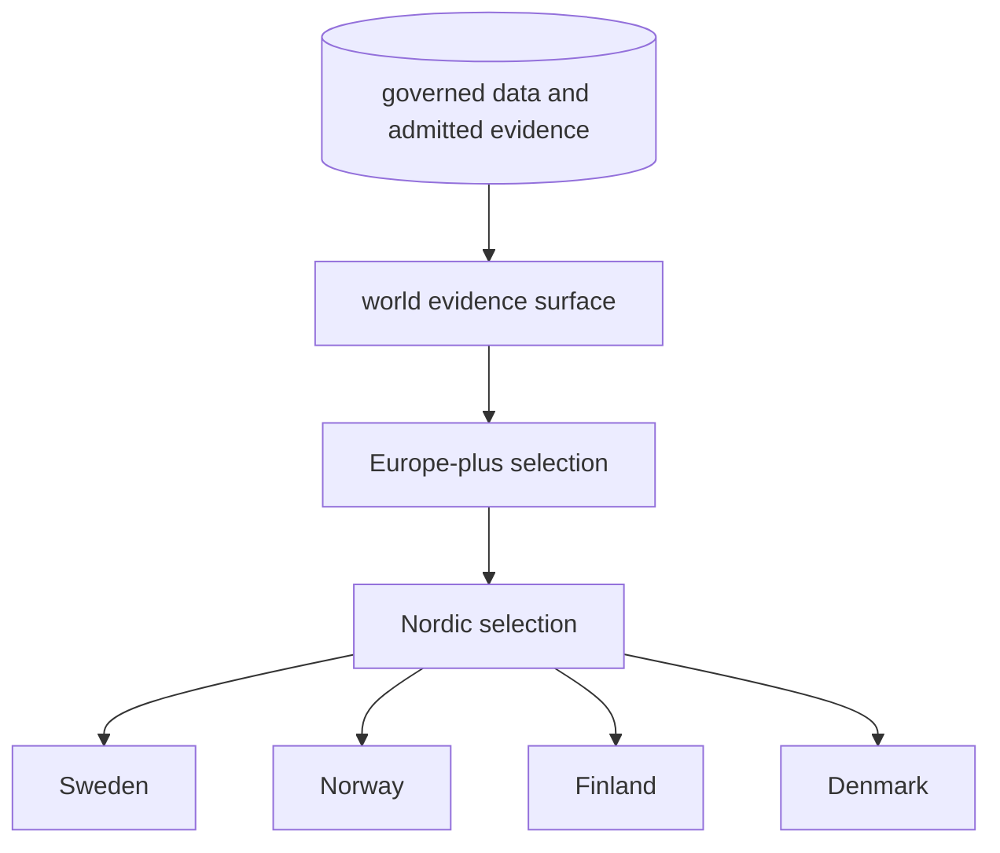
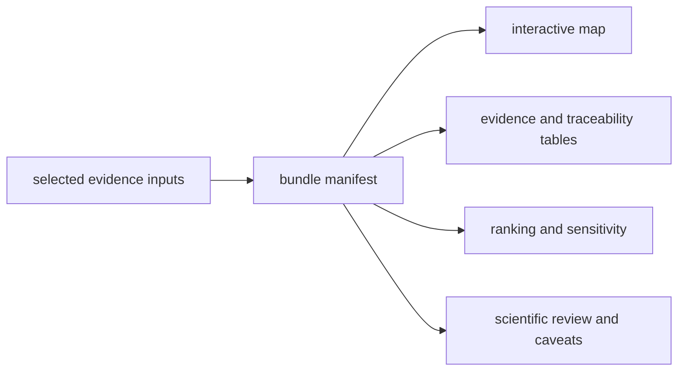
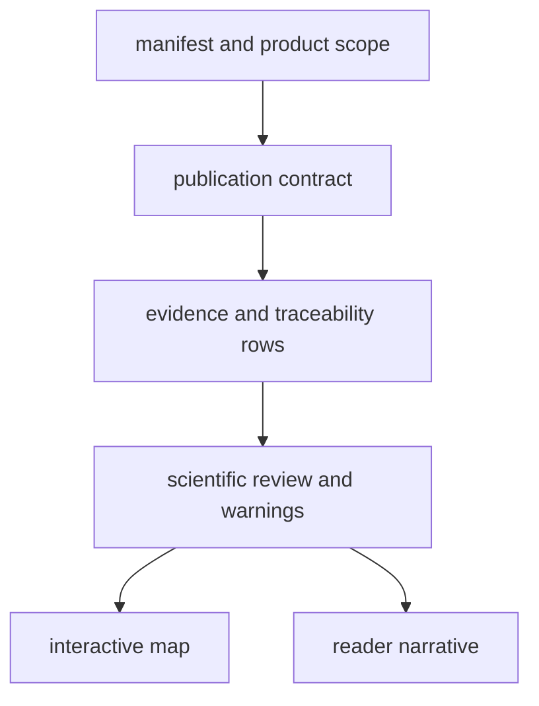
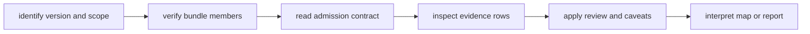

# Evidence Publications

Pollenomics publications are derived, versioned views over the governed data
state. Reports, maps, evidence tables, ranking outputs, and caveat surfaces are
assembled together so a visual result can be inspected alongside its inputs,
traceability, and scientific review.

## Geographic Lineage

The hierarchy is a lineage and subset contract. Regional and country outputs
are narrower selections over shared evidence; they are not separately curated
databases. Subset validation detects rows that appear in a child without a
governed parent or that change meaning between scopes.

## Publication Bundle

A geographic bundle can include:

- a manifest and summary;
- an interactive map document and local map assets;
- source-family GeoJSON layers;
- animal evidence and point-traceability tables;
- a map publication contract;
- candidate-site rankings and sensitivity results;
- a ranking-engine manifest; and
- scientific review in machine-readable and narrative forms.

The map is one consumer of the bundle, not the bundle's authority.

### Bundle identity

A publication is identified by the combination of **version**, **geographic
scope**, **member inventory**, and **governing contracts**. Two bundles with the
same map title are not interchangeable when any of those fields differ.

| Identity field | Question it answers | Why it must travel with reuse |
| --- | --- | --- |
| version | which governed data state was published? | later recovery or review can change admission |
| scope | which geographic selection was applied? | a country result cannot stand for the Nordic or world collection |
| member inventory | which tables, layers, reviews, and rankings belong together? | prevents artifacts from different runs being combined |
| contract identity | which rules admitted and qualified records? | makes the visible subset reproducible |

The bundle is complete for interpretation only when its manifest, evidence
members, review surfaces, and renderings resolve to the same identity. A
standalone HTML map can remain useful for exploration, but it is not a complete
scientific publication.

## Bundle Authority Order

When publication artifacts disagree, resolve the claim through the narrowest
governing surface:

1. the bundle manifest governs product identity, version, scope, and members;
2. the publication contract governs required layers, fields, and admission
   behavior;
3. point traceability and evidence tables govern visible record identity;
4. scientific review and warning surfaces govern material qualifications;
5. maps and narrative reports render and interpret that governed state.

A map label or narrative sentence cannot override a manifest member, evidence
identifier, precision posture, or material warning. If the rendered surface
disagrees, the rendering is stale or defective and must be corrected.

## Read A Bundle In Order

This order separates product discovery from claim evaluation. The manifest
locates the right product; the contract explains why records are present; the
evidence rows support the claim; review surfaces preserve qualifications; and
the rendering helps the reader see the result. Reversing that order risks
treating visual prominence as scientific authority.

## Publication Gates

Animal publication checks currently enforce that:

- published points retain sample, site, coordinate, and citation support;
- sample-site disagreement is not flattened into one project locality;
- blocked sample-site rows do not publish as exact sites;
- unresolved or conflicting chronology does not enter country or atlas output;
- project-level locality substitution does not masquerade as sample evidence;
- broad chronology does not publish as a numeric time window; and
- contextual temporal rows remain distinguishable from numeric comparisons.

Passing these safeguards permits the qualified publication surface. It does
not authorize unrestricted precision or final-release maturity; those stronger
claims have separate evidence requirements.

## Choose A Publication

- [Reports](reports.md) provide scope-oriented narrative and inventories.
- [Maps](maps.md) provide visual exploration across evidence families.
- [Map inputs](map-inputs.md) identify the source files behind visible layers.
- [Point rules](point-rules.md) explain eligibility and coordinate posture.
- [Filters and popups](filters-and-popups.md) explain interactive selection and
  displayed metadata.
- [Publication types](publication-types.md) distinguish scientific evidence,
  context, framing, and review surfaces.
- [Collection summary](collection-summary.md) binds publications to the
  collected source state.
- [Limits](limits.md) records the boundaries that remain after a bundle passes
  its structural checks.

The generated [report portal](../../../report/index.md) provides direct access
to world, regional, country, review, and caveat outputs.

## Reuse Rule

Reuse the smallest surface that supports the claim. A map screenshot is enough
to illustrate layout, but not to support a sample-level scientific assertion.
For that, retain the evidence row, source lineage, locality and chronology
posture, coordinate basis, bundle version, and applicable caveats.

A reusable citation package therefore contains the product identity and the
narrowest evidence member that supports the statement. If that member cannot
be named, the statement is not yet traceable enough for scientific reuse.
