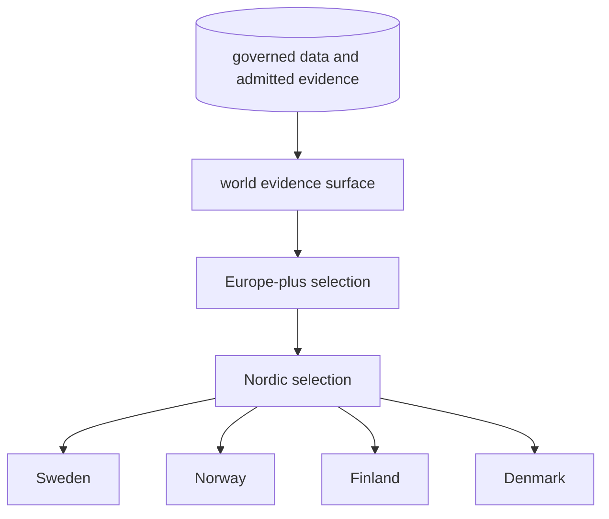
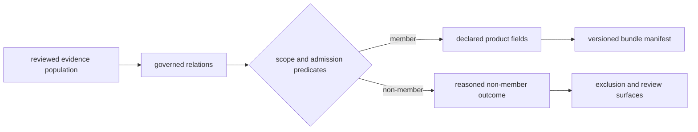
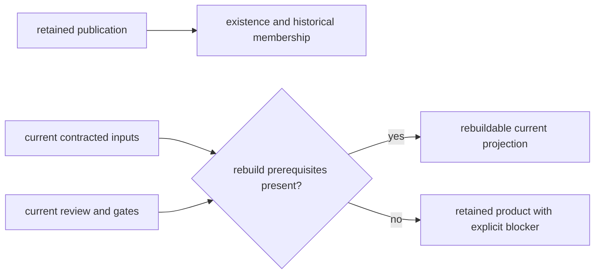
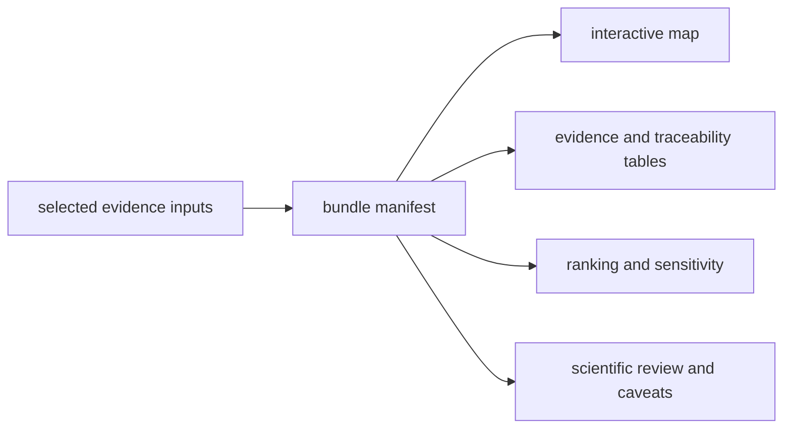
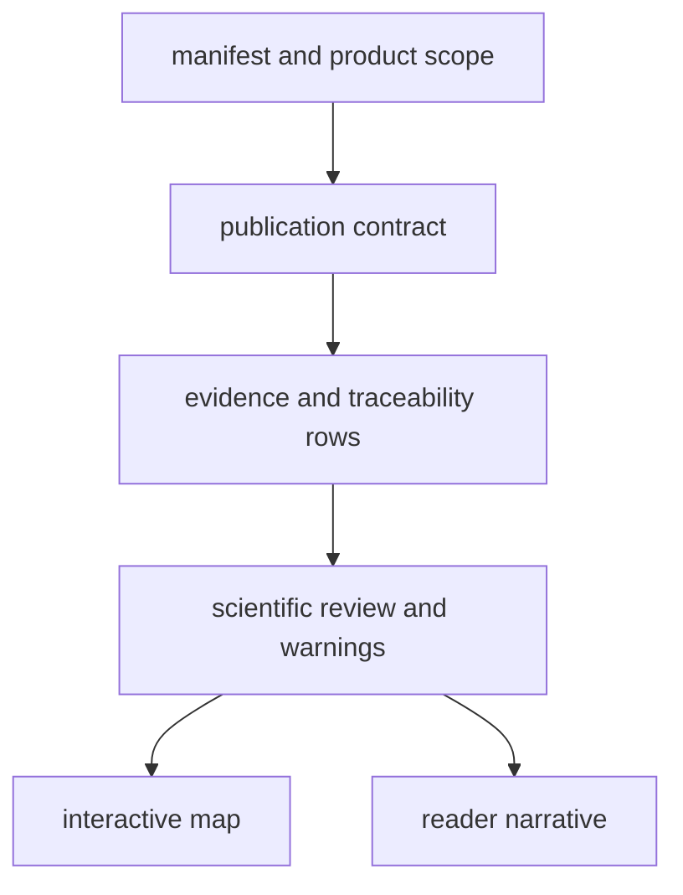
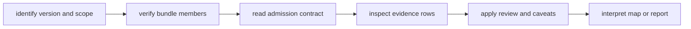
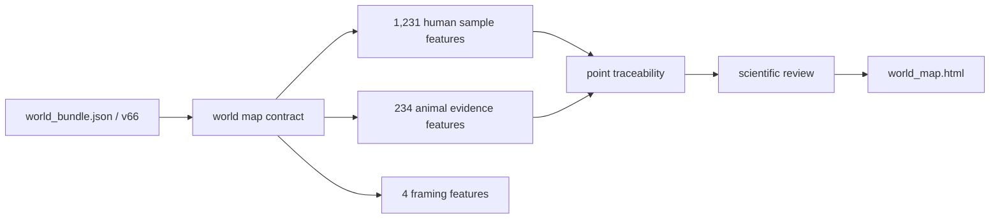

# Evidence Publications

Pollenomics publications are derived, versioned views over the governed data
state. Reports, maps, evidence tables, ranking outputs, and caveat surfaces are
assembled together so a visual result can be inspected alongside its inputs,
traceability, and scientific review.

## Geographic Lineage

The hierarchy is a lineage and subset contract. Regional and country outputs
are narrower selections over shared evidence; they are not separately curated
databases. Subset validation detects rows that appear in a child without a
governed parent or that change meaning between scopes.

## Publication As A Governed Query

A publication behaves like a recorded database query whose inputs, predicates,
members, and non-members remain inspectable:

| Query component | Governed publication equivalent |
| --- | --- |
| input population | versioned normalized and reviewed evidence identities |
| relation set | source, sample, site, locality, chronology, coordinate, and geography joins admitted by contract |
| predicates | product scope, evidence role, identity posture, spatial fitness, temporal fitness, and exclusion rules |
| projection | declared fields, units, coordinate posture, warnings, and source locators |
| result identity | bundle manifest, version, member IDs, and companion artifact inventory |
| non-member accounting | outside-scope, excluded, refused, conflicted, and deferred identities with reasons |

This is why a country map is not produced by clipping arbitrary coordinates.
Containment is only one predicate; evidence role, point class, chronology
posture, lineage, and product rules continue to govern the selected member.

### Projection Invariants

A publication projection is valid only when it preserves the semantics of the
database state it selects:

| Invariant | Required publication behavior |
| --- | --- |
| identity preservation | every member resolves to the same typed governed object used during admission |
| role preservation | direct evidence, context, sampling support, and framing remain distinguishable |
| precision preservation | projected fields do not imply finer place, time, or identity support than their authorities |
| state preservation | qualifications and conflicts material to use remain reachable; exclusions remain accounted for |
| population preservation | numerator, eligible denominator, scope, and observation unit travel with aggregate claims |
| revision consistency | manifest, members, traceability, warnings, and rendering derive from one database snapshot |

Projection may rename columns, select fields, transform coordinate
representation, or aggregate declared populations. It may not mint upstream
facts, discard a material qualification, or reinterpret a contextual member
as direct evidence.

## Product Existence And Rebuildability Differ

A committed publication can remain available after the current database state
reveals that one of its prerequisites is missing. The product then remains a
retained, versioned result; it is not silently certified as reproducible from
the present inputs.

| Question | Governing evidence |
| --- | --- |
| Does the product exist? | bundle manifest and committed member inventory |
| What did it publish? | product contract, evidence rows, exclusions, and review surfaces |
| Can the current snapshot rebuild it? | materialized source-family stages, exact input artifacts, and passing publication gates |
| Is it scientifically reusable now? | rebuildability plus the evidence and qualifications required by the proposed reuse |

The evidence-stage matrix can therefore report `published` while also
reporting a missing normalized or review stage. That combination is a visible
integrity warning, not a contradiction and not permission to infer the
missing evidence backward from the product.

## Publication Bundle

A geographic bundle can include:

- a manifest and summary;
- an interactive map document and local map assets;
- source-family GeoJSON layers;
- animal evidence and point-traceability tables;
- a map publication contract;
- candidate-site rankings and sensitivity results;
- a ranking-engine manifest; and
- scientific review in machine-readable and narrative forms.

The map is one consumer of the bundle, not the bundle's authority.

### Bundle Identity

A publication is identified by the combination of **version**, **geographic
scope**, **member inventory**, and **governing contracts**. Two bundles with the
same map title are not interchangeable when any of those fields differ.

| Identity field | Question it answers | Why it must travel with reuse |
| --- | --- | --- |
| version | which governed data state was published? | later recovery or review can change admission |
| scope | which geographic selection was applied? | a country result cannot stand for the Nordic or world collection |
| member inventory | which tables, layers, reviews, and rankings belong together? | prevents artifacts from different runs being combined |
| contract identity | which rules admitted and qualified records? | makes the visible subset reproducible |

The bundle is complete for interpretation only when its manifest, evidence
members, review surfaces, and renderings resolve to the same identity. A
standalone HTML map can remain useful for exploration, but it is not a complete
scientific publication.

### Member Decisions Travel With The Bundle

| Decision field | What it prevents |
| --- | --- |
| stable member identifier | confusing the same label across sources, scopes, or versions |
| source-family role | treating context, framing, and direct evidence as interchangeable |
| admission or exclusion reason | reading absence as proof that the source has no record |
| spatial basis and precision | inferring survey precision from marker placement |
| temporal posture | converting broad, contextual, or unresolved time into a numeric comparison |
| parent and child membership | double counting one record across nested geographic products |

These decisions are part of the publication even when a rendering does not
display every field. A map may shorten them for legibility; the evidence and
traceability members retain them for audit and reuse.

## Bundle Authority Order

When publication artifacts disagree, resolve the claim through the narrowest
governing surface:

1. the bundle manifest governs product identity, version, scope, and members;
2. the publication contract governs required layers, fields, and admission
   behavior;
3. point traceability and evidence tables govern visible record identity;
4. scientific review and warning surfaces govern material qualifications;
5. maps and narrative reports render and interpret that governed state.

A map label or narrative sentence cannot override a manifest member, evidence
identifier, precision posture, or material warning. If the rendered surface
disagrees, the rendering is stale or defective and must be corrected.

## Read A Bundle In Order

This order separates product discovery from claim evaluation. The manifest
locates the right product; the contract explains why records are present; the
evidence rows support the claim; review surfaces preserve qualifications; and
the rendering helps the reader see the result. Reversing that order risks
treating visual prominence as scientific authority.

## Worked Bundle: World v66

The checked-in world manifest makes the reading order concrete:

| Surface | Governed fact | Reader decision |
| --- | --- | --- |
| `world_bundle.json` | `scope_key: world`, version `v66`, generated `2026-06-22` | select the product identity before opening a rendering |
| `world_map_publication_contract.json` | five declared layer rows and their filter behavior | determine which roles are eligible at world scope |
| `world_point_traceability.json` | visible feature-to-evidence relations | resolve a marker to its governing row |
| `world_scientific_review.json` | qualifications and comparison limits | constrain interpretation |
| `world_map.html` | interactive rendering of the governed members | explore after scope and role are known |

The map contract currently declares 1,231 AADR features, one dromedary context
feature, 26 goat features, 207 horse features, and four boundary features.
Those counts are not one population: they mix human samples, differently
qualified animal evidence features, and geographic framing. The manifest binds
them into one product without making their observation units equivalent.

A valid world citation names `world`, `v66`, the relevant member identity, and
its governing evidence role. “Visible on the world map” is not enough to
distinguish a human sample, animal context feature, or boundary polygon.

## Publication Gates

Animal publication checks currently enforce that:

- published points retain the identity support declared by their point class:
  final sample lineage or visibly provisional project context;
- provisional project context does not become recovered sample evidence;
- sample-site disagreement is not flattened into one project locality;
- blocked sample-site rows do not publish as exact sites;
- unresolved or conflicting chronology does not enter country or atlas output;
- project-level locality substitution does not masquerade as sample evidence;
- broad chronology does not publish as a numeric time window; and
- contextual temporal rows remain distinguishable from numeric comparisons.

Passing these safeguards permits the qualified publication surface. It does
not authorize unrestricted precision or final-release maturity; those stronger
claims have separate evidence requirements.

## Choose A Publication

- [Geographic publication lineage](geographic-lineage.md) explains how world,
  regional, and country products preserve identity and subset meaning.
- [Reports](reports.md) provide scope-oriented narrative and inventories.
- [Maps](maps.md) provide visual exploration across evidence families.
- [Map inputs](map-inputs.md) identify the source files behind visible layers.
- [Point rules](point-rules.md) explain eligibility and coordinate posture.
- [Filters and popups](filters-and-popups.md) explain interactive selection and
  displayed metadata.
- [Publication types](publication-types.md) distinguish scientific evidence,
  context, framing, and review surfaces.
- [Collection summary](collection-summary.md) binds publications to the
  collected source state.
- [Limits](limits.md) records the boundaries that remain after a bundle passes
  its structural checks.

The generated [report portal](../../../report/index.md) provides direct access
to world, regional, country, review, and caveat outputs.

## Reuse Rule

Reuse the smallest surface that supports the claim. A map screenshot is enough
to illustrate layout, but not to support a sample-level scientific assertion.
For that, retain the evidence row, source lineage, locality and chronology
posture, coordinate basis, bundle version, and applicable caveats.

A reusable citation package therefore contains the product identity and the
narrowest evidence member that supports the statement. If that member cannot
be named, the statement is not yet traceable enough for scientific reuse.

For a count, also retain the observation unit, numerator, eligible population,
exclusions, and scope. “234 points” is a product-membership statement; it is
not a recovery rate until a defensible denominator and recovery rule are named.

The [revision and state model](../database/revision-and-state-model.md)
defines the database snapshot from which a projection receives its authority.
