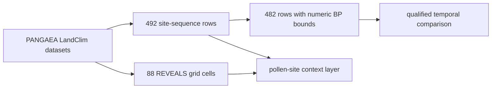

# LandClim Exports

LandClim exports provide Nordic pollen-sequence locations and REVEALS
vegetation-reconstruction coverage. They are environmental context with their
own observation units and time windows, not background decoration for an aDNA
map.

## Current Governed Surface

The checked-in normalized state contains:

| Surface | Count | Observation unit |
| --- | ---: | --- |
| pollen site-sequence rows | 492 | dataset-specific site sequence |
| rows with supported numeric time bounds | 482 | site sequence with numeric BP posture |
| REVEALS grid cells | 88 | reconstructed vegetation coverage cell |

The normalized artifacts are:

- `nordic_pollen_site_sequences.csv` for tabular reuse;
- `nordic_pollen_site_sequences.geojson` for site locations;
- `nordic_reveals_grid_cells.geojson` for reconstruction coverage; and
- `landclim_summary.json` for layer identities and counts.

## Site Rows And Grid Cells Are Not Interchangeable

A site row identifies one dataset-specific pollen sequence at a location and
can carry its own time window, source URL, and sequence metadata. A grid cell
summarizes published REVEALS coverage and can combine variables, datasets, and
multiple time windows. One site can contribute to broader reconstruction
context; that relationship does not make the site and cell the same record.

Names can recur across LandClim datasets. Stable `record_id` values retain the
dataset and location identity needed to avoid merging similarly named site
sequences by display label alone.

## Temporal Reading

Numeric `time_start_bp` and `time_end_bp` values support interval-aware
filtering for the 482 qualified rows. They do not guarantee equal dating
resolution, identical sampling intervals, or event-level contemporaneity with
an aDNA sample. The remaining rows are not zero-dated; their numeric posture is
unavailable under the normalized contract.

REVEALS grid cells can span many windows. Use their declared window coverage
rather than collapsing a cell to a single date. A cell's broad reconstruction
span must not be treated as a sample-owned chronology.

## Reuse Contract

Keep record identity, source DOI, geometry type, observation unit, dataset,
time bounds and label, record count, and popup/source details with each row.
When aggregating, keep site sequences separate from grid cells and state
whether the denominator is 492 site rows, 482 numerically qualified rows, or
88 coverage cells.

Continue to [LandClim source guidance](../sources/landclim.md) for acquisition
and normalization, [maps](maps.md) for layer interpretation, and
[chronology guidance](../evidence/chronology.md) for cross-family time claims.
