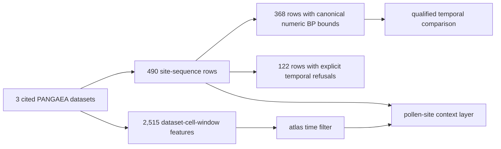
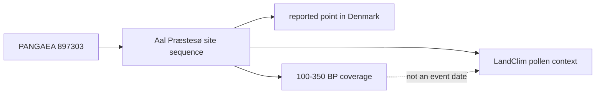

# LandClim Exports

LandClim exports provide Nordic pollen-sequence locations and REVEALS
vegetation-reconstruction coverage. They are environmental context with their
own observation units and time windows, not background decoration for an aDNA
map.

## Current Governed Surface

The checked-in normalized state contains:

| Surface | Count | Observation unit |
| --- | ---: | --- |
| pollen site-sequence rows | 490 | dataset-specific site sequence |
| rows with supported numeric time bounds | 368 | site sequence with canonical numeric BP posture |
| rows with refused time bounds | 122 | 112 negative-BP and 10 partial source intervals retained without canonical numeric bounds |
| aggregate REVEALS grid cells | 77 | discovery summary of reconstructed vegetation coverage |
| temporal REVEALS grid features | 2,515 | one dataset, cell, and published window |
| distinct modeled windows | 25 | explicit BP intervals available to the time filter |

The normalized artifacts are:

- `data/landclim/normalized/nordic_pollen_site_sequences.csv` for tabular
  reuse;
- `data/landclim/normalized/nordic_pollen_site_sequences.geojson` for site
  locations;
- `data/landclim/normalized/nordic_reveals_grid_cells.geojson` for
  aggregate reconstruction discovery;
- `data/landclim/normalized/nordic_reveals_temporal_grid_cells.geojson` for
  time-filterable, dataset-specific reconstruction values and uncertainty;
- `data/landclim/normalized/landclim_bibliography.json` for dataset citations
  and linked publications;
- `data/landclim/review/spatiotemporal_review.json` for coverage and linkage
  verification; and
- `data/landclim/normalized/landclim_summary.json` for layer identities and
  counts.

These paths identify the normalized family authority. Scope-specific copies in
report bundles remain product members whose lineage leads back to these
records; copying a feature into a map directory does not transfer ownership of
its sequence identity or temporal posture.

## Site Rows And Grid Cells Are Not Interchangeable

A site row identifies one dataset-specific pollen sequence at a location and
can carry its own time window, source URL, and sequence metadata. A grid cell
summarizes published REVEALS coverage and can combine variables, datasets, and
multiple time windows. One site can contribute to broader reconstruction
context; that relationship does not make the site and cell the same record.

Names can recur across LandClim datasets. Stable `record_id` values retain the
dataset and location identity needed to avoid merging similarly named site
sequences by display label alone.

## Temporal Reading

Numeric `time_start_bp` and `time_end_bp` values support interval-aware
filtering for the 368 qualified rows. They do not guarantee equal dating
resolution, identical sampling intervals, or event-level contemporaneity with
an aDNA sample. The remaining 122 rows are not zero-dated: their source values
remain inspectable while the canonical projection explicitly refuses 112
negative-BP intervals and 10 partial intervals.

REVEALS values are published as separate window features. The atlas selects
them by their numeric BP bounds instead of filtering one aggregate cell that
claims the whole Holocene. A selected window is still a modeled vegetation
estimate, not a sample-owned chronology or evidence of a continuous value
between adjacent windows.

The Marquer reconstruction contributes 309 grid-window features across 13
Nordic cells and 25 windows. LandClim I contributes 331 features across five
windows. LandClim II contributes 1,875 across 25 windows and retains standard
errors and cell quality where supplied. All 2,515 features have numeric bounds
and bibliography links. Missing source estimates remain absent rather than
becoming zero cover. The ten LandClim II site sequences without upstream
numeric bounds remain explicitly unresolved rather than receiving synthetic
dates.

## Worked Record: Aal Præstesø

The normalized LandClim feature for **Aal Præstesø** demonstrates the minimum
portable site-sequence claim:

| Field | Governed value | Interpretation |
| --- | --- | --- |
| `record_id` | `897303:Aal Præstesø:55.637778:8.257222` | dataset, label, and reported position form the retained record identity |
| country | Denmark | publication grouping, not the scientific identity |
| geometry | `8.257222, 55.637778` | GeoJSON longitude then latitude |
| source | `https://doi.org/10.1594/PANGAEA.897303` | LandClim dataset lineage |
| interval | `100-350 BP` | coverage attached to this site-sequence row |
| observation unit | one site sequence | not one pollen grain, sample event, or REVEALS cell |

The interval permits interval-aware filtering at the **site-sequence** level.
It does not state that every observation within the sequence has that date or
that another record overlapping `100-350 BP` represents the same event. If the
feature is exported without its `record_id`, source DOI, and observation unit,
the remaining name and point are insufficient to reconstruct that meaning.

## Reuse Contract

Keep record identity, source DOI, geometry type, observation unit, dataset,
time bounds and label, record count, and popup/source details with each row.
When aggregating, keep site sequences, aggregate discovery cells, and temporal
grid features separate. State whether the denominator is 490 site rows, 368
numerically qualified site rows, 77 aggregate cells, or 2,515
dataset-cell-window features. Preserve `dataset_id`, `parent_grid_record_id`,
numeric BP bounds, reconstruction values, uncertainty, and bibliography keys
when extracting temporal features.

Continue to [LandClim source guidance](../sources/landclim.md) for acquisition
and normalization, [maps](maps.md) for layer interpretation, and
[chronology guidance](../evidence/chronology.md) for cross-family time claims.
