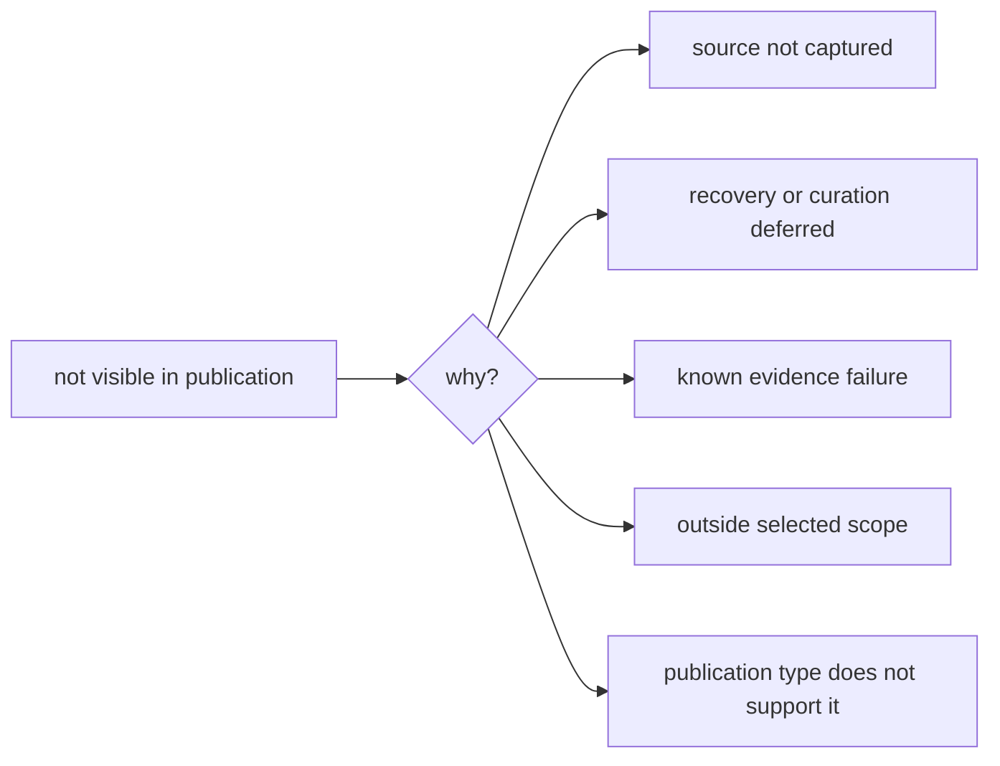

# Publication Limits

The checked-in publications are credible, inspectable evidence surfaces, but
they do not support every possible pollenomics claim. Limits are separated by
cause so missing source material, weak comparability, conservative admission,
and absent runtime capability are not mistaken for one generic disclaimer.

## Current Release Posture

The repository's generated release assessment refuses final-release language.
Its current blocking dimensions are:

- **animal data recovery**: sample extraction is not yet sufficiently complete
  and region-agnostic for the strongest coverage claims;
- **SEAD treatment**: access and temporal comparability remain weaker than the
  mature context surfaces; and
- **geographic extensibility**: the publication lineage and onboarding contract
  exist, but broader geographic proof is not yet established.

The animal publication gate passes its current anti-overclaim checks while
still reporting that reference-grade language is not allowed. These two results
are compatible: a conservative subset can be safely published before the
underlying recovery program is complete.

## Limits By Dimension

| Dimension | Supported use | Unsupported inference |
| --- | --- | --- |
| Coverage | inspect tracked and admitted records | assume absence means no relevant evidence exists |
| Locality | distinguish exact, qualified, broad, and blocked place claims | treat a project or region label as a sample site |
| Chronology | compare records carrying compatible temporal semantics | convert broad or contextual dates into precise numeric overlap |
| Coordinates | inspect direct or explicitly derived mapping posture | read marker precision as source precision |
| Cross-domain maps | explore co-located evidence families | infer causal, biological, or temporal association from proximity |
| Lake ranking | prioritize candidates under declared scoring and sensitivity | replace bathymetry, access, permitting, coring design, or field verification |
| AADR | use versioned public metadata | infer genotype processing or population-genetic analysis |
| Country views | inspect filtered descendants of the shared atlas state | treat a country bundle as an independent complete database |

## Visible Absence

These causes have different meanings. The exclusion and recovery surfaces are
necessary companions to the visible atlas because a clean map alone cannot
distinguish them.

## Map Boundaries

- Basemap tiles may still depend on external providers even though publication
  assets and Leaflet code are bundled locally.
- RAÄ is a Sweden-specific context source.
- Country and regional filters do not repair weak source geography.
- Popups summarize governed fields; they are not complete provenance records.
- Candidate rankings are sensitive to available layers, scoring assumptions,
  geographic scope, and missing evidence.

## Responsible Use

Before relying on a publication:

1. identify the bundle version and geographic scope;
2. determine the source family and its evidence role;
3. inspect point traceability and scientific review for consequential claims;
4. preserve precision and temporal posture when quoting or transforming data;
5. check exclusions and recovery gaps before interpreting absence; and
6. avoid language stronger than the current release posture.

The generated
[`repository_final_release_refusal`](../../../report/repository_final_release_refusal.md)
and [`repository_credibility_dashboard`](../../../report/repository_credibility_dashboard.md)
record the current machine-derived assessment. They should be read with the
specific evidence review relevant to the claim, not as substitutes for it.
