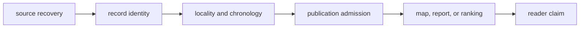
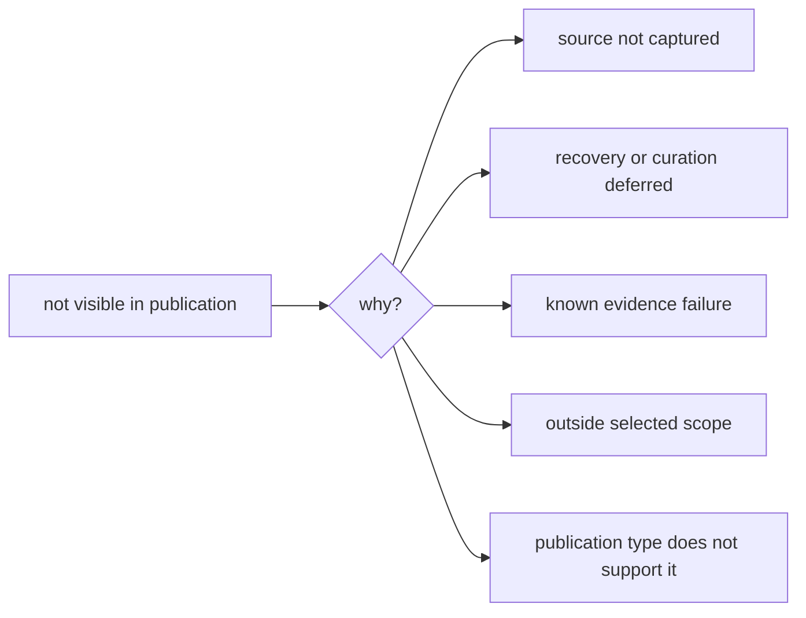

# Publication Limits

The checked-in publications are credible, inspectable evidence surfaces, but
they do not support every possible pollenomics claim. Limits are separated by
cause so missing source material, weak comparability, conservative admission,
and absent runtime capability are not mistaken for one generic disclaimer.

## Current Release Posture

The repository's generated release assessment refuses final-release language.
Its current blocking dimensions are:

- **animal data recovery**: sample extraction is not yet sufficiently complete
  and region-agnostic for the strongest coverage claims;
- **SEAD treatment**: access and temporal comparability remain weaker than the
  mature context surfaces; and
- **geographic extensibility**: the publication lineage and onboarding contract
  exist, but broader geographic proof is not yet established.

The animal publication gate passes its current anti-overclaim checks while
still prohibiting language that implies unrestricted precision. These two
results are compatible: a conservative subset can be safely published before
the underlying recovery program is complete.

## Quantified Boundaries

The current governed state makes several limits measurable:

| Surface | Current signal | Consequence |
| --- | --- | --- |
| Animal foundation preparation | 894 rows: 502 fully grounded, 256 partially grounded, 29 blocked by metadata, four by location detail, and 103 by chronology | preparation depth is measurable, but grounding posture is not sample identity or point eligibility |
| Animal sample recovery | 868 recovered rows across 40 projects; only four projects have a trustworthy expected count | recovered rows are auditable, but collection completeness is usually unknown |
| Animal locality | 820 direct sample-site assignments; 32 region-only; 16 unresolved | 48 samples cannot be described as exact sample sites |
| Animal publication points | 234 accepted point-evidence rows; 233 final sample-backed features and one provisional project-context feature | the point subset is traceable but identity and spatial support are mixed |
| Neotoma time | 175 of 200 sites have numeric BP spans; chronology rows are not captured | site-span comparison requires the Neotoma temporal caveat |
| SEAD time | 2,172 normalized sites and no numeric intervals in the current capture | use as archaeology context, not same-period support |
| RAÄ scope | Sweden-specific density source | do not generalize its coverage to the Nordic region |

These numbers are a snapshot of the governed artifacts, not permanent project
constants. The applicable manifests and review surfaces remain authoritative
when the data state changes.

The animal counts cannot be placed into one percentage without changing their
meaning. The 894-row foundation classifies preparation, the 868-row sample
master governs recovered identities, and the 234-row point surface governs
product membership. A publication limit must name which population is blocked
and which stronger claim the blocker prevents.

## Limits By Dimension

| Dimension | Supported use | Unsupported inference |
| --- | --- | --- |
| Coverage | inspect tracked and admitted records | assume absence means no relevant evidence exists |
| Locality | distinguish exact, qualified, broad, and blocked place claims | treat a project or region label as a sample site |
| Chronology | compare records carrying compatible temporal semantics | convert broad or contextual dates into precise numeric overlap |
| Coordinates | inspect direct or explicitly derived mapping posture | read marker precision as source precision |
| Cross-domain maps | explore co-located evidence families | infer causal, biological, or temporal association from proximity |
| Lake ranking | prioritize candidates under declared scoring and sensitivity | replace bathymetry, access, permitting, coring design, or field verification |
| AADR | use versioned public metadata | infer genotype processing or population-genetic analysis |
| Country views | inspect filtered descendants of the shared atlas state | treat a country bundle as an independent complete database |

## How Limits Propagate

A derived surface cannot be more certain than the evidence and rules that
produced it. Filtering, ranking, and rendering may narrow a question; they do
not repair missing recovery, ambiguous identity, broad chronology, or weak
coordinate support.

At each arrow, the downstream surface inherits the strongest applicable limit
from upstream. A precise marker cannot improve an approximate coordinate; a
country filter cannot make recovery complete; and a ranking cannot turn
contextual proximity into causal evidence.

## Claims The Release Does Not Support

The current publications must not be used to claim that:

- the collection is an exhaustive inventory of pollenomics evidence;
- absence from a map establishes biological, archaeological, or historical
  absence;
- all visible points have equivalent locality or chronological precision;
- every animal point represents a recovered source-native sample;
- proximity between evidence families establishes association,
  contemporaneity, or causation;
- a ranked lake has been field-validated or is ready for sampling; or
- passing a publication gate establishes final-release completeness.

These are claim boundaries, not defects hidden behind a generic disclaimer.
Each boundary names the additional evidence or validation that a stronger
interpretation would require.

### Known Point-Surface Exception

The single dromedary feature for Site 1040 near Wadi Halfa is admitted as
qualified project context. Its paper-backed place statement and approximate
named-place resolution support a visible spatial context feature. Its sample
identity remains provisional and its source-native sample row remains
unrecovered.

| Proposed use | Current decision | Evidence needed for stronger use |
| --- | --- | --- |
| show qualified dromedary project context | supported with approximate and provisional labels | current evidence is sufficient for this bounded product role |
| count recovered animal samples | exclude this feature from the recovered-sample population | recover and resolve the source-native sample row |
| compare sample chronology numerically | not supported | sample-owned chronology with eligible numeric semantics |
| claim exact excavation location | not supported | source-supplied or otherwise defensible site-level coordinate provenance |
| infer an independent biological observation | not supported | final sample identity and evidence separating the observation from project context |

This is a visible limit, not a reason to discard the other 233 point features.
It is also not a license to average the exception away. Downstream work either
uses the context feature under its declared role or excludes it with an
accounted reason.

## Visible Absence

These causes have different meanings. The exclusion and recovery surfaces are
necessary companions to the visible atlas because a clean map alone cannot
distinguish them.

Absence is therefore not one claim. “Not captured,” “captured but unresolved,”
“reviewed and refused,” “outside geographic scope,” and “unsupported by this
publication type” require different language and different next evidence. A
responsible downstream analysis should retain the reason rather than replace
all five with a single missing-value code.

| Absence class | Defensible statement | Evidence needed to go further |
| --- | --- | --- |
| not captured | the governed collection has no captured record | source discovery and recovery |
| captured but unresolved | a candidate record exists but lacks publishable qualification | identity, locality, chronology, or citation resolution |
| reviewed and refused | the record failed a named publication rule | corrected evidence and a new review decision |
| outside scope | the record was not selected for this product | inspect the parent or applicable geographic bundle |
| unsupported role | this publication type cannot answer the question | use a surface with the required evidence role |

## Map Boundaries

- Basemap tiles may still depend on external providers even though publication
  assets and Leaflet code are bundled locally.
- RAÄ is a Sweden-specific context source.
- Country and regional filters do not repair weak source geography.
- Popups summarize governed fields; they are not complete provenance records.
- Candidate rankings are sensitive to available layers, scoring assumptions,
  geographic scope, and missing evidence.

## Responsible Use

Before relying on a publication:

1. identify the bundle version and geographic scope;
2. determine the source family and its evidence role;
3. inspect point traceability and scientific review for consequential claims;
4. preserve precision and temporal posture when quoting or transforming data;
5. check exclusions and recovery gaps before interpreting absence; and
6. avoid language stronger than the current release posture.

For lake prioritization, treat the ranking as a reproducible screening model,
not a fieldwork decision. A high score identifies a candidate supported by the
available and weighted layers. It does not establish sediment preservation,
basin geometry, access, legal permission, sampling feasibility, or the absence
of uncaptured evidence around lower-ranked lakes.

For cross-domain interpretation, report proximity and temporal compatibility
as separate findings. Co-location is not contemporaneity; contemporaneity is
not causation; contextual archaeology or pollen is not direct evidence about a
particular human or animal sample.

### Match A Limit To The Intended Reuse

| Intended reuse | Limit that must travel with it |
| --- | --- |
| recovered-sample analysis | project denominator coverage, identity posture, and exclusion of project-context members |
| point or distance analysis | locality ownership, coordinate basis, precision, withheld geography, and boundary sensitivity |
| chronology-aware comparison | source wording, numeric eligibility, dating basis, precision, and incomparable records |
| source-coverage statement | discovery and capture population, access failures, expected denominator, and recovery state |
| map screenshot or extract | product version, scope, active filters, member identities, roles, caveats, and exclusion context |

A generic citation to “the atlas” cannot carry these limits. The reusable unit
is the bounded claim plus its evidence and qualification packet.

The generated
[`repository_final_release_refusal`](../../../report/repository_final_release_refusal.md)
and [`repository_credibility_dashboard`](../../../report/repository_credibility_dashboard.md)
record the current machine-derived assessment. They should be read with the
specific evidence review relevant to the claim, not as substitutes for it.
