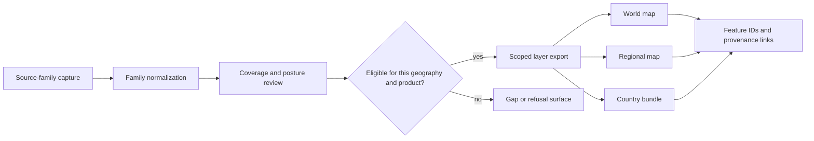

# Map inputs

The atlas is assembled from governed evidence layers, geographic framing, and
publication decisions. There is no single coordinate table that defines the
map. Each visible feature retains a source-family role and a path back to the
normalized or reviewed record that authorized it.

## The six governed input families

| Input | Role in the atlas | Governing surface | Interpretation limit |
| --- | --- | --- | --- |
| LandClim | primary pollen context | `data/landclim/normalized/landclim_summary.json` | pollen sequences and grids, not direct human or animal evidence |
| Neotoma | primary pollen context | `data/neotoma/raw/neotoma_pollen_sites.json` and normalized outputs | separate pollen inventory with uneven temporal support |
| SEAD | contextual archaeology | `data/sead/raw/nordic_sites.json` and reviewed outputs | environmental archaeology context, not uniformly dated evidence |
| RAÄ | contextual archaeology | `data/raa/normalized/sweden_archaeology_layer.json` | Sweden-scoped density context, not Nordic-wide site coverage |
| Nordic boundaries | geographic framing | `data/boundaries/normalized/nordic_country_boundaries.geojson` | scope and clipping only; contributes no evidence score |
| Animal aDNA | sample-backed evidence and explicit refusals | species-normalized records plus publication reviews | visible subset of an incomplete recovery program |

SVAR lake records provide the authoritative candidate-lake anchors for the
Sweden priority analysis. Human aDNA exports and additional report layers enter
the products that declare them, but their presence does not change the role of
the six audited atlas families above.

## Assembly and review

Eligibility is evaluated for a particular product. A record admitted to a
world layer is not automatically Nordic evidence; a Sweden density layer is
not automatically available for another country; and a tracked animal project
is not automatically a mapped sample.

## What a scoped export must preserve

A public layer must retain enough structure to answer:

- which source family supplied the feature;
- whether the feature is direct evidence, context, or framing;
- which geography admitted it and why;
- which normalized identity and source record it came from;
- whether its coordinates are direct, resolved, or withheld;
- whether its temporal semantics permit numeric comparison;
- which rows were excluded or refused rather than silently dropped.

This is also why visual filters are not the publication boundary. A feature
must already belong to the scoped export before the browser can show or hide
it. Client-side controls cannot authorize an otherwise ineligible record.

## Geographic products are subsets

World, regional, and country outputs have explicit publication contracts. A
regional bundle must be a defensible subset of its upstream evidence, and a
country bundle must preserve sample, locality, chronology, coordinate, and
citation linkage for every included direct-evidence feature.

Boundary polygons frame those subsets but never increase evidence strength.
Context layers may explain what surrounds a sample or lake, yet proximity does
not turn them into sample-owned proof.

## Tracing a visible feature

Use the feature's layer and stable identifier to follow this route:

1. identify the product contract under `docs/report/world/`,
   `docs/report/regions/<region>/`, or the country publication root;
2. locate the feature in the corresponding GeoJSON or evidence-row export;
3. follow its source-family, sample, site, or source identifiers into the
   normalized data root;
4. inspect coordinate and temporal semantics before comparing it with another
   layer;
5. check the refusal and coverage surfaces when expected evidence is absent.

The [repository atlas input audit](../../../report/repository_atlas_input_audit.md)
summarizes the active input families and their tracked metrics. The
[cross-domain evidence matrix](../../../report/repository_cross_domain_evidence_matrix.md)
shows their responsibilities, while [point publication rules](point-rules.md)
define the direct-evidence admission boundary.
