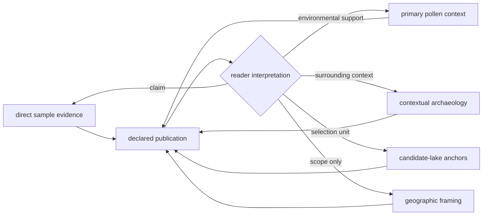
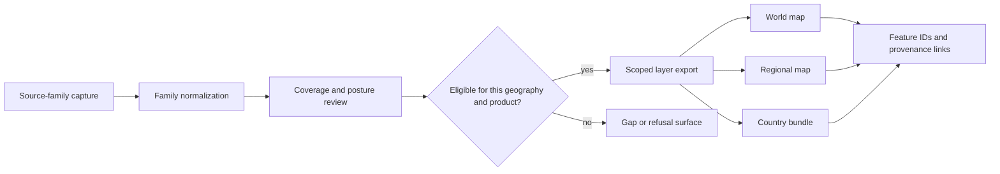
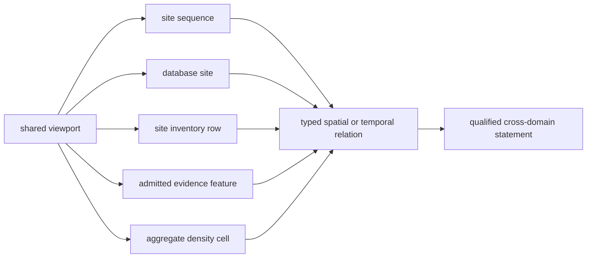
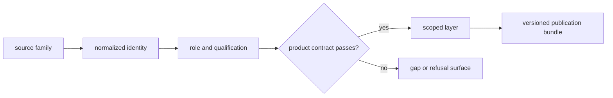

# Map Inputs

The atlas is assembled from governed evidence layers, geographic framing, and
publication decisions. There is no single coordinate table that defines the
map. Each visible feature retains a source-family role and a path back to the
normalized or reviewed record that authorized it.

## The Six Governed Input Families

| Input | Role in the atlas | Governing evidence surface | Interpretation limit |
| --- | --- | --- | --- |
| LandClim | primary pollen context | `data/landclim/normalized/nordic_pollen_site_sequences.geojson` | pollen sequences and grids, not direct human or animal evidence |
| Neotoma | primary pollen context | `data/neotoma/normalized/nordic_pollen_sites.geojson` | separate pollen inventory with uneven temporal support |
| SEAD | contextual archaeology | `data/sead/normalized/nordic_environmental_sites.geojson` | environmental archaeology context, not uniformly dated evidence |
| RAÄ | contextual archaeology | `data/raa/normalized/sweden_archaeology_layer.json` | Sweden-scoped density context, not Nordic-wide site coverage |
| Nordic boundaries | geographic framing | `data/boundaries/normalized/nordic_country_boundaries.geojson` | scope and clipping only; contributes no evidence score |
| Animal aDNA | sample-backed evidence plus visibly qualified project context and explicit refusals | `data/adna/final/atlas/animal_atlas_point_candidates.json` | point classes must remain distinct within an incomplete recovery program |

Summary files and raw captures remain important refresh and review anchors,
but they do not replace the normalized or admitted surface that governs a
visible layer. This distinction matters when a raw inventory contains rows
that normalization later excludes or qualifies.

SVAR lake records provide the authoritative candidate-lake anchors for the
Sweden priority analysis. Human aDNA exports and additional report layers enter
the products that declare them, but their presence does not change the role of
the six audited atlas families above.

## Evidence Role Is Part Of The Layer

Layer co-location does not collapse these roles. A boundary can select a
country but cannot support a scientific score. An archaeology layer can
describe surrounding evidence without becoming a sample observation. A pollen
sequence can supply palaeoenvironmental context without becoming direct aDNA
evidence.

## Assembly And Review

Eligibility is evaluated for a particular product. A record admitted to a
world layer is not automatically Nordic evidence; a Sweden density layer is
not automatically available for another country; and a tracked animal project
is not automatically a mapped sample.

### Layer Assembly Packet

Each emitted layer can be reconstructed from a bounded packet:

| Packet member | What it controls |
| --- | --- |
| source population | exact normalized or reviewed input identities and version |
| relation contract | allowed joins from source record to evidence and geography |
| selection contract | product scope, evidence roles, point classes, and fitness predicates |
| field projection | properties retained for identity, provenance, space, time, role, and qualification |
| member inventory | stable feature IDs included in the layer |
| non-member inventory | excluded, refused, deferred, or outside-scope candidates and reasons |

The layer count is derived from the member inventory. It cannot substitute for
that inventory, and a browser filter cannot alter it. This makes a layer
rebuild reviewable as an identity and decision diff rather than a visual map
comparison.

### Materialized Input Contract

A layer is available for assembly only when the exact artifact named by its
source-family contract exists with governed content. Related files do not
satisfy that requirement:

| Available artifact | Missing artifact | Result |
| --- | --- | --- |
| source manifest | contracted raw capture | source identity known; raw stage still missing |
| normalized summary and count | contracted normalized member dataset | coverage may be described; layer cannot be rebuilt |
| evidence-stage matrix | source-specific review | review stage remains missing |
| retained published GeoJSON | its current normalized authority | product remains inspectable; current rebuild is blocked |
| empty directory or `.gitkeep` | any contracted evidence artifact | no stage evidence |

This rule prevents a downstream map layer from being treated as a convenient
backup of its own source. Recovery begins at the governing input or review
surface and then regenerates the scoped export and bundle.

The current input scale is intentionally heterogeneous: 492 LandClim site
sequences, 200 Neotoma sites, 2,172 normalized SEAD sites, a RAÄ density source
covering 761,917 published Swedish sites, four Nordic boundary polygons, and
234 reviewed animal publication points. These counts describe different units
and roles and must never be summed into one evidence total.

## One Viewport, Different Scientific Objects

A LandClim marker, a Neotoma marker, a SEAD marker, an animal point, and a RAÄ
density cell may overlap visually while answering different questions:

| Visible object | Example meaning | Valid comparison | Invalid promotion |
| --- | --- | --- | --- |
| LandClim point | one dataset-specific pollen site sequence such as Aal Præstesø | compare declared sequence coverage and location | call the point a dated pollen event |
| Neotoma point | one database site such as Abborrtjärnen with nested collections and samples | compare site-level coverage under its temporal posture | count nested samples as independent map points |
| SEAD point | one captured environmental-archaeology site inventory row | report a declared spatial relation | infer same-period association without recovered chronology |
| animal point | one product-admitted animal evidence feature | follow sample or project identity and qualification | treat all admitted points as equally complete samples |
| RAÄ cell | aggregate count of selected registry records in one grid cell | compare declared density cells | reconstruct synthetic archaeological site coordinates |

The correct cross-layer join is therefore a typed relation between two named
members, not a merge on marker position. Its result records the two source
identities, relation rule, distance or interval calculation, scope, and the
weaker input posture.

## Layer Acceptance Contract

Each exported layer answers five questions before it enters a bundle:

| Contract field | Required answer |
| --- | --- |
| identity | what stable feature and source-family identifiers survive export? |
| role | is the feature direct evidence, primary context, contextual archaeology, a candidate anchor, or framing? |
| admission | which normalized or reviewed surface authorized inclusion? |
| qualification | which spatial, temporal, and citation limits travel with the feature? |
| scope | which world, regional, or country product selected it? |

If a layer cannot answer all five, it may be useful source material but is not
ready to function as a governed publication input.

The refusal branch is part of the evidence architecture. It keeps a visually
clean layer from concealing records that were captured but could not support
the product's claims.

## What A Scoped Export Must Preserve

A public layer must retain enough structure to answer:

- which source family supplied the feature;
- whether the feature is direct evidence, context, or framing;
- which geography admitted it and why;
- which normalized identity and source record it came from;
- whether its coordinates are direct, resolved, or withheld;
- whether its temporal semantics permit numeric comparison;
- which rows were excluded or refused rather than silently dropped.

This is also why visual filters are not the publication boundary. A feature
must already belong to the scoped export before the browser can show or hide
it. Client-side controls cannot authorize an otherwise ineligible record.

## Geographic Products Are Subsets

World, regional, and country outputs have explicit publication contracts. A
regional bundle must be a defensible subset of its upstream evidence, and a
country bundle must preserve sample, locality, chronology, coordinate, and
citation linkage for every included direct-evidence feature.

Boundary polygons frame those subsets but never increase evidence strength.
Context layers may explain what surrounds a sample or lake, yet proximity does
not turn them into sample-owned proof.

### Use The Correct Denominator

Layer counts have meaning only against the population from which they were
selected. For animal points, distinguish tracked projects, recovered samples,
locality-qualified samples, and admitted point rows. For pollen and archaeology
layers, retain the applicable source inventory and temporal posture. Reporting
only the number of visible markers makes conservative admission look like
collection completeness and makes heterogeneous layers look comparable when
they are not.

## Tracing A Visible Feature

Use the feature's layer and stable identifier to follow this route:

1. identify the product contract under `docs/report/world/`,
   `docs/report/regions/<region>/`, or the country publication root;
2. locate the feature in the corresponding GeoJSON or evidence-row export;
3. follow its source-family, sample, site, or source identifiers into the
   normalized data root;
4. inspect coordinate and temporal semantics before comparing it with another
   layer;
5. check the refusal and coverage surfaces when expected evidence is absent.

The [repository atlas input audit](../../../report/repository_atlas_input_audit.md)
summarizes refresh anchors and tracked metrics for the active input families.
The source-fact ownership registry identifies the governing evidence surfaces.
The
[cross-domain evidence matrix](../../../report/repository_cross_domain_evidence_matrix.md)
shows their responsibilities, while [point publication rules](point-rules.md)
define the direct-evidence admission boundary.
