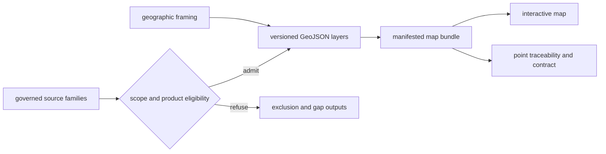
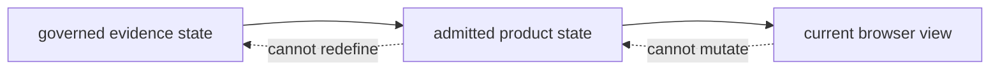

# Maps

Maps are scoped views over admitted evidence, contextual layers, and geographic
framing. They reveal spatial relationships quickly, while their contracts and
traceability surfaces preserve the slower answer to why each feature appears.

## Map Assembly

The browser is a consumer. Its filters can hide admitted features but cannot
admit new ones. Popup text can summarize a record but cannot replace its
evidence row.

The map publication contract makes that boundary inspectable. It declares the
scope and parent scope, artifact membership, countries, roles, layer rows,
legend sections, filter surfaces, bounds, initial view, basemap, and visible
caveats. The HTML map renders the contract; it is not the contract itself.

## Three States Behind One View

An interactive map combines three states that must remain distinguishable:

| State | Owned by | What can change it |
| --- | --- | --- |
| evidence state | source and curated evidence authorities | source capture, normalization, or review decision |
| product state | manifest, admission, layer, and traceability contracts | governed publication regeneration |
| view state | browser filters, layers, viewport, selection, and basemap | reader interaction |

A feature hidden by a country or time filter remains a product member. A
feature absent from the product may be excluded, outside scope, unresolved, or
unrecovered. A changed viewport has no evidentiary meaning. Reproducible map
discussion therefore names all three states instead of treating the screenshot
as the dataset.

## Reading Layers

| Layer role | Safe interpretation | Required follow-up for a stronger claim |
| --- | --- | --- |
| direct evidence | admitted sample or observation at declared precision | sample, locality, chronology, coordinate, and citation lineage |
| environmental context | surrounding palaeoenvironmental signal | source-specific temporal and observation-unit semantics |
| archaeological context | nearby or scoped archaeology records | dating and registry limits; proximity is not ownership |
| decision support | ranked or scored candidate geometry | ranking model, inputs, and sensitivity output |
| framing | boundary or viewport | none as scientific evidence; framing carries no evidence weight |

### Check Compatibility Before Comparing Layers

| Dimension | Compatibility question | If the answer is no |
| --- | --- | --- |
| observation unit | are both features sites, samples, modeled cells, registry records, or another declared unit? | describe the layers separately |
| evidence role | are both direct evidence, or is one contextual or framing information? | do not assign equal evidentiary weight |
| spatial support | do point, polygon, grid, and approximate-location semantics support the proposed relation? | qualify or refuse the spatial comparison |
| temporal support | do both records have compatible admitted time postures? | restrict the result to spatial context |
| population | are capture scope, filters, and exclusions known for both layers? | do not interpret density or emptiness as abundance or absence |

The browser can make incompatible features look visually commensurate because
all geometry shares one viewport. Compatibility is established from the layer
contracts and evidence fields, not from symbol size, color, or proximity.

## Geographic Subsets

World, Europe-plus, Nordic, and country maps form a subset lineage. Narrowing
scope must preserve feature identity and meaning. It may apply a stricter
product rule, but it must not invent a child feature, strengthen coordinate
precision, or reclassify context as direct evidence.

Subset validation answers product lineage, not scientific coverage. A valid
Nordic subset can still contain uneven source recovery by country, species, or
period. The manifest establishes which governed members were selected; family
coverage and exclusion surfaces explain the population from which selection
occurred.

## Spatial Relationships The Map Does Not Prove

| Visual pattern | What is visible | What remains unproven |
| --- | --- | --- |
| two nearby points | co-location at the displayed precision | contemporaneity, interaction, or shared cause |
| dense cluster | many admitted features in the rendered area | historical abundance or uniform sampling effort |
| point inside a boundary | coordinate falls within current framing geometry | historical political affiliation |
| lake near archaeology context | proximity under the current map projection | depositional linkage or field suitability |
| empty area | no visible admitted feature under current filters | absence in the source, past landscape, or recovery queue |

Temporal posture, coordinate confidence, source role, and product membership
must be compatible before proximity becomes a defensible comparison. The map
helps locate candidates for that comparison; it does not perform the
evidential join by appearance.

## Auditing A Feature

1. record the map scope, version, layer, and stable feature identifier;
2. locate the feature in the corresponding layer or evidence-row export;
3. inspect the geography's publication contract and point-traceability table;
4. follow source, sample, site, chronology, and coordinate identifiers to the
   governed data surface;
5. check the exclusion output when an expected feature is absent.

A cluster supports a statement about the visible product, not necessarily
sampling intensity or historical abundance. An empty area may mean no admitted
record, incomplete source recovery, incompatible temporal support, or true
source absence; the map alone cannot choose among those explanations.

## Preserve Meaning When Exporting A View

A screenshot preserves pixels but loses membership and provenance. A GeoJSON
file preserves features but can still lose the parent scope, evidence roles,
filter state, caveats, and exclusion context. A reusable map extract therefore
travels with its publication contract, product manifest, selected feature
identifiers, traceability, temporal semantics, coordinate-confidence fields,
and visible warnings.

Record filters separately from product membership. “Hidden by the reader” and
“excluded by the publication contract” are different states and lead to
different scientific interpretations.

For a reproducible view, record the bundle version, scope, active layers,
filter values, selected identifiers, basemap, viewport, and export time. Those
details reproduce presentation. The product manifest and evidence rows remain
necessary to reproduce membership and scientific meaning.

Audit anchors include the
[world map publication contract](../../../report/world/world_map_publication_contract.md),
[Nordic point traceability](../../../report/regions/nordic/nordic_point_traceability.md),
[atlas input audit](../../../report/repository_atlas_input_audit.md), and
[animal atlas exclusion report](../../../report/animal_atlas_exclusion_report.md).
Candidate admission and refusal are also recorded in
`data/adna/final/atlas/animal_atlas_candidate_accountability.md`.
Continue with [map inputs](map-inputs.md), [point rules](point-rules.md), and
[filters and popups](filters-and-popups.md).
