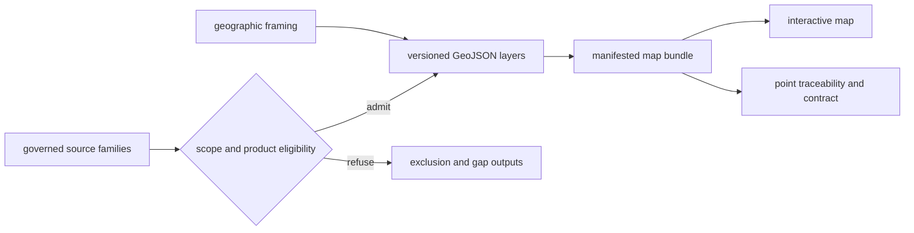

# Maps

Maps are scoped views over admitted evidence, contextual layers, and geographic
framing. They reveal spatial relationships quickly, while their contracts and
traceability surfaces preserve the slower answer to why each feature appears.

## Map Assembly

The browser is a consumer. Its filters can hide admitted features but cannot
admit new ones. Popup text can summarize a record but cannot replace its
evidence row.

## Reading Layers

| Layer role | Safe interpretation | Required follow-up for a stronger claim |
| --- | --- | --- |
| direct evidence | admitted sample or observation at declared precision | sample, locality, chronology, coordinate, and citation lineage |
| environmental context | surrounding palaeoenvironmental signal | source-specific temporal and observation-unit semantics |
| archaeological context | nearby or scoped archaeology records | dating and registry limits; proximity is not ownership |
| decision support | ranked or scored candidate geometry | ranking model, inputs, and sensitivity output |
| framing | boundary or viewport | none as scientific evidence; framing carries no evidence weight |

## Geographic Subsets

World, Europe-plus, Nordic, and country maps form a subset lineage. Narrowing
scope must preserve feature identity and meaning. It may apply a stricter
product rule, but it must not invent a child feature, strengthen coordinate
precision, or reclassify context as direct evidence.

## Auditing A Feature

1. record the map scope, version, layer, and stable feature identifier;
2. locate the feature in the corresponding layer or evidence-row export;
3. inspect the geography's publication contract and point-traceability table;
4. follow source, sample, site, chronology, and coordinate identifiers to the
   governed data surface;
5. check the exclusion output when an expected feature is absent.

A cluster supports a statement about the visible product, not necessarily
sampling intensity or historical abundance. An empty area may mean no admitted
record, incomplete source recovery, incompatible temporal support, or true
source absence; the map alone cannot choose among those explanations.

Audit anchors include the
[world map publication contract](../../../report/world/world_map_publication_contract.md),
[Nordic point traceability](../../../report/regions/nordic/nordic_point_traceability.md),
[atlas input audit](../../../report/repository_atlas_input_audit.md), and
[animal atlas exclusion report](../../../report/animal_atlas_exclusion_report.md).
Candidate admission and refusal are also recorded in
`data/adna/final/atlas/animal_atlas_candidate_accountability.md`.
Continue with [map inputs](map-inputs.md), [point rules](point-rules.md), and
[filters and popups](filters-and-popups.md).
