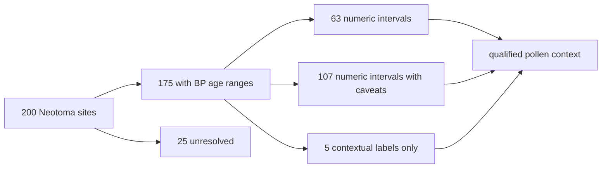

# Neotoma Exports

Neotoma exports provide Nordic pollen-site context from the Neotoma
Paleoecology Database. The normalized layer combines stable site identity,
location, collection summaries, source links, and explicit temporal semantics
without converting site-level age coverage into sample-event chronology.

## Current Governed Surface

The point layer contains **200 Nordic sites**. Its temporal review separates
the sites as follows:

| Posture | Sites | Permitted reading |
| --- | ---: | --- |
| numeric interval | 63 | site-level BP coverage can participate in numeric interval comparison |
| numeric interval with caveat | 107 | numeric comparison retains a material qualification |
| contextual label only | 5 | display and group as temporal context, not numeric overlap |
| unresolved | 25 | no temporal comparison |

In total, 175 sites carry BP age-range information, but the five
contextual-only sites are not promoted into numeric comparability. None of the
200 sites has captured chronology rows in the current repository state. The
available bounds are site-level pollen coverage spans, not sample-owned dates.

## Artifacts And Identity

- `nordic_pollen_sites.csv` is the tabular normalized surface;
- `nordic_pollen_sites.geojson` is the mapped point surface; and
- `review/temporal_review.{json,csv,md}` exposes the temporal classification
  and its denominators.

`record_id` retains Neotoma site identity. Site name or coordinates are not
safe substitutes: names can recur, coordinates can be revised, and one site
can contain multiple collection units, datasets, samples, or taxa.

## Temporal Contract

`time_start_bp`, `time_end_bp`, and `time_mean_bp` summarize site coverage only
when the review supports them. The accompanying temporal-semantics object names
evidence class, precision, comparability posture, window, provenance locator,
and comparison note.

An interval overlap with a human or animal aDNA row means their declared
windows intersect. It does not prove that pollen deposition and the dated
individual represent the same event, locality process, or causal relationship.

## Reuse Contract

Carry the site identifier, source URL, geometry, collection counts, original
age-unit labels, normalized bounds, temporal posture, caveats, and review
version together. State whether an analysis uses all 200 sites, the 175 sites
with BP ranges, the 170 numerically comparable sites, or only the 63
non-caveated numeric intervals.

Continue to [Neotoma source guidance](../sources/neotoma.md) for acquisition
and source semantics, [maps](maps.md) for spatial comparison, and
[chronology guidance](../evidence/chronology.md) for cross-family time claims.
