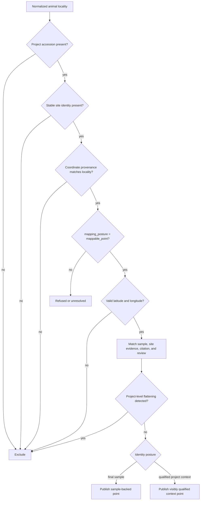
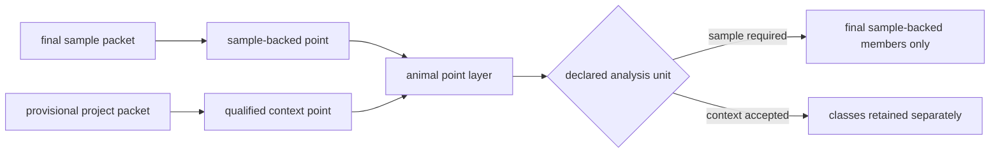
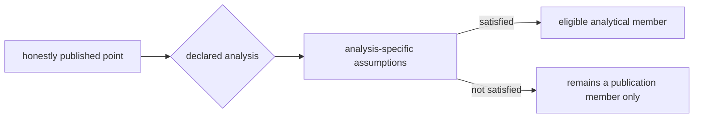
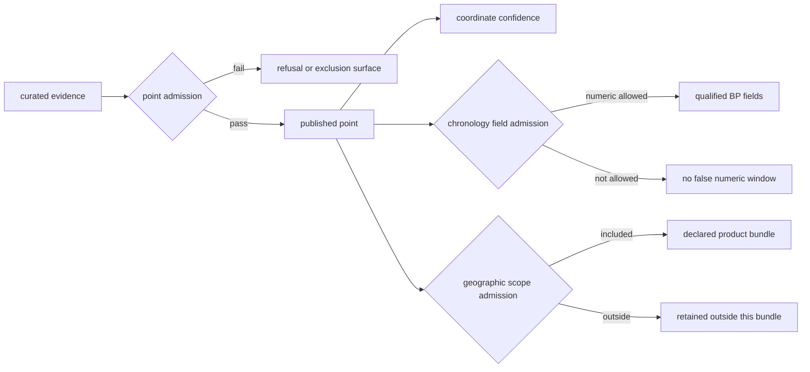

# Point Publication Rules

A point is published only when the repository can reconstruct what it
represents, where its coordinate came from, and which evidence rows support it.
The rule is deliberately asymmetric: unresolved evidence can remain in the
curated collection, but it cannot borrow visual certainty from a map marker.

## Current Published Point Posture

The animal point-evidence review contains 234 accepted rows. Of these, 233 use
coordinates captured directly from supplementary tables and carry `exact`
coordinate confidence. One uses documented named-site geocoding and carries
`approximate` confidence. The public surface therefore contains qualified
coordinate classes; it must not be described as entirely source-coordinate
backed.

Identity posture is mixed as well. The 233 supplementary-coordinate features
contain final, directly extracted sample identities. The single Wadi Halfa
dromedary feature contains a provisional project-anchored identity with
`sample_evidence_status: not_yet_recoverable`. It is a qualified context point,
not a recovered sample point.

Acceptance applies to the declared point product. It does not certify complete
project recovery, equal coverage across species, or unrestricted analytical
fitness. The animal publication gate currently passes all ten anti-overclaim
and traceability checks. The supported claim is narrower: every admitted
marker can be traced through the evidence fields required by this product.
Project completeness, species completeness, and suitability for an analysis
that needs uniform ascertainment remain outside that claim.

### What The Published Marker Establishes

| Reader question | Answer supported by an admitted marker | Claim not established by the marker |
| --- | --- | --- |
| What is it? | a stable feature linked to species and project, plus final sample evidence when recovered | that every admitted feature is a recovered sample or an exhaustive inventory |
| Why is it here? | a locality and coordinate decision with recorded provenance | survey-grade positional accuracy unless the source establishes it |
| How certain is the position? | the published `exact` or `approximate` coordinate class | identical precision across all markers |
| When is it from? | only the chronology posture and fields admitted for that row | a numeric date where the evidence is contextual, broad, or conflicting |
| Why is it visible? | membership in the named product under its admission contract | eligibility for every regional subset or analytical use |

In this contract, `exact` identifies a coordinate transcribed from a governed
source rather than a coordinate resolved by the repository. It does not add a
measurement precision that the source never reported.

## Animal Point Admission

The emitted row carries stable feature, evidence-row, and site identifiers;
species and support class; locality and coordinate provenance; project and
sample identifiers; paper and supplement citations; site-evidence text; scope
inclusion; and chronology at the precision allowed for publication.

For the qualified project-context branch, “sample identifier” means the
retained project-anchored token and must travel with its provisional resolution
and unrecovered-sample status. It must not be presented as equivalent to a
source-native sample identifier.

### Current Point Classes

| Product class | Features | Minimum identity | Coordinate posture | Claim ceiling |
| --- | ---: | --- | --- | --- |
| sample-backed animal point | 233 | final extracted sample identity | supplementary-table coordinate | qualified sample presence at the reported point |
| project-context animal point | 1 | paper-pinned project context; sample not yet recoverable | approximate Wadi Halfa named-place geocode | qualified spatial context for the tracked project |

The two classes share a point layer because both satisfy the current spatial
product contract. They do not share analytical eligibility. Sample-level
counts, recovery estimates, and independent-observation analyses must use the
first class unless they declare and defend a different unit.

### Compare Two Admission Packets

The distinction is visible in the evidence required to build each feature:

| Packet member | Direkli goat sample | Wadi Halfa dromedary context |
| --- | --- | --- |
| governed identity | final sample `SAMEA4453841` in project `PRJEB90141` | provisional project-anchored token in `SRP073444` |
| source locator | supplementary workbook, Table S2, row 2 | paper-backed named-place statement |
| locality | sample-owned Direkli Cave | project-context Wadi Halfa |
| coordinate | supplementary-table coordinate, `exact` source class | named-place geocode, `approximate` class |
| sample evidence status | recovered final sample | `not_yet_recoverable` |
| permitted point claim | qualified sample presence at the reported point | qualified project-context spatial presence |
| forbidden promotion | complete project recovery or uniform ascertainment | recovered sample, exact excavation coordinate, or sample-level count |

Both packets can satisfy the spatial product, but they answer different
questions. Any export or analysis that drops `sample_identity_resolution`,
`sample_evidence_status`, coordinate class, or evidence role destroys the
distinction on which their joint visibility depends.

## Admission And Field Qualification

A row-level admission and a field-level admission answer different questions:

| Decision | Question | Possible result |
| --- | --- | --- |
| point admission | is there enough identity, locality, coordinate, and citation support to draw this point? | publish, refuse, or exclude |
| coordinate qualification | was the pair reported directly or resolved from a named place? | exact or approximate confidence |
| chronology admission | may numeric time fields appear for this point? | precise interval, qualified context, or no numeric fields |
| scope admission | does the point belong in this world, regional, or country product? | include with reason or omit from that scope |

A point can pass spatial admission while numeric chronology remains absent.
Likewise, a point accepted on the world surface can remain outside a Nordic or
country subset. The public row must preserve those decisions rather than
compress them into one status.

### Admission Is Conjunctive

For direct animal evidence, a marker is eligible only when every required
spatial condition is satisfied:

> stable identity **and** locality ownership **and** coordinate provenance
> **and** valid coordinates **and** citation lineage **and** product scope

One strong field cannot compensate for a failed field. A precise coordinate
without defensible sample ownership is ineligible; a well-cited sample without
a mappable locality remains in the collection but outside the point layer.

| Evidence state | Point decision | Field decision | Published meaning |
| --- | --- | --- | --- |
| direct coordinate, owned locality, complete lineage | admit | preserve direct coordinate class | qualified sample-backed point |
| defensible named-site resolution, complete lineage | admit | mark coordinate approximate | qualified point at resolved precision |
| admitted location, broad chronology | admit spatially | omit numeric time window | location is visible; numeric temporal comparison is not authorized |
| region-only or project-level locality | refuse | no coordinate fields | known evidence without a defensible marker |
| sample/site disagreement | exclude pending resolution | no spatial or numeric borrowing | conflict remains visible in review surfaces |

The last column is the marker's claim ceiling. Popup copy, legends, and
downstream prose must remain at or below it. Presentation can explain a
qualification, but it cannot remove one.

## Publication Eligibility Is Not Analytical Eligibility

Point admission answers whether a marker can be drawn honestly. An analysis
may require a stricter and different contract:

| Proposed use | Additional requirement beyond point admission |
| --- | --- |
| exact distance threshold | endpoint precision and uncertainty small enough that threshold membership is stable |
| density or clustering | known observation unit, duplicate relation, ascertainment, and comparable coverage |
| temporal co-occurrence | compatible numeric intervals and an explicit overlap rule |
| cross-species comparison | compatible recovery and admission populations, not merely visible species layers |
| independent observations | sample, site, project, and publication relations sufficient to detect shared evidence |

An exact source-coordinate class does not establish independent sampling,
uniform recovery, or stable membership in an arbitrary distance band. The
analytical population must be derived separately and must account for every
published point it excludes.

## Required Evidence By Field

| Published field | Minimum support |
| --- | --- |
| Feature identity | stable site token, species identity, and project accession |
| Sample count | matched sample records; project-level estimates do not become mapped samples |
| Locality | sample- or defensibly group-owned locality at the declared resolution |
| Coordinates | matching provenance row, `mappable_point` posture, numeric pair, basis, and confidence |
| Citation | paper or governed source linkage sufficient to trace the claim |
| Chronology | sample-owned, non-conflicting posture for numeric windows; otherwise broad context stays non-numeric or absent |
| Nordic inclusion | explicit inclusion flag and reason, independent of world-map eligibility |

Chronology is field-gated as well as point-gated. A spatially admissible point
does not gain a numeric time window when its chronology is broad, contextual,
approximate beyond the product contract, unresolved, or conflicting.

## Coordinate Classes Remain Visible

Direct coordinate bases include published coordinates, supplementary-table
coordinates, and archive coordinates. A named-site geocode can appear only
with its approximate confidence, resolution method, gazetteer or curated
anchor, and rationale. Region-centroid fallbacks remain `refused_region_only`
and do not become markers.

The public coordinate review counts direct and named-site-resolved features
separately. This prevents a mixed layer from being described as wholly
source-coordinate-backed.

## Exclusion Is A Governed Result

Rows are excluded or refused when any of these conditions holds:

- a project accession or stable site identity is missing;
- the locality has no matching coordinate-provenance row;
- geography remains regional, aggregated, or unresolved;
- the coordinate pair is missing or invalid;
- sample rows disagree with a flattened project-level site assignment;
- citation or site-evidence lineage cannot support the visible claim;
- chronology would require stronger numeric language than its evidence class
  permits.

Refused rows remain visible in readiness, overbroad-site, unresolved-site,
chronology, and recovery audits. Absence from the atlas is therefore not
absence from the collection.

Admission can change only when the governing evidence changes or the declared
product contract changes. Replacing a marker symbol, filtering a layer, or
editing popup text cannot turn a refused row into an admitted one.

## Publication Gates

The animal publication gate verifies the whole emitted surface, including:

- required member, site, coordinate, and citation traceability, including the
  explicit identity posture of project-anchored context;
- no project-level substitution for blocked sample sites;
- no leakage of unresolved or conflicting chronology into country or atlas
  outputs;
- no numeric windows for broad or contextual chronology;
- temporal-semantics fields that keep contextual rows non-numeric;
- public language that does not claim all-species readiness while refusals and
  unresolved rows remain.

Passing those protections means the published subset obeys its contracts. It
does not mean all tracked projects or species are fully recovered, and it does
not justify stronger collection-wide completeness language. In particular,
the passing `published_points_keep_required_traceability` check proves that
the dromedary context feature retains its provisional sample status; it does
not convert that status to final sample recovery.

## Auditing Inclusion And Absence

For published features, begin with
`docs/report/animal_point_evidence_review.json` and follow the stable evidence
identifiers into the species-normalized files. For absent or blocked features,
inspect `data/adna/governance/cross_species_map_readiness.json`, the coordinate
and locality ledgers, and `docs/report/animal_publication_release_gate.json`.

For any point-level claim, retain four linked facts: the feature identifier,
the evidence-row identifier, the coordinate basis and confidence, and the
bundle scope and version. Together they distinguish “this marker was visible”
from “this evidence was qualified to support the stated claim.”

Read [map inputs](map-inputs.md) for the full layer assembly,
[coordinate provenance](../evidence/coordinates.md) for spatial confidence,
and [chronology evidence](../evidence/chronology.md) for temporal field
admission.
