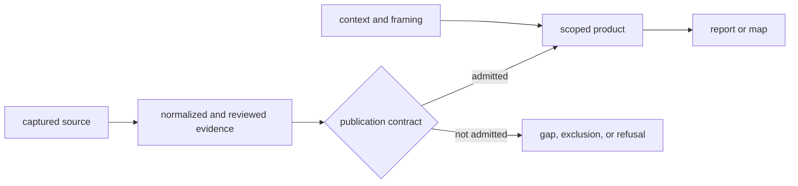
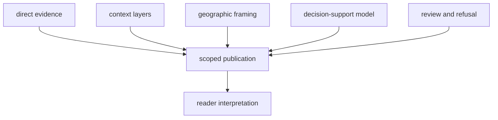
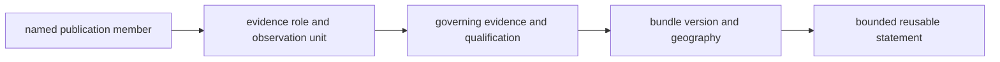

# Publication Types

Publication type states what a surface can support. It prevents a map, review,
or source inventory from acquiring authority merely because it is polished or
easy to cite.

The [domain language](../domain-language.md) defines direct evidence, context,
framing, decision support, publication member, and projection.

## Surface Roles

| Role | Answers | Typical surfaces | Cannot establish alone |
| --- | --- | --- | --- |
| evidence | what admitted records show within a declared scope | evidence tables, country samples, traceability rows | completeness beyond the published scope |
| context | what surrounds or helps interpret direct evidence | pollen, archaeology, lake, human-aDNA, and boundary layers | a sample-owned locality, chronology, or biological observation |
| framing | which geography and visual extent define a product | boundaries, scope registries, map viewport | scientific support |
| decision support | which candidates rank under an explicit model | candidate-site rankings and sensitivity outputs | a fieldwork conclusion or historical fact |
| review | where evidence is incomplete, conflicting, or refused | caveat ledgers, exclusion reports, maturity reviews | a stronger claim than the reviewed evidence |
| contract | what must hold before a surface may publish | manifests, publication contracts, subset validation | the scientific observation itself |
| narrative | how the scoped evidence and limits fit together | world, regional, and country reports | authority beyond its linked bundle |

One artifact can participate in more than one product, but its role must not
change silently. A boundary polygon remains framing when displayed beside an
animal sample. A pollen site remains environmental context unless the product
explicitly asks a pollen question.

## Authority Flow



The arrow direction matters. A narrative can lead a reader back to evidence;
it cannot make the evidence stronger. A review can explain an exclusion; it
cannot convert that exclusion into a negative scientific finding.

## Products Combine Roles Without Collapsing Them

A publication can place direct evidence, contextual layers, a ranking, and a
review in one bundle. Their proximity does not merge their authority.



For example, an admitted animal point can support the qualified presence of a
published sample. A nearby pollen site supplies environmental context. A lake
score supplies a prioritization result. None of those statements implies the
others, even when all three symbols appear in the same viewport.

## Select By Claim

| Intended claim | Required publication role | Companion material |
| --- | --- | --- |
| a sample has a qualified published locality | evidence | point traceability, locality posture, citation |
| a source family occurs within the selected map extent | evidence or context, as declared | bundle scope and layer contract |
| two records are temporally comparable | evidence | explicit temporal semantics and numeric eligibility |
| a lake ranks highly under the model | decision support | model identity, inputs, weights, and sensitivity |
| a record was deliberately withheld | review | exclusion reason and failed admission rule |
| a regional pattern is visible | narrative or map rendering | underlying scoped evidence and known coverage limits |

The companion material is part of the claim, not optional background. It
prevents a visual observation from silently becoming a stronger scientific
assertion.

### Construct A Typed Publication Claim

A reusable publication statement contains five parts:

```text
governed member + evidence role + supported predicate + product scope + qualification
```

For example:

> Neotoma site 13338 is published as Nordic pollen context with a site-level
> 0–9815 BP coverage span; the interval describes site coverage, not a dated
> sample event.

| Part | Value in the example | Failure if omitted |
| --- | --- | --- |
| governed member | Neotoma site 13338 | the statement cannot be traced to one source-native object |
| evidence role | pollen context | context may be mistaken for direct human or animal evidence |
| supported predicate | site coverage spans 0–9815 BP | a marker may be cited without naming what it establishes |
| product scope | Nordic publication | local membership may be generalized to another geography or version |
| qualification | site coverage, not sample-event chronology | broad temporal presence may be promoted into contemporaneity |

This grammar works for direct evidence, context, framing, rankings, and
refusals. The verb and qualification change with the role; the map symbol does
not choose them.

## Avoid Surface Mismatch

Choose the surface at the same granularity as the statement. Publication
errors often begin by citing a broad artifact for a narrow claim:

| Statement being made | Governing surface | Mismatched substitute |
| --- | --- | --- |
| one sample has a named locality | sample evidence and locality trace | project overview or map popup |
| one feature belongs to a product | bundle manifest and admission record | presence in a rendered viewport |
| one source family has a published count | family-specific members and declared scope | total feature count across layers |
| a lake has a model rank | ranking record, inputs, and sensitivity result | symbol order or narrative emphasis |
| a record was refused | exclusion or recovery surface with its reason | absence from CSV or map |
| a regional pattern is described | scoped member set plus coverage limits | screenshot alone |

The broader artifact can orient the reader, but it cannot replace the narrower
authority. Conversely, a row-level fact cannot establish that the product as a
whole is complete or representative.

## Four Features In One Product

The world surface demonstrates why publication type belongs to each member:

| Visible feature | Publication type | Supported claim | Required restraint |
| --- | --- | --- | --- |
| AADR `RISE175.SG` | direct evidence | one release-resolved human sample belongs to its scoped bundle | two panel memberships do not mean two people |
| goat `Direkli1-2` | direct sample evidence | one final sample has supplement-backed identity, place, coordinate, and chronology | project accession does not collapse the other three project samples into this row |
| Wadi Halfa dromedary | qualified project context | one paper-backed named-place context feature is spatially admitted | do not describe it as a recovered sample or apply numeric time filtering |
| RAÄ cell `17-18°E, 59-60°N` | contextual aggregate | 27,450 selected registry records fall in the declared cell | do not turn the polygon or count into synthetic sites |
| Sweden boundary | framing | the polygon participates in geographic scope selection | do not treat it as scientific evidence or historical affiliation |

This table is also an authority order. When a generic layer label or popup
conflicts with the narrower traceability posture, the narrower evidence record
controls the claim. A shared map is an assembly surface, not a permission to
standardize unlike evidence into one sentence.

### Claim Construction



A reusable statement is complete only when all four parts are known. If the
observation unit or qualification is missing, the reader may identify a symbol
but cannot yet identify the scientific claim.

## Preserve The Governing Surface

- For a sample-level assertion, retain the evidence or traceability row and
  its locality, chronology, coordinate, and citation lineage.
- For a geographic pattern, use the scoped map together with its manifest and
  publication contract.
- For a ranked recommendation, retain the ranking inputs, model identity, and
  sensitivity output.
- For a missing record, consult the applicable exclusion or recovery review;
  absence from a product is not evidence of biological absence.
- For a narrative summary, cite the report and the narrower evidence surface
  that supports the sentence being reused.

Exporting rows, taking a screenshot, or quoting a report does not transfer the
bundle's contract automatically. Downstream work must carry the scope, version,
role, identifiers, and material qualifications needed to reconstruct the
claim.

For citation, preserve both levels when the statement crosses them: cite the
publication for scope and the member evidence for the fact. This keeps a future
reader from having to guess whether the claim came from the product contract,
the source record, or narrative interpretation.

### Publication Member Identity Is Composite

A feature token alone does not identify a reusable publication claim. The
claim is fixed by the product, version, scope, member, role, and governing
evidence posture together:

```text
publication claim = product + version + scope + member + role + evidence posture
```

| Identity member | Prevents |
| --- | --- |
| product and version | treating historical or independently regenerated membership as current |
| geographic or purpose scope | promoting a country or ranking result into a broader product |
| stable member identity | relying on row order, popup label, or symbol position |
| observation unit and role | counting context, framing, aggregates, and direct evidence as equivalent rows |
| governing evidence identity | allowing the projection to become authority for source facts |
| qualification and admission posture | reusing a visible member at stronger precision or certainty |

This receipt is especially important for the 234-member animal point surface:
233 members are final sample-backed evidence and one is qualified
project-context evidence. Dropping role or posture preserves the count while
destroying the scientific distinction.

## Scope And Version Are Part Of Meaning

World, Europe-plus, Nordic, and country products are related subsets, not
interchangeable editions. A version identifies a collected and published state;
it does not imply that every source family has equal maturity. Reuse therefore
retains product scope, version, role, evidence identifier, and visible caveat.

Continue with [reports](reports.md), [maps](maps.md),
[map inputs](map-inputs.md), [point rules](point-rules.md), and
[publication limits](limits.md).
