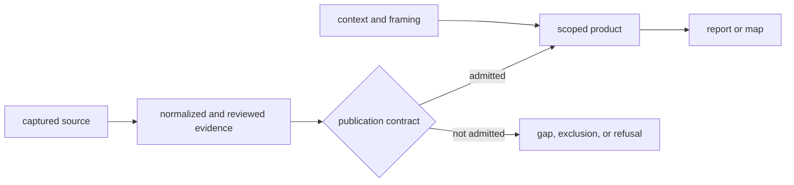

# Publication Types

Publication type states what a surface can support. It prevents a map, review,
or source inventory from acquiring authority merely because it is polished or
easy to cite.

## Surface Roles

| Role | Answers | Typical surfaces | Cannot establish alone |
| --- | --- | --- | --- |
| evidence | what admitted records show within a declared scope | evidence tables, country samples, traceability rows | completeness beyond the published scope |
| context | what surrounds or helps interpret direct evidence | pollen, archaeology, lake, human-aDNA, and boundary layers | a sample-owned locality, chronology, or biological observation |
| framing | which geography and visual extent define a product | boundaries, scope registries, map viewport | scientific support |
| decision support | which candidates rank under an explicit model | candidate-site rankings and sensitivity outputs | a fieldwork conclusion or historical fact |
| review | where evidence is incomplete, conflicting, or refused | caveat ledgers, exclusion reports, maturity reviews | a stronger claim than the reviewed evidence |
| contract | what must hold before a surface may publish | manifests, publication contracts, subset validation | the scientific observation itself |
| narrative | how the scoped evidence and limits fit together | world, regional, and country reports | authority beyond its linked bundle |

One artifact can participate in more than one product, but its role must not
change silently. A boundary polygon remains framing when displayed beside an
animal sample. A pollen site remains environmental context unless the product
explicitly asks a pollen question.

## Authority Flow

The arrow direction matters. A narrative can lead a reader back to evidence;
it cannot make the evidence stronger. A review can explain an exclusion; it
cannot convert that exclusion into a negative scientific finding.

## Choosing A Surface

- For a sample-level assertion, retain the evidence or traceability row and
  its locality, chronology, coordinate, and citation lineage.
- For a geographic pattern, use the scoped map together with its manifest and
  publication contract.
- For a ranked recommendation, retain the ranking inputs, model identity, and
  sensitivity output.
- For a missing record, consult the applicable exclusion or recovery review;
  absence from a product is not evidence of biological absence.
- For a narrative summary, cite the report and the narrower evidence surface
  that supports the sentence being reused.

## Scope And Version Are Part Of Meaning

World, Europe-plus, Nordic, and country products are related subsets, not
interchangeable editions. A version identifies a collected and published state;
it does not imply that every source family has equal maturity. Reuse therefore
retains product scope, version, role, evidence identifier, and visible caveat.

Continue with [reports](reports.md), [maps](maps.md),
[map inputs](map-inputs.md), [point rules](point-rules.md), and
[publication limits](limits.md).
