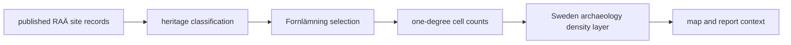

# RAÄ Exports

RAÄ exports provide Sweden-specific archaeology context from
Riksantikvarieämbetet/Fornsök Open Data. The public map uses an aggregated
density layer so national context remains legible without rendering hundreds
of thousands of point markers.

## Current Governed Surface

`data/raa/normalized/sweden_archaeology_layer.json` records:

| Measure | Value |
| --- | ---: |
| all published sites represented by the source | 761,917 |
| records classified `Fornlämning` | 318,265 |
| `Fornlämning` or possible ancient remains | 416,913 |
| one-degree density features rendered | 106 |

The public density GeoJSON is
`data/raa/normalized/sweden_archaeology_density.geojson`. Its cells summarize
the `Fornlämning` selection for national-scale rendering. A density feature is
therefore an aggregate display object, not an archaeological site and not a
sample.

## Three Counts, Three Meanings

The 761,917 total describes the broad published source population represented
by the layer metadata. The 318,265 count describes the `Fornlämning` subset
used for density rendering. The 106 count describes grid cells that carry
aggregated map features. Comparing those numbers as though they shared an
observation unit would confuse source records, selected records, and rendered
geometry.

## Supported Interpretation

The layer supports questions about the spatial density of published Swedish
archaeology records under the declared classification and grid. It helps
identify where admitted aDNA, pollen, or lake candidates sit relative to that
registry context.

It does not establish:

- a sample-to-site relationship;
- contemporaneity between a registry record and another layer;
- historical abundance from modern registry density;
- equivalent archaeology coverage outside Sweden; or
- exact site chronology from a density cell.

The current normalized RAÄ layer carries **no numeric temporal intervals**.
Spatial co-occurrence with a cell must therefore remain archaeology context,
not a time-aligned event claim.

## Reuse Contract

Carry the layer metadata, selection class, source population counts,
one-degree grid definition, density GeoJSON, source identity, and non-numeric
temporal posture together. Preserve cell counts as aggregates and do not
expand a cell into synthetic site points.

Continue to [RAÄ source guidance](../sources/raa.md) for source semantics,
[maps](maps.md) for role-aware spatial reading, and
[publication limits](limits.md) for comparison boundaries.
