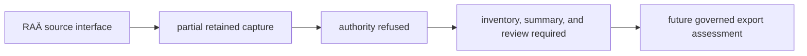

# RAÄ Exports

RAÄ is intended to provide Sweden-specific archaeology context from
Riksantikvarieämbetet/Fornsök Open Data. The repository retains capture
metadata and derived density files for audit, but RAÄ is not currently an
admitted export. Source authority is refused until the raw inventory, raw
summary, normalized counts, and qualified scientific review reconcile.

## Current Governed Surface

| Measure | Governed value |
| --- | --- |
| source inventory denominator | unavailable |
| classified-record denominators | unavailable |
| admitted public density features | none |
| temporal evidence | not applicable while authority is refused |

`data/raa/normalized/sweden_archaeology_layer.json` and
`data/raa/normalized/sweden_archaeology_density.geojson` are retained evidence
of an earlier derived surface. They do not establish a current source
population and are excluded from governed maps, reports, and analytical
counts. Unavailable denominators are not zeroes.

## Retained Aggregate Semantics

If authority is admitted in a future capture, a one-degree density feature
will remain an aggregate display object, not an archaeological site or sample.
Until then, values inside the retained files are historical provenance only
and cannot support current source-wide or cell-level claims.

| Reuse operation | Defensible result | Information lost or invented |
| --- | --- | --- |
| preserve the retained file unchanged | auditable historical input pending authority review | no current analytical claim is admitted |
| convert a retained cell to one point | no defensible current result | polygon extent, within-cell distribution, and source authority |
| expand the count into repeated points | no defensible scientific result | synthetic coordinates and false independence |
| compare with another grid size | no defensible current result | source-population and area comparability |

The grid definition remains part of the observation. Even after future
admission, a density count without its cell geometry, selection class, and
source population cannot be reconstructed or compared responsibly.

## Supported Interpretation

No current public or analytical interpretation is supported. After a future
authority admission, a regenerated layer may support questions about the
spatial density of published Swedish archaeology records under a declared
classification and grid.

It does not establish:

- a sample-to-site relationship;
- contemporaneity between a registry record and another layer;
- historical abundance from modern registry density;
- equivalent archaeology coverage outside Sweden; or
- exact site chronology from a density cell.

The refused surface cannot contribute numeric temporal evidence. Its absence
from a governed view means “authority refused,” not “no archaeology observed.”

## Reuse Contract

Do not publish or analyze the retained density files as current RAÄ evidence.
Preserve them unchanged for audit. A future admitted export must bind its raw
inventory, normalized population, classification, grid definition, source
identity, review decision, and temporal posture, and must be regenerated from
that authority rather than recovered from a downstream map.

Continue to [RAÄ source guidance](../sources/raa.md) for source semantics,
[maps](maps.md) for role-aware spatial reading, and
[publication limits](limits.md) for comparison boundaries.
