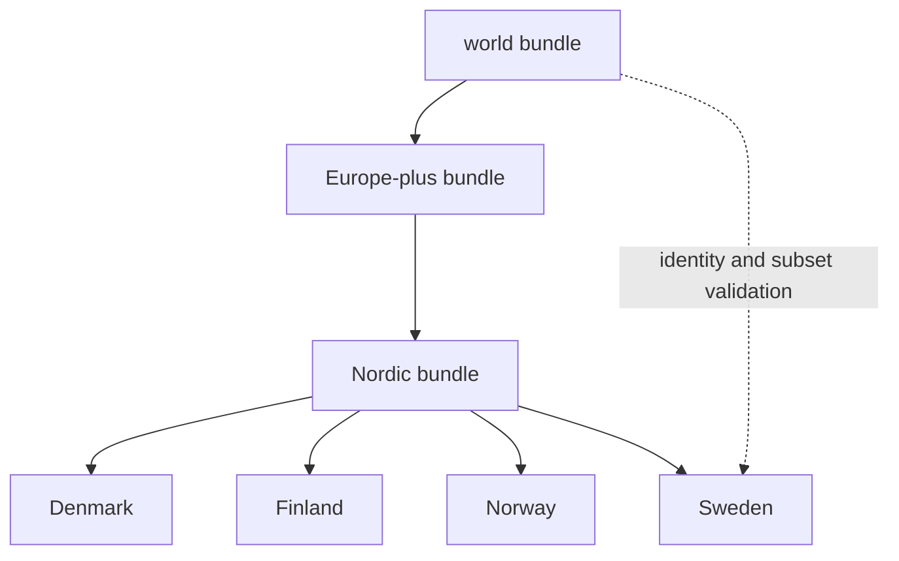
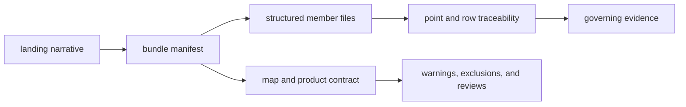

# Reports

Reports assemble a scoped narrative, evidence inventory, map contract,
traceability, analytical outputs, and scientific caveats. They are publication
bundles over governed evidence—not independent databases and not stronger than
the records they cite.

## How The Report Tree Is Organized

- `docs/report/index.md` is the public entry point
- `docs/report/world/` is the broadest shared answer
- `docs/report/regions/europe-plus/` and `docs/report/regions/nordic/` are
  intermediate regional views
- `docs/report/countries/<country-slug>/` holds the narrowest country bundles

Each child scope is a selection from a governed parent. Country bundles cannot
introduce records that lack an upstream identity or silently change the meaning
of a shared feature.

The report tree has two complementary axes. Geographic bundles answer **where
does this product apply?** Repository-wide reviews answer **how strong is the
support, and what remains blocked?** A country landing page without its
repository review companions can describe the visible subset but cannot
establish collection completeness.

## Bundle Anatomy

| Component | Responsibility |
| --- | --- |
| landing narrative | state scope, principal findings, and interpretation limits |
| evidence surface | enumerate admitted source-family content |
| map contract | declare layers, roles, controls, and publication checks |
| point traceability | connect visible feature identifiers to governed records |
| candidate ranking | expose score components and ordered candidates |
| sensitivity analysis | show whether conclusions survive plausible model changes |
| scientific review | evaluate evidential strength and unresolved risk |
| warnings and exclusions | account for records that did not publish |

### Read Every Count As A Defined Population

A report number is interpretable only when its observation unit and eligible
population are explicit. Keep these five parts together:

| Part | Question |
| --- | --- |
| observation unit | are rows projects, samples, sites, source records, map features, or lakes? |
| numerator | which governed members satisfy the stated condition? |
| denominator | which members were eligible to satisfy it? |
| exclusions | which captured or tracked members were refused, unresolved, or outside scope? |
| version and geography | which publication state and selection produced the count? |

This distinction matters throughout the report tree. A tracked-project count
cannot be divided into an admitted-point count without a declared relationship;
a country member count cannot stand for source prevalence; and an admitted
subset cannot establish recovery completeness when the expected population is
unknown.

## Choose By Question

- Use the [report portal](../../../report/index.md) to select a geography.
- Use the [world surface](../../../report/world/README.md) for repository-wide
  posture and the broadest admitted view.
- Use [Europe-plus](../../../report/regions/europe-plus/README.md) or
  [Nordic](../../../report/regions/nordic/README.md) for shared regional
  questions and cross-country comparison.
- Use a country bundle such as [Sweden](../../../report/countries/sweden/README.md)
  for national selection, citations, warnings, and local framing.
- Use an analytic sidecar such as
  [Sweden lake evidence richness](../../../report/countries/sweden/sweden_lake_evidence_richness_v66.md)
  for a derived ranking and its inputs.
- Use a sample table such as
  [Sweden animal aDNA samples](../../../report/countries/sweden/sweden_animal_adna_v66_samples.md)
  for the direct published rows rather than a narrative summary.

## Read A Bundle In Authority Order

1. The landing page states the question, scope, and principal results.
2. The bundle manifest establishes product identity, parent scope, version,
   countries, and artifact membership.
3. JSON, CSV, and GeoJSON members carry the reusable records.
4. Traceability surfaces connect visible identifiers to governed evidence.
5. Contracts define roles, controls, bounds, and comparison semantics.
6. Reviews and exclusions qualify both visible and absent evidence.

Narrative is the orientation layer, not the final authority for a row-level
claim. When two surfaces disagree, the stable member identity, governing
evidence, and narrower qualification control; the disagreement itself becomes
a publication-integrity finding.

## Compare Scopes Without Double Counting

World, Europe-plus, Nordic, and country products are nested selections, not
independent observations. The same feature identifier can legitimately appear
in several bundles. Combining those bundles by concatenation would duplicate
evidence.

For cross-scope comparison, compare member identifiers against the parent,
confirm each child's subset relationship, and then group by evidence role and
temporal posture. A country count describes membership in that country
product; summing country counts is valid only when the manifests establish
disjoint membership for the observation unit being counted.

When scopes overlap, use a set operation over stable member identifiers and
report the intersection. Do not infer independence from separate report files
or separate map layers.

## Review And Refusal Companions

Use these beside the main bundle when the question is about strength rather
than description:

- [animal sample database review](../../../report/animal_sample_database_review.md)
- [animal intake recovery review](../../../report/animal_intake_recovery_review.md)
- [animal point evidence review](../../../report/animal_point_evidence_review.md)
- [animal output honesty](../../../report/animal_output_honesty.md)
- [world map publication contract](../../../report/world/world_map_publication_contract.md)
- [Nordic point traceability](../../../report/regions/nordic/nordic_point_traceability.md)
- [repository source family matrix](../../../report/repository_source_family_matrix.md)
- [repository truth posture](../../../report/repository_truth_posture.md)

Absence from a report is not evidence of absence. Consult the
[animal atlas exclusion report](../../../report/animal_atlas_exclusion_report.md)
and [animal intake recovery review](../../../report/animal_intake_recovery_review.md)
to distinguish a publication refusal from incomplete recovery. When a
narrative sentence and its linked evidence disagree, the narrower governed
evidence and visible caveat control the interpretation.
