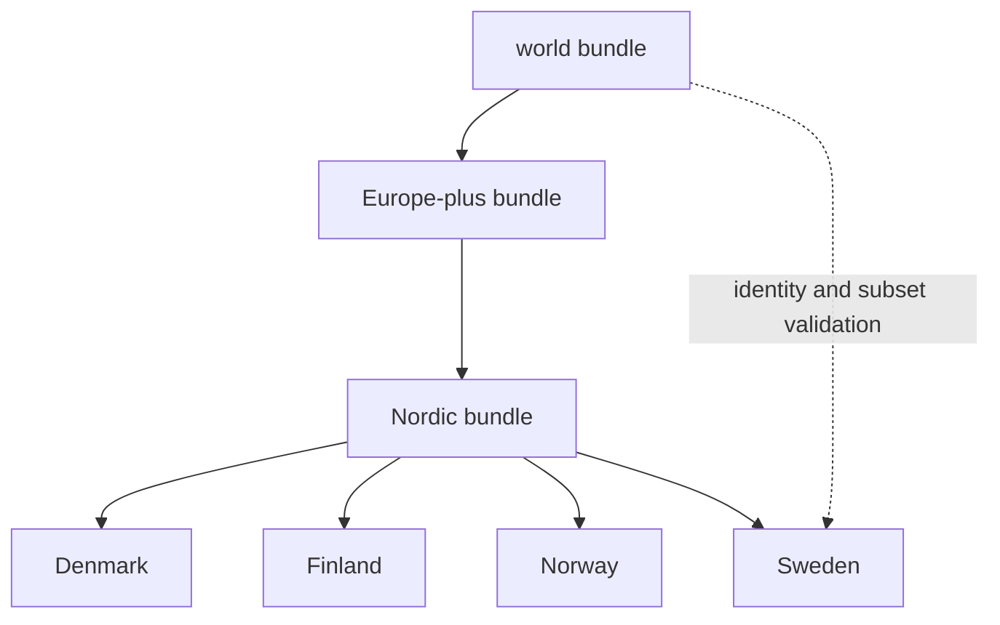

# Reports

Reports assemble a scoped narrative, evidence inventory, map contract,
traceability, analytical outputs, and scientific caveats. They are publication
bundles over governed evidence—not independent databases and not stronger than
the records they cite.

## How The Report Tree Is Organized

- `docs/report/index.md` is the public entry point
- `docs/report/world/` is the broadest shared answer
- `docs/report/regions/europe-plus/` and `docs/report/regions/nordic/` are
  intermediate regional views
- `docs/report/countries/<country-slug>/` holds the narrowest country bundles

Each child scope is a selection from a governed parent. Country bundles cannot
introduce records that lack an upstream identity or silently change the meaning
of a shared feature.

## Bundle Anatomy

| Component | Responsibility |
| --- | --- |
| landing narrative | state scope, principal findings, and interpretation limits |
| evidence surface | enumerate admitted source-family content |
| map contract | declare layers, roles, controls, and publication checks |
| point traceability | connect visible feature identifiers to governed records |
| candidate ranking | expose score components and ordered candidates |
| sensitivity analysis | show whether conclusions survive plausible model changes |
| scientific review | evaluate evidential strength and unresolved risk |
| warnings and exclusions | account for records that did not publish |

## Choose By Question

- Use the [report portal](../../../report/index.md) to select a geography.
- Use the [world surface](../../../report/world/README.md) for repository-wide
  posture and the broadest admitted view.
- Use [Europe-plus](../../../report/regions/europe-plus/README.md) or
  [Nordic](../../../report/regions/nordic/README.md) for shared regional
  questions and cross-country comparison.
- Use a country bundle such as [Sweden](../../../report/countries/sweden/README.md)
  for national selection, citations, warnings, and local framing.
- Use an analytic sidecar such as
  [Sweden lake evidence richness](../../../report/countries/sweden/sweden_lake_evidence_richness_v66.md)
  for a derived ranking and its inputs.
- Use a sample table such as
  [Sweden animal aDNA samples](../../../report/countries/sweden/sweden_animal_adna_v66_samples.md)
  for the direct published rows rather than a narrative summary.

## Review And Refusal Companions

Use these beside the main bundle when the question is about strength rather
than description:

- [animal sample database review](../../../report/animal_sample_database_review.md)
- [animal intake recovery review](../../../report/animal_intake_recovery_review.md)
- [animal point evidence review](../../../report/animal_point_evidence_review.md)
- [animal output honesty](../../../report/animal_output_honesty.md)
- [world map publication contract](../../../report/world/world_map_publication_contract.md)
- [Nordic point traceability](../../../report/regions/nordic/nordic_point_traceability.md)
- [repository source family matrix](../../../report/repository_source_family_matrix.md)
- [repository truth posture](../../../report/repository_truth_posture.md)

Absence from a report is not evidence of absence. Consult the
[animal atlas exclusion report](../../../report/animal_atlas_exclusion_report.md)
and [animal intake recovery review](../../../report/animal_intake_recovery_review.md)
to distinguish a publication refusal from incomplete recovery. When a
narrative sentence and its linked evidence disagree, the narrower governed
evidence and visible caveat control the interpretation.
