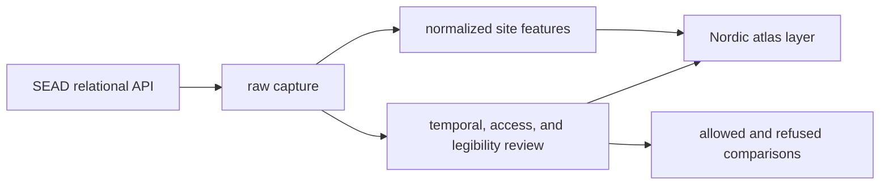
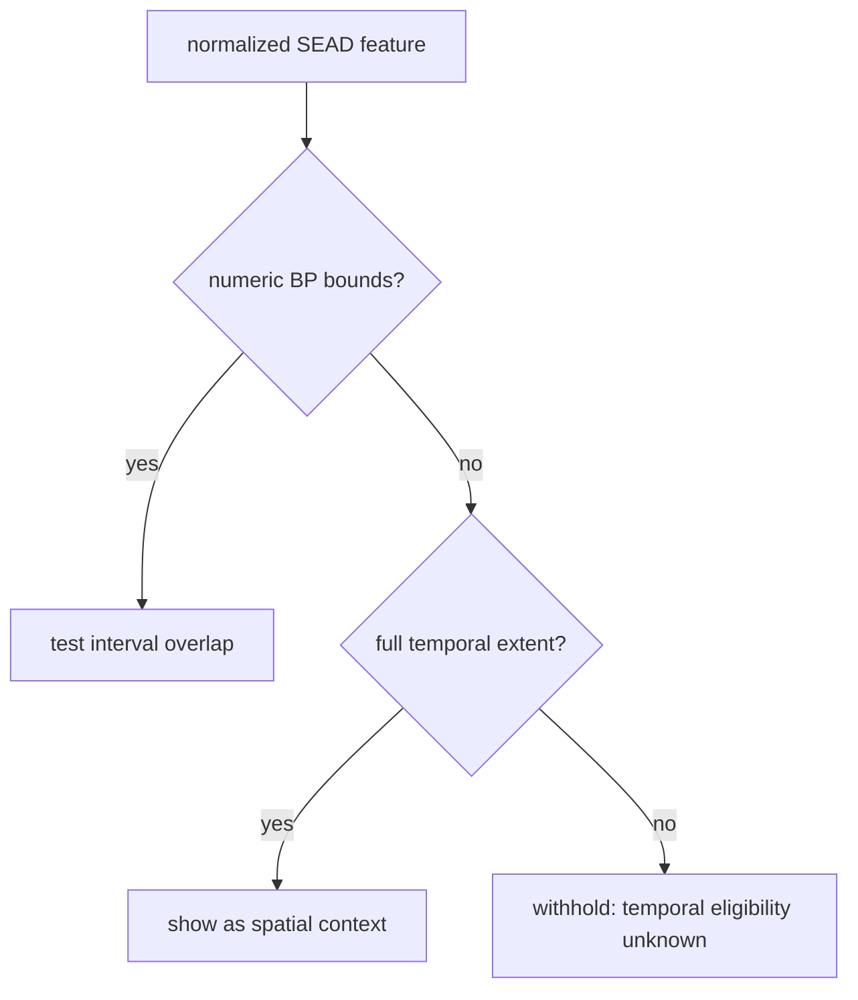

# SEAD Exports

SEAD exports turn a relational environmental-archaeology source into three
different products: an auditable capture, a normalized map layer, and review
packets that explain which comparisons are allowed. Choose the product that
matches the question rather than treating the GeoJSON as the whole database.

## Snapshot At A Glance

| Population or relation | Count |
| --- | ---: |
| captured sites | 2,195 |
| mapped Nordic features | 2,172 |
| mapped numeric features | 889 |
| mapped contextual-label-only features | 12 |
| mapped unresolved features | 1,271 |
| captured sites with numeric interval material | 911 |
| captured sites linked to dating ranges | 392 |
| captured sites linked to relative periods | 531 |
| captured sites linked to bibliography | 1,034 |
| captured site-inventory-only rows | 1,137 |

The difference between 911 captured numeric rows and 889 mapped numeric
features is deliberate. Capture and map-country membership are separate
decisions. The difference between 2,195 captured sites and 2,172 mapped sites
is the same kind of publication boundary, not evidence loss.

## Choose An Artifact

| Need | Use | Why |
| --- | --- | --- |
| audit acquisition and joins | `data/sead/raw/nordic_sites.json` | preserves source rows, relation inventories, counts, and site-linked material |
| display or spatial analysis | `data/sead/normalized/nordic_environmental_sites.geojson` | provides admitted point geometry, popup evidence, and normalized temporal fields |
| tabular exchange | `data/sead/normalized/nordic_environmental_sites.csv` | represents the same normalized point population with serialized temporal semantics |
| decide temporal eligibility | `data/sead/review/temporal_review.json` | classifies each captured site as numeric-plus-context, label-only, or unresolved |
| inspect access limits | `data/sead/review/access_model.json` | distinguishes mirrored material from upstream browsing and references |
| assess interpretability | `data/sead/review/evidence_legibility_review.json` | records capture depth, risk, and publication posture |
| plan stronger evidence recovery | `data/sead/review/recovery_requirements.json` | links gaps to required evidence and satisfaction signals |

CSV and Markdown companions are review and exchange views of the same governed
packets. They do not define a second scientific truth.

## Read The Normalized Temporal Fields

For a numeric feature:

- `time_start_bp` and `time_end_bp` define the derived site envelope;
- `time_mean_bp` is a display and indexing aid, not a replacement for the
  interval;
- `time_label` presents the interval to readers; and
- `temporal_semantics` records evidence class, precision, comparison posture,
  original labels, normalized labels, uncertainty, and provenance locator.

For label-only or unresolved features, numeric fields remain null. Do not
coerce null to zero, manufacture a midpoint, or map a broad label to numeric
bounds without a governed source rule.

## Atlas Behavior

The SEAD layer is a mixed temporal population. The atlas therefore applies a
two-mode interaction contract:

| Atlas state | Numeric features | Label-only and unresolved features |
| --- | --- | --- |
| full temporal extent | shown | shown |
| narrowed BP window | shown only on interval overlap | withheld because overlap is unknown |

This makes the full view useful for spatial exploration while keeping a
narrowed view scientifically honest. A withheld unresolved point is not a
negative finding about the selected period.

## Follow Two Concrete Rows

### Agerod V (`4237`)

The capture follows Agerod V through its linked sample and analysis inventory.
The normalized feature publishes `7000–10000 BP` and retains its original
period context. It is eligible for numeric timeline overlap, but the interval
must still be described as a site envelope rather than a single event date.

### Borgholm (`3776`)

The capture retains the source label `Quaternary`, but no eligible numeric
site interval. The normalized feature remains valuable in the full spatial
view. It is withheld from narrowed numeric windows because the repository has
not invented a BP conversion for the label.

## Geographic Membership

Twenty-three captured rows are not members of the four-country point layer.
They retain their identities and coordinates in the raw and review surfaces.
Their absence from GeoJSON means they did not satisfy the current Sweden,
Norway, Finland, or Denmark geometry rule; it does not mean that the source
row was invalid, deduplicated, or deleted.

Use 2,195 as the capture denominator and 2,172 as the mapped denominator.
Whenever numeric map coverage is discussed, use 497 as the mapped temporal
denominator and state that 1,675 mapped features remain label-only or
unresolved.

## Reuse Checklist

Before publishing a SEAD-derived result, verify that it retains:

- the site identifier and source URL;
- capture and mapped denominators relevant to the claim;
- coordinate and country-membership basis;
- temporal posture and numeric bounds, if any;
- the site-envelope observation unit;
- uncertainty and original period labels;
- the distance or interval-overlap rule used; and
- a clear distinction between absence, exclusion, and unknown temporal
  eligibility.

Continue to [SEAD source guidance](../sources/sead.md) for the full evidence
model, [maps](maps.md) for atlas interpretation, and
[publication limits](limits.md) for refused comparisons.
