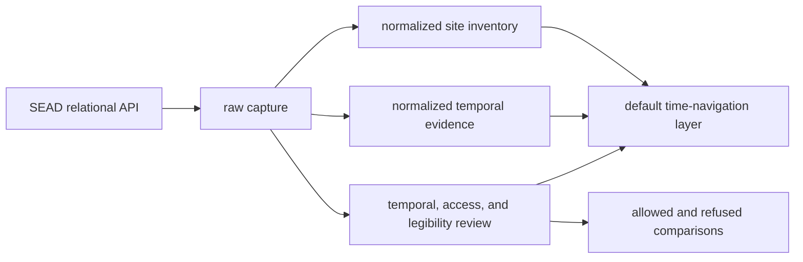
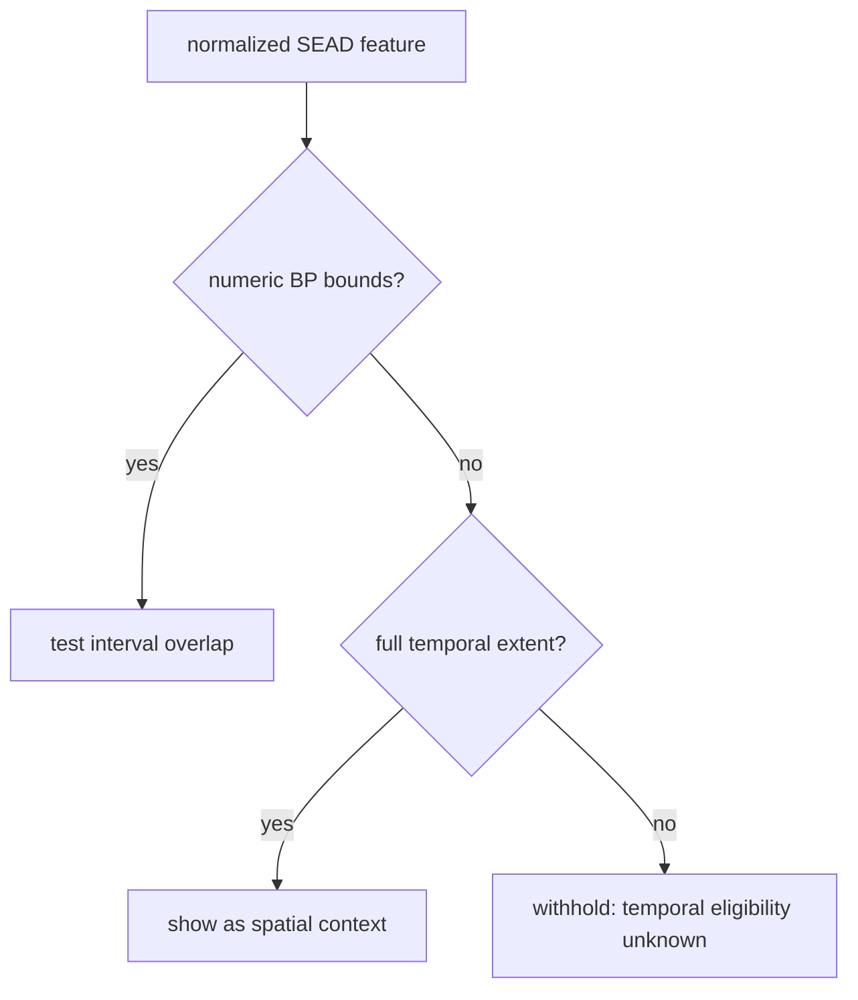

# SEAD Exports

SEAD exports turn a relational environmental-archaeology source into four
different products: an auditable capture, a site-inventory layer, a
record-level temporal-evidence layer, and review
packets that explain which comparisons are allowed. Choose the product that
matches the question rather than treating the GeoJSON as the whole database.

## Snapshot At A Glance

| Population or relation | Count |
| --- | ---: |
| captured sites | 2,195 |
| mapped Nordic features | 2,172 |
| mapped sites with numeric summaries | 905 |
| mapped sites with unresolved time | 1,267 |
| captured chronology source records | 27,002 |
| mapped chronology source records | 26,556 |
| mapped temporal-evidence features | 9,380 |
| captured sites linked to bibliography | 1,300 |
| captured sites without usable chronology | 1,268 |

The difference between 27,002 captured and 26,556 mapped chronology records is
deliberate. Capture and map-country membership are separate decisions. The
difference between 26,556 source records and 9,380 rendered features is also
deliberate: coincident rows are grouped only when site, chronology kind,
interval, label, and uncertainty agree.

## Choose An Artifact

| Need | Use | Why |
| --- | --- | --- |
| audit acquisition and joins | `data/sead/raw/nordic_sites.json` | preserves source rows, relation inventories, counts, and site-linked material |
| display or spatial analysis | `data/sead/normalized/nordic_environmental_sites.geojson` | provides admitted point geometry, popup evidence, and normalized temporal fields |
| tabular exchange | `data/sead/normalized/nordic_environmental_sites.csv` | represents the same normalized point population with serialized temporal semantics |
| navigate chronology through time | `data/sead/normalized/nordic_temporal_evidence.geojson` | provides interval-preserving features for every mapped linked chronology group |
| exchange record-level chronology | `data/sead/normalized/nordic_temporal_evidence.csv` | provides the same grouped temporal population in tabular form |
| decide site-level temporal eligibility | `data/sead/review/temporal_review.json` | classifies each captured site as numeric-plus-context or unresolved |
| inspect access limits | `data/sead/review/access_model.json` | distinguishes mirrored material from upstream browsing and references |
| assess interpretability | `data/sead/review/evidence_legibility_review.json` | records capture depth, risk, and publication posture |
| plan stronger evidence recovery | `data/sead/review/recovery_requirements.json` | links gaps to required evidence and satisfaction signals |

CSV and Markdown companions are review and exchange views of the same governed
packets. They do not define a second scientific truth.

## Read The Normalized Temporal Fields

For a numeric feature in either normalized product:

- `time_start_bp` and `time_end_bp` define the grouped chronology interval or,
  in the site inventory, the derived site envelope;
- `time_mean_bp` is a display and indexing aid, not a replacement for the
  interval;
- `time_label` presents the interval to readers; and
- `temporal_semantics` records evidence class, precision, comparison posture,
  original labels, normalized labels, uncertainty, and provenance locator.

Every temporal-evidence feature has numeric bounds. Unresolved site-inventory
features keep null numeric fields. Do not coerce null to zero, manufacture a
midpoint, or map a broad label to numeric bounds without a governed source
rule.

## Atlas Behavior

The atlas publishes two SEAD layers with different responsibilities:

| Atlas state | Temporal-evidence layer | Optional site-inventory layer |
| --- | --- | --- |
| full temporal extent | all 9,380 grouped chronology features shown | all 2,172 sites available when enabled |
| narrowed BP window | shown only on record-interval overlap | dated envelopes can overlap; unresolved sites are withheld |

This makes the full view useful for spatial exploration while keeping a
narrowed view scientifically honest. A withheld unresolved point is not a
negative finding about the selected period.

## Follow Two Concrete Rows

### Agerod V (`4237`)

The capture follows Agerod V through its linked sample and analysis inventory.
The site layer publishes the overall `7000–10000 BP` envelope. The temporal
layer publishes its grouped chronology intervals and source-record IDs. Use
the second product for timeline overlap and the first for total site coverage.

### Borgholm (`3776`)

The capture retains the source label `Quaternary`, but no eligible numeric
site interval. The site-inventory feature remains valuable for spatial
discovery. It does not appear in the temporal-evidence layer because the
repository has not invented a BP conversion for the label.

## Geographic Membership

Twenty-three captured rows are not members of the four-country point layer.
They retain their identities and coordinates in the raw and review surfaces.
Their absence from GeoJSON means they did not satisfy the current Sweden,
Norway, Finland, or Denmark geometry rule; it does not mean that the source
row was invalid, deduplicated, or deleted.

Use 2,195 as the capture denominator and 2,172 as the mapped denominator.
Whenever temporal map coverage is discussed, use 9,380 as the grouped-feature
denominator and 26,556 as the represented source-record denominator. For site
coverage, report 905 dated and 1,267 unresolved mapped sites.

## Reuse Checklist

Before publishing a SEAD-derived result, verify that it retains:

- the site identifier and source URL;
- capture and mapped denominators relevant to the claim;
- coordinate and country-membership basis;
- temporal posture and numeric bounds, if any;
- the observation unit: chronology interval or site envelope;
- uncertainty and original period labels;
- the distance or interval-overlap rule used; and
- a clear distinction between absence, exclusion, and unknown temporal
  eligibility.

Continue to [SEAD source guidance](../sources/sead.md) for the full evidence
model, [maps](maps.md) for atlas interpretation, and
[publication limits](limits.md) for refused comparisons.
