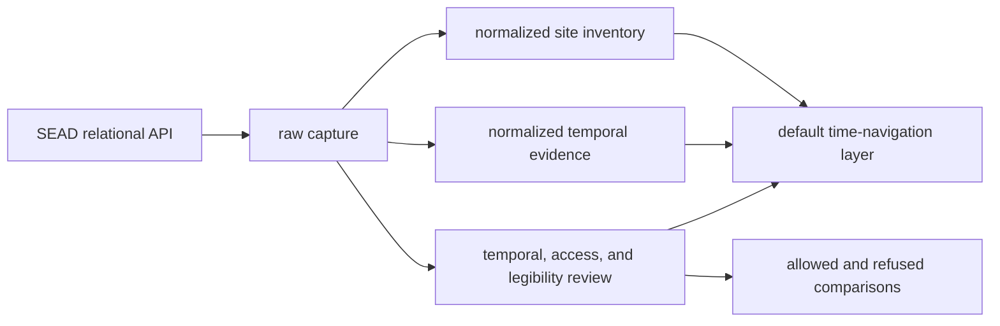
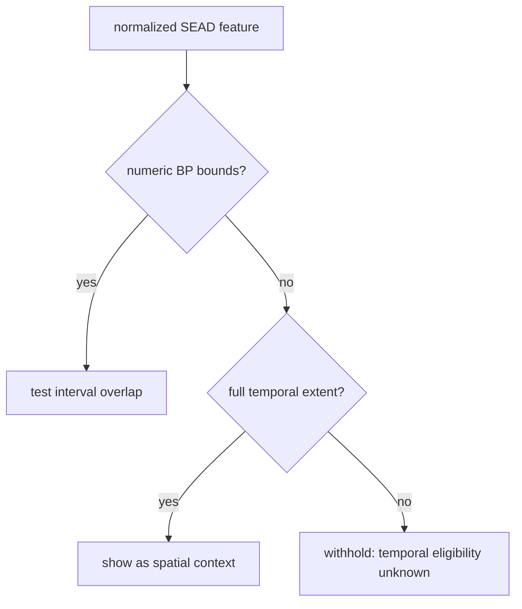

# SEAD Exports

SEAD exports turn a relational environmental-archaeology source into five
different products: an auditable capture, a site-inventory layer, a
record-level temporal-evidence layer, a governed Sweden discovery surface, and
review packets that explain which comparisons are allowed. Choose the product
that matches the question rather than treating one GeoJSON as the whole
database.

## Snapshot At A Glance

<!-- sead-evidence:generated:start -->
The current governed full-evidence run is `sead-full-evidence-39bfff6a-ce80714e` (`sha256:ce80714e4c9e9974b24913e5da50f49854670ed642879c1ca5076499e1d56725`). Its denominators are:

| Governed population | Count | Interpretation |
| --- | ---: | --- |
| source tables | 61 | complete captured relational table set |
| sites in the Nordic bounding-box review | 2,195 | country-decision denominator |
| assigned four-country sites | 2,069 | SE 1,925, DK 59, NO 45, FI 40 |
| sites requiring country review | 103 | retained outside assigned publication membership |
| unassigned sites | 23 | retained without a governed country assignment |
| atlas SEAD features | 11,807 | 2,069 four-country site features plus 9,738 Swedish chronology-discovery features; not a distinct-site count |
| chronology claims | 25,109 | 14,324 comparable, 10,144 context-only, 641 unresolved |
| source-native observations | 177,763 | quantitative observation denominator |
| source-native taxon relations | 1,974 | preserved source taxonomy, not accepted cross-source classification |
| dimension relations | 2,639 | explicit source-native measurement dimensions |
| eligible / refused propagation events | 0 / 177,763 | `refused`: `source_classification_not_accepted` |

Site, feature, claim, observation, relation, and event counts are different units. The atlas may display SEAD chronology and source-native detail, but it must not turn the refused event population into migration or propagation evidence.
<!-- sead-evidence:generated:end -->

## Choose An Artifact

| Need | Use | Why |
| --- | --- | --- |
| audit acquisition and joins | `data/sead/raw/nordic_sites.json` | preserves source rows, relation inventories, counts, and site-linked material |
| display or spatial analysis | `data/sead/normalized/nordic_environmental_sites.geojson` | provides admitted point geometry, popup evidence, and normalized temporal fields |
| tabular exchange | `data/sead/normalized/nordic_environmental_sites.csv` | represents the same normalized point population with serialized temporal semantics |
| navigate chronology through time | `data/sead/normalized/nordic_temporal_evidence.geojson` | provides interval-preserving features for every mapped linked chronology group |
| exchange record-level chronology | `data/sead/normalized/nordic_temporal_evidence.csv` | provides the same grouped temporal population in tabular form |
| discover and prioritize Swedish sites | `data/sead/derived/sweden_archaeology_site_discovery.json` | preserves all 1,925 assigned Swedish sites, a transparent evidence-readiness order, and the ranking contract |
| navigate Swedish discovery through time | `data/sead/derived/sweden_archaeology_site_discovery.geojson` | carries 8,184 exact linked intervals and 1,554 explicitly unresolved site features |
| exchange the one-row-per-site discovery registry | `data/sead/derived/sweden_archaeology_site_discovery.csv` | keeps chronology, bibliography, dataset, RAÄ-context, and activity-status fields together |
| decide site-level temporal eligibility | `data/sead/review/temporal_review.json` | classifies each captured site as numeric-plus-context or unresolved |
| inspect access limits | `data/sead/review/access_model.json` | distinguishes mirrored material from upstream browsing and references |
| assess interpretability | `data/sead/review/evidence_legibility_review.json` | records capture depth, risk, and publication posture |
| plan stronger evidence recovery | `data/sead/review/recovery_requirements.json` | links gaps to required evidence and satisfaction signals |

CSV and Markdown companions are review and exchange views of the same governed
packets. They do not define a second scientific truth.

## Read The Normalized Temporal Fields

For a numeric feature in either normalized product:

- `time_start_bp` and `time_end_bp` define the grouped chronology interval or,
  in the site inventory, the derived site envelope;
- `time_mean_bp` is a display and indexing aid, not a replacement for the
  interval;
- `time_label` presents the interval to readers; and
- `temporal_semantics` records evidence class, precision, comparison posture,
  original labels, normalized labels, uncertainty, and provenance locator.

Every temporal-evidence feature has numeric bounds. Unresolved site-inventory
features keep null numeric fields. Do not coerce null to zero, manufacture a
midpoint, or map a broad label to numeric bounds without a governed source
rule.

## Atlas Behavior

The Nordic Atlas publishes the governed Sweden discovery layer rather than
loading the two normalized SEAD layers beside it:

| Atlas state | Numeric discovery features | Unresolved discovery features |
| --- | --- | --- |
| full temporal extent | all 8,184 linked interval features shown | all 1,554 unresolved Swedish sites shown |
| narrowed BP window | shown only on record-interval overlap | withheld because overlap is unknown |

This makes the full view useful for spatial exploration while keeping a
narrowed view scientifically honest. A withheld unresolved point is not a
negative finding about the selected period.

## Follow Two Concrete Rows

### Agerod V (`4237`)

The capture follows Agerod V through its linked sample and analysis inventory.
The site layer publishes the overall `7000–10000 BP` envelope. The temporal
layer publishes its grouped chronology intervals and source-record IDs. Use
the second product for timeline overlap and the first for total site coverage.

### Borgholm (`3776`)

The capture retains the source label `Quaternary`, but no eligible numeric
site interval. The site-inventory feature remains valuable for spatial
discovery. It does not appear in the temporal-evidence layer because the
repository has not invented a BP conversion for the label.

## Geographic Membership

One hundred twenty-six bounding-box review rows are not assigned members of
the four-country point layer: 103 require country review and 23 remain
unassigned. They retain their identities and coordinates in the raw and review
surfaces. Their absence from GeoJSON does not mean that the source row was
invalid, deduplicated, or deleted.

Use 2,195 as the country-decision denominator and 2,069 as the assigned-site
denominator. Whenever temporal evidence coverage is discussed, use 25,109 as
the claim denominator, partitioned into 14,324 comparable, 10,144 context-only,
and 641 unresolved claims. For Swedish discovery, report 8,184 numeric features
and 1,554 unresolved-site features across 1,925 assigned sites.

## Reuse Checklist

Before publishing a SEAD-derived result, verify that it retains:

- the site identifier and source URL;
- capture and mapped denominators relevant to the claim;
- coordinate and country-membership basis;
- temporal posture and numeric bounds, if any;
- the observation unit: chronology interval or site envelope;
- uncertainty and original period labels;
- the distance or interval-overlap rule used; and
- a clear distinction between absence, exclusion, and unknown temporal
  eligibility.

Continue to [SEAD source guidance](../sources/sead.md) for the full evidence
model, [Sweden archaeology site discovery](archaeology-site-discovery.md) for
the readiness and coverage contract, [maps](maps.md) for atlas interpretation, and
[publication limits](limits.md) for refused comparisons.
