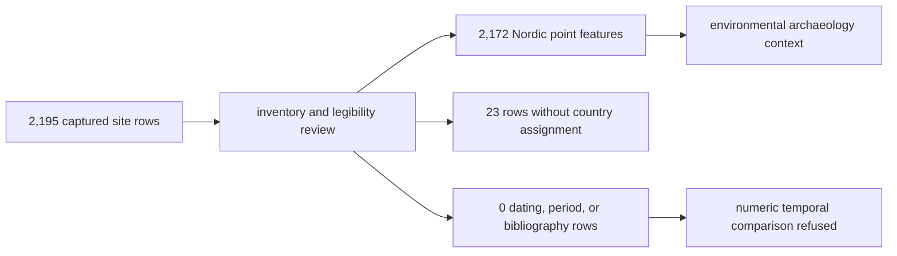

# SEAD Exports

SEAD exports provide Nordic environmental-archaeology site context. Their
current strength is inventory and spatial framing. Their current limitation is
equally important: the checked-in capture does not contain the linked temporal
and bibliographic evidence required for chronological comparison.

## Current Governed Surface

The temporal and legibility reviews cover **2,195 source inventory rows**. The
normalized Nordic GeoJSON contains **2,172 mapped features** across Sweden,
Norway, Finland, and Denmark. The remaining 23 review rows lack a country
assignment and are not members of the normalized Nordic point layer.

| Evidence dimension | Current review result |
| --- | ---: |
| numeric interval rows | 0 |
| dating-range rows | 0 |
| relative-period rows | 0 |
| bibliography rows | 0 |
| site-inventory-only rows | 2,195 |
| mapped Nordic context features | 2,172 |

Every reviewed row currently has `site_page_only` access visibility,
`duration_not_available` posture, and unresolved temporal comparability. The
layer is therefore useful context, but it is not a temporally aligned
archaeology event surface.

## Read A SEAD Feature

The normalized feature preserves the SEAD site identifier, name, country,
coordinates, source page URL, context role, access limits, and explicit
unresolved temporal semantics. The site page is the upstream inspection
anchor when the repository view is too thin for a stronger claim.

The current export does not establish:

- a numeric age or duration;
- a relative-period assignment;
- source bibliography for the site's archaeological interpretation;
- equivalence between site inventory density and past activity; or
- contemporaneity with nearby pollen or aDNA evidence.

Missing temporal values mean **not captured under the current contract**, not
zero, undated in the upstream database, or absent from archaeology.

## Reuse Contract

Carry the site identifier, source URL, point geometry, country assignment,
access posture, context-only evidence role, and unresolved temporal-semantics
object. Use 2,195 as the reviewed inventory denominator and 2,172 as the mapped
Nordic-feature denominator; do not interchange them or silently discard the 23
unassigned records from a completeness statement.

Continue to [SEAD source guidance](../sources/sead.md) for access and capture
limits, [maps](maps.md) for context-layer interpretation, and
[publication limits](limits.md) for refused comparisons.
