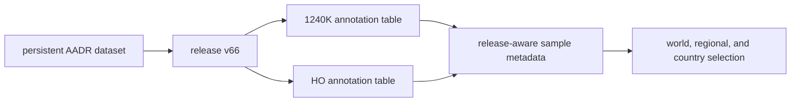
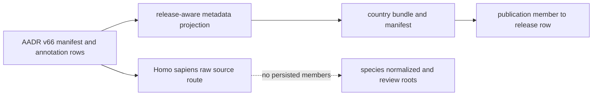

# AADR

AADR supplies release-owned human ancient-DNA metadata. The checked-in capture
preserves a named release, persistent dataset identity, two annotation tables,
and file identities so human samples can enter geographic publications without
becoming an unversioned background layer.

The current runtime consumes annotation metadata. It does not process AADR
`.geno`, `.ind`, or `.snp` genotype files and does not claim population-genetic
analysis.

## Checked-In Release

| Property | Governed value |
| --- | --- |
| requested release | `v66` |
| persistent dataset identity | `doi:10.7910/DVN/FFIDCW` |
| upstream Dataverse release | `10.0` |
| release timestamp | `2026-04-13T04:33:11Z` |
| annotation members | `1240K` and Human Origins (`HO`) |
| `1240K` annotation rows | 23,250 records after the header |
| `HO` annotation rows | 27,755 records after the header |

The two row counts are table populations, not a unique-individual total. A
person or genetic representation can occur across datasets, and identity must
be resolved through the source identifiers rather than by adding counts.

### Release Capture And Species Projection

The checked-in authority currently has two layers with different persistence:

| Layer | Current repository state | Consequence |
| --- | --- | --- |
| AADR release capture | `data/aadr/v66/` contains the release manifest and both annotation members | release identity, file membership, checksums, and source rows are directly inspectable |
| species-owned raw route | `data/adna/species/homo_sapiens/raw/aadr` links to the AADR capture | human species ownership is visible without copying the release |
| species-owned normalized and review roots | the governed directories exist but contain no checked-in member or review artifacts | do not claim a persisted human normalization or review database from those roots |
| country publication bundles | checked-in country CSV, GeoJSON, Markdown, summary, and manifest outputs | publication rows are derived directly through the release-aware annotation runtime and must be audited against both bundle membership and the AADR source row |

This boundary is narrower than a fully materialized human evidence database.
The country products are reproducible from the governed release and runtime,
but a consumer must not cite the empty species-owned roots as proof that a
separate normalized or reviewed population was checked in.

## Read An AADR Member

An annotation row can carry genetic, individual, skeletal, publication,
repository, dating, locality, coordinate, data-type, and assessment fields.
These fields do not all have the same authority or precision.

| Claim | Evidence to retain | Boundary |
| --- | --- | --- |
| sample identity | genetic and persistent identifiers plus release member | labels can represent genetic data instances rather than unique persons |
| publication lineage | DOI, publication abbreviation, and repository locator | first publication and the publication of this representation may differ |
| chronology | method, mean and deviation, full source wording, and date class | direct and contextual dates must remain distinguishable |
| locality | source locality, political entity, latitude, and longitude | map precision cannot exceed source metadata precision |
| data posture | pulldown strategy, data type, libraries, and assessment | metadata does not substitute for genotype processing |

For a public claim, retain the AADR release and annotation member as well as the
row identity. A sample label without release context cannot explain later
coverage or metadata changes.

## Audit A Human aDNA Feature

1. Record the publication scope, product version, layer, and feature identifier.
2. Resolve the feature to its AADR annotation member and source row.
3. Confirm the release identity in `release_manifest.json`; do not infer it
   from the map filename or sample label.
4. Read locality and chronology from the annotation fields at their reported
   precision, including method and source wording where present.
5. Distinguish the genetic-data instance from a unique person before counting
   or joining `1240K` and `HO` rows.
6. Retain the product admission and geographic-scope decision separately from
   the source metadata.

This route separates three identities that are easy to conflate: the public
map feature, the release-versioned annotation row, and the represented person
or genetic data instance. A match at one level does not prove a match at the
others.

## Release Changes Affect More Than Counts

| Release difference | Re-evaluate |
| --- | --- |
| member file added, removed, or renamed | dataset membership and publication input identity |
| row identity or aliases changed | cross-member deduplication and stable feature lineage |
| locality or coordinate changed | geographic scope, point geometry, and distance relations |
| chronology fields changed | temporal posture and cross-family comparisons |
| publication or repository locator changed | citation lineage and recoverability |
| assessment or data-type field changed | metadata interpretation without implying genotype analysis |

A release refresh is complete only when these semantic differences are
reviewed. Equal row counts do not establish equal evidence.

## Relationship To Animal aDNA

AADR is a release-oriented human metadata family. Animal aDNA is a
project-and-literature recovery system whose publication depends on curated
sample, locality, chronology, coordinate, and supporting-material evidence.
They may share a map and both represent direct sample evidence, but neither
inherits the other's recovery model, denominator, or fitness decision.

Spatial proximity between a human and animal point supports a qualified
geographic comparison. It does not establish contemporaneity, association, or
a shared archaeological context unless those dimensions are evaluated
separately.

## Governing Surfaces

- `data/aadr/v66/release_manifest.json` governs persistent identity, upstream
  release, member files, sizes, and checksums;
- `data/aadr/v66/1240k/v66.1240K.aadr.PUB.anno` preserves the tracked `1240K`
  annotation population; and
- `data/aadr/v66/ho/v66.HO.aadr.PUB.anno` preserves the tracked Human Origins
  annotation population;
- `data/adna/species/homo_sapiens/raw/aadr` exposes the release through the
  species-owned source boundary; and
- `docs/report/countries/<country>/` contains the derived AADR publication
  bundles whose manifests govern country membership.

Continue to [AADR exports](../publications/aadr-exports.md) for publication use,
[shared normalization](shared-normalization.md) for field lineage, and
[source comparison](source-comparison.md) before combining AADR with another
family.
