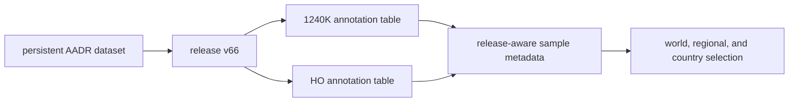

# AADR

AADR supplies release-owned human ancient-DNA metadata. The checked-in capture
preserves a named release, persistent dataset identity, two annotation tables,
and file identities so human samples can enter geographic publications without
becoming an unversioned background layer.

The current runtime consumes annotation metadata. It does not process AADR
`.geno`, `.ind`, or `.snp` genotype files and does not claim population-genetic
analysis.

## Checked-In Release

| Property | Governed value |
| --- | --- |
| requested release | `v66` |
| persistent dataset identity | `doi:10.7910/DVN/FFIDCW` |
| upstream Dataverse release | `10.0` |
| release timestamp | `2026-04-13T04:33:11Z` |
| annotation members | `1240K` and Human Origins (`HO`) |
| `1240K` annotation rows | 23,250 records after the header |
| `HO` annotation rows | 27,755 records after the header |

The two row counts are table populations, not a unique-individual total. A
person or genetic representation can occur across datasets, and identity must
be resolved through the source identifiers rather than by adding counts.

## Read An AADR Member

An annotation row can carry genetic, individual, skeletal, publication,
repository, dating, locality, coordinate, data-type, and assessment fields.
These fields do not all have the same authority or precision.

| Claim | Evidence to retain | Boundary |
| --- | --- | --- |
| sample identity | genetic and persistent identifiers plus release member | labels can represent genetic data instances rather than unique persons |
| publication lineage | DOI, publication abbreviation, and repository locator | first publication and the publication of this representation may differ |
| chronology | method, mean and deviation, full source wording, and date class | direct and contextual dates must remain distinguishable |
| locality | source locality, political entity, latitude, and longitude | map precision cannot exceed source metadata precision |
| data posture | pulldown strategy, data type, libraries, and assessment | metadata does not substitute for genotype processing |

For a public claim, retain the AADR release and annotation member as well as the
row identity. A sample label without release context cannot explain later
coverage or metadata changes.

## Relationship To Animal aDNA

AADR is a release-oriented human metadata family. Animal aDNA is a
project-and-literature recovery system whose publication depends on curated
sample, locality, chronology, coordinate, and supporting-material evidence.
They may share a map and both represent direct sample evidence, but neither
inherits the other's recovery model, denominator, or fitness decision.

Spatial proximity between a human and animal point supports a qualified
geographic comparison. It does not establish contemporaneity, association, or
a shared archaeological context unless those dimensions are evaluated
separately.

## Governing Surfaces

- `data/aadr/v66/release_manifest.json` governs persistent identity, upstream
  release, member files, sizes, and checksums;
- `data/aadr/v66/1240k/v66.1240K.aadr.PUB.anno` preserves the tracked `1240K`
  annotation population; and
- `data/aadr/v66/ho/v66.HO.aadr.PUB.anno` preserves the tracked Human Origins
  annotation population.

Continue to [AADR exports](../publications/aadr-exports.md) for publication use,
[shared normalization](shared-normalization.md) for field lineage, and
[source comparison](source-comparison.md) before combining AADR with another
family.
