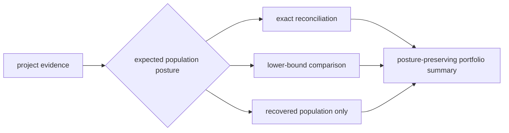
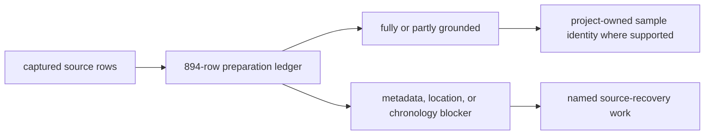
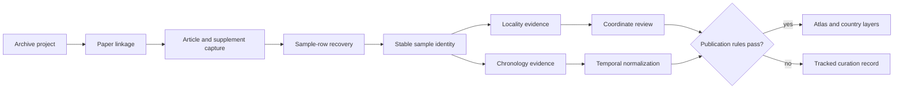
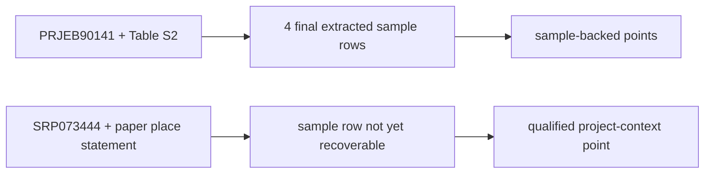
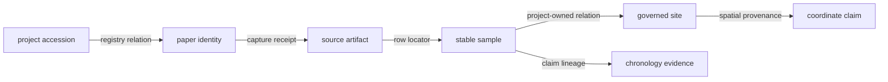
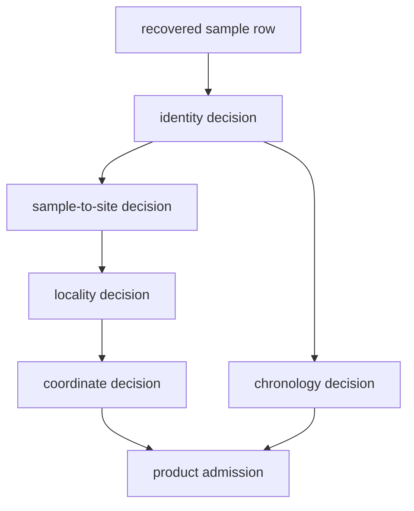
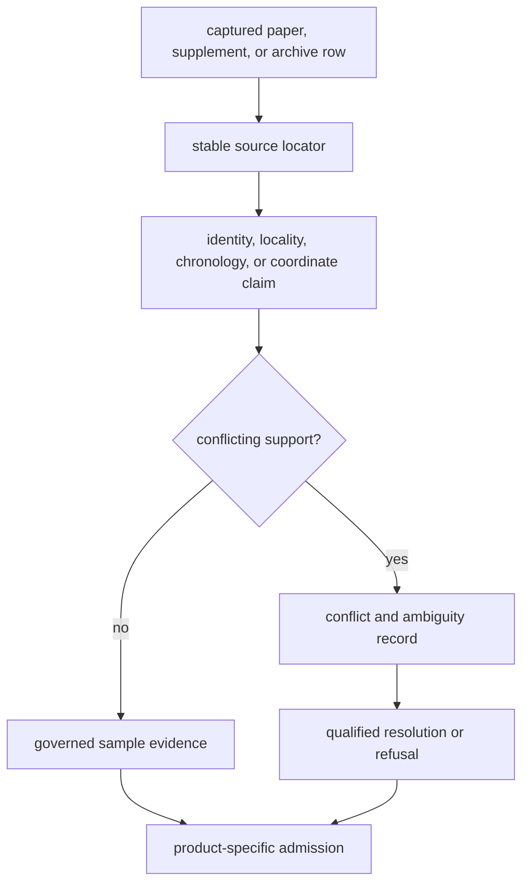

# Animal Source Intake

An animal ancient-DNA point begins with a project accession, a paper, and often
several supplementary files—not with a finished map row. Bijux Pollenomics
preserves that recovery chain so a published sample can be traced to the
artifact and passage that support its identity, locality, and chronology.

The tracked collection is therefore broader than the atlas. A project may be
important enough to curate while still lacking the evidence needed to place a
sample on a map. Its absence from a map means *not yet admissible at that
resolution*, not *no evidence exists*.

## Collection Snapshot

The current recovery review records:

| Measure | Current value | Interpretation |
| --- | ---: | --- |
| tracked archive projects | 40 | declared project inventory, not sample count |
| sample-foundation truth rows | 894 | curated source-row grounding and blocker population across 10 species |
| recovered final sample rows | 868 | extracted governed rows, not a complete source census |
| projects with exact expected counts | 4 | projects for which exact recovery completeness can be measured |
| projects with a minimum expected floor | 22 | projects for which recovery can be tested against a lower bound |
| projects with implausibly low recovery | 8 | source or extraction work still blocks a stronger claim |
| projects ready for publication review | 8 | projects that reached this lifecycle checkpoint |
| blocked projects | 26 | tracked projects held before that checkpoint |

These measures are published together because no one of them is an honest
summary of the collection. In particular, dividing the recovered sample total
by the four exact-denominator projects would compare unrelated populations.

### Denominator Confidence Governs Recovery Claims

Project recovery uses three denominator postures. They must not be combined
into one portfolio-wide completion percentage.

| Denominator posture | What can be claimed | What remains unknown |
| --- | --- | --- |
| exact expected count | recovered, missing, duplicate, and unresolved identities can reconcile to a fixed source population | whether uncatalogued source material exists outside the declared authority |
| minimum expected floor | recovery can be shown to meet or fall below a supported lower bound | the true total and percentage complete |
| unknown expected count | recovered identities and their evidence can be reported | completeness, deficit, and percentage complete |

A portfolio summary may count projects in each posture and may sum recovered
identities after collision review. It may not divide the summed recovery by a
mixture of exact, minimum, and unknown denominators. That calculation would
manufacture precision from projects whose source populations are not known.

### The Foundation Is A Preparation Ledger

`data/adna/governance/animal_sample_foundation_truth.json` records whether each
foundation row has enough attributed evidence to support downstream curation:

| Foundation posture | Rows | Intake meaning |
| --- | ---: | --- |
| fully grounded | 502 | identity and required evidence dimensions are attributable at the declared scope |
| partially grounded | 256 | useful evidence exists, but one or more dimensions remain materially limited |
| blocked: missing metadata | 29 | source metadata required to establish the governed row is absent |
| blocked: missing location detail | 4 | locality evidence cannot support the requested spatial claim |
| blocked: weak chronology | 103 | temporal evidence remains too weak for the stronger chronology claim |

These 894 rows are not interchangeable with the 868 project sample-master
identities. The foundation classifies preparation evidence; the sample master
governs recovered identity. A row can be valuable in one population without
having a one-to-one counterpart in the other.

The blocker class determines the next evidence action. Missing metadata calls
for source or relation recovery; missing location detail calls for stronger
sample-to-site evidence; weak chronology calls for a sample-owned temporal
source or a narrower non-numeric posture. None is repaired by copying a value
from a published point.

### Intake And Point Populations Are Not The Same

The current point-evidence surface combines two identity postures:

| Population | Count | Intake basis | Permitted description |
| --- | ---: | --- | --- |
| final extracted samples with supplementary coordinates | 233 | directly extracted sample rows with final identity | sample-backed publication points |
| Wadi Halfa dromedary context | 1 | project `SRP073444`, paper-pinned place statement, provisional sample identity | qualified project-anchored context point |

The second row is not part of the 868 recovered sample population merely
because it appears in the 234-row point review. Its stable token anchors the
project context, while `sample_evidence_status: not_yet_recoverable` and
`sample_identity_resolution: provisional` preserve the missing sample-level
link.

This distinction prevents two inverse errors: dropping useful paper-backed
context because sample recovery is incomplete, and reporting that context as
if a sample-bearing table had been recovered. A query that requires samples
uses the first population. A map that accepts qualified project context may use
both, but must expose the identity class.

## From Project To Publishable Sample

Each transition has its own evidence requirement. A readable paper does not
prove that its sample table was recovered; a recovered sample label does not
prove an exact site; and a named site does not justify coordinates unless the
coordinate source and resolution are explicit.

For project `PRJEB90141`, supplementary workbook Table S2 supplies four final
goat sample rows—Direkli1-2, Blagotin3, Semnan3, and Acem2—with distinct archive
identifiers, localities, coordinates, and chronology. The project accession is
shared; the sample claims are not. For `SRP073444`, the paper supplies a named
Wadi Halfa context while a recoverable sample-master row remains absent. These
two projects therefore follow different branches of the intake contract.

## Governed Intake Surfaces

The source library separates cross-project inventory from project-owned
evidence. This lets a reader locate the decision that controls each transition:

| Question | Governing surface | What it establishes |
| --- | --- | --- |
| Which projects and papers are tracked? | `tracked_project_and_paper_inventory.json` and `paper_registry.json` | archive and publication identity without implying sample recovery |
| Were supporting files acquired and classified? | `supplement_acquisition_checklist.json` and `supplement_file_family_audit.json` | fetch and file-family posture for sample-bearing material |
| What remains incomplete at intake? | `source_intake_audit.json` | project-level blocks, deficits, and next evidence boundary |
| How much sample material was expected and recovered? | `project_sample_master_completeness.json` and each project's `sample_master.json` | denominator-qualified recovery and stable sample identity |
| Which samples resolve to named sites? | `project_sample_site_review.json` and each project's `sample_sites.json` | sample-to-site relations without inventing coordinates |
| Which locality claims conflict or need normalization? | each project's `locality_worksheet.json` and `sample_locality_evidence.json`, plus `sample_locality_conflict_ledger.json` and `site_name_normalization_dictionary.json` | reported place text, normalized identity, precision, and unresolved disagreement |
| Which temporal claims are sample-owned? | `project_sample_chronology_review.json` and each project's `sample_chronology.json` | chronology coverage and source-owned temporal posture |

The cross-project files live under
`data/adna/governance/source_library/`. Project-owned files live under
`data/adna/governance/source_library/projects/<project-accession>/`. A row in a
cross-project review must resolve to the project file that supplies its sample,
site, locality, or chronology evidence; the review cannot become a substitute
authority.

### Every Recovery Edge Has A Receipt

The source library is a graph of attributed relations, not a folder of papers
beside a table of samples. Each edge is independently recoverable:

| Relation | Receipt required |
| --- | --- |
| project to paper | accession, DOI or stable paper identity, relation basis, and governing registry row |
| paper to artifact | canonical source URL, logical and physical path, media type, size, fetch outcome, and content identity |
| artifact to sample | table, sheet, row, archive member, or excerpt locator plus source-native sample label |
| sample to site | project-owned sample and site keys, native relation or explicit curation basis, and ambiguity posture |
| sample to chronology | verbatim claim, source locator, ownership class, dating basis, normalized result, and precision |
| site to coordinate | reported locality, coordinate source, resolution method, confidence, and disagreement outcome |

An orphaned edge blocks only the claim that depends on it. A sample can retain
its identity when its locality is unresolved, and a site can retain its name
when no defensible coordinate exists. Conversely, a complete-looking endpoint
cannot repair a missing edge: an exact coordinate is not sample evidence when
the sample-to-site relation is absent.

### One Intake Produces Several Governed Decisions

Extracting a sample row does not write one universal “curated” status. It
creates independent decisions that can mature at different rates:

| Decision record | Candidate input | Durable outcome |
| --- | --- | --- |
| sample identity | native label, accession, table locator, and project relation | final identity, unresolved candidates, or refusal to merge |
| sample-to-site relation | sample label, site label, table relation, and project context | direct relation, documented substitution, ambiguity, or missing link |
| locality claim | verbatim place text, site evidence, hierarchy, and conflicts | resolved locality with precision or unresolved claim |
| chronology claim | verbatim date, basis, sample ownership, and competing wording | numeric interval, textual posture, contextual range, conflict, or unknown |
| coordinate claim | supplied coordinate or named-place resolution with provenance | exact, approximate, substituted, region-only, withheld, or unresolved |
| publication admission | the preceding decisions plus product scope | admitted, qualified, excluded, or deferred member |

This fan-out is the central curation operation. A final identity can coexist
with unresolved chronology; an exact coordinate can coexist with text-only
time; and a project-context feature can remain visibly distinct from a final
sample-backed member.

## What Is Captured

| Evidence unit | Preserved information | Why it matters |
| --- | --- | --- |
| Project | archive accession, species scope, project URL, intake status | keeps archive identity separate from later interpretation |
| Paper | DOI, canonical URL, title, journal, year, linked projects | establishes the publication anchor |
| Source artifact | source URL, logical path, storage path, content type, size, fetch status | identifies the exact acquired object |
| Supplement | file family, archive member, parse status, linked paper | exposes whether the usable sample evidence was actually recovered |
| Sample | source-native label, stable repository identifier, source locator and excerpt | prevents project-level evidence from being presented as sample-level evidence |
| Locality | reported place text, site assignment, resolution, provenance, conflicts | controls how precisely a sample may be mapped |
| Chronology | reported date text, normalized interval, basis, precision, provenance | controls whether temporal comparison is defensible |

HTML article and archive captures may be stored as compressed `.html.gz`
payloads. Their logical `article.html` or `archive_metadata.html` identity stays
stable, while companion metadata records the physical path, byte size, and
encoding. Storage optimization therefore does not break provenance locators.

## Evidence Hierarchy

Different artifacts can support different claims about the same sample. The
curation record keeps those authorities separate:

| Claim | Preferred authority | Acceptable narrower fallback | Never sufficient by itself |
| --- | --- | --- | --- |
| sample identity | sample-bearing supplement or archive row with stable locator | explicit paper table or project metadata linked to the sample | project title or species list |
| project membership | archive accession and sample-to-project relation | paper statement naming both project and sample | DOI proximity alone |
| locality | sample row, sample-specific table, or explicit sample-to-site link | documented named site or region with matching precision | project country or map-centroid inference |
| chronology | sample-owned reported value and dating basis | explicit sample group interval carried as contextual or broad | paper year or undifferentiated project period |
| coordinate | source-supplied sample or verified site coordinate with provenance | documented approximate named-site resolution | arbitrary representative point for a region |

When authorities conflict, the intake does not select the most precise value.
It records the competing claims, their locators, and the decision basis. A
less precise but directly supported value outranks an exact-looking value with
unclear ownership.

## Recovery States Are Evidence, Too

The intake registry distinguishes incomplete acquisition from incomplete
extraction. These conditions have different remedies and different scientific
meaning:

- **paper capture blocked** — the publication anchor is not readable locally;
- **supplement capture blocked** — the paper is known, but its sample-bearing
  files are unavailable;
- **sample extraction blocked** — readable material exists, but defensible
  sample rows have not been recovered;
- **locality or chronology unresolved** — the sample exists, but a public
  spatial or temporal claim would exceed its evidence;
- **publication ready** — sample identity and the fields used by the output
  satisfy the applicable admission rules.

Expected sample counts are also provenance-bearing claims. When the available
paper or archive surface is too weak, the registry keeps the count unknown
rather than turning an estimate into an apparent fact.

Foundation blockers and intake blockers remain separately addressable. A weak
chronology posture can block a temporal claim even when the paper, supplement,
sample row, and locality are fully recovered. Conversely, an unavailable
supplement can block sample extraction before locality or chronology can be
evaluated at all. Reporting both levels prevents “blocked” from becoming an
opaque catch-all.

Recovery completeness must therefore name its denominator. “All recovered
samples reviewed” describes the extracted rows; it does not mean every sample
expected from every paper or project was recovered. Where a trustworthy
expected count is unavailable, completeness remains unknown even if every
known row is curated.

## Recovery And Publication Are Separate Ledgers

The intake surfaces record whether source material was found, captured,
parsed, and converted into stable sample evidence. Publication surfaces record
whether a governed record satisfies a particular output contract. Keeping
these decisions separate preserves important cases:

| Recovery state | Publication consequence |
| --- | --- |
| source known, supplement unavailable | retain project and paper identity; do not invent sample rows |
| supplement captured, sample table unextracted | expose recovery work; do not equate capture with sample coverage |
| sample recovered, locality unresolved | retain the sample; refuse exact-point publication |
| sample and site resolved, chronology contextual | publish only where the product accepts non-numeric temporal posture |
| point admitted, project under-recovered | publish the supported member; retain the project-level completeness warning |

This is the central collection rule: evidence already fit for a narrow product
does not erase known recovery debt, and recovery debt does not erase the
evidence that has been defensibly curated.

## How To Audit A Sample

Start with the project registry under
`data/adna/governance/source_library/project_registry.json`, then follow the
project's `source_bundle_path`. The bundle connects project and paper records
to captured artifacts and supplements. Project-owned recovery records under
`data/adna/governance/source_library/projects/<project-accession>/` then
preserve the source claims:

1. `sample_master.json` establishes stable sample identity and source lineage;
2. `sample_locality_evidence.json` and `sample_sites.json` preserve reported
   locality, resolution, and site linkage;
3. `sample_chronology_evidence.json` and
   `sample_chronology_provenance.json` preserve temporal claims and their
   source locators;
4. the species-owned `normalized/` directory under
   `data/adna/species/<species-slug>/` exposes `sample_records.json`,
   `site_evidence.json`, and `coordinate_provenance.json` for downstream
   products.

Cross-project audits expose missing captures, ambiguous identities, locality
conflicts, chronology gaps, and manual-curation work without promoting those
records into public points.

An audit should also verify that every published descendant points back to the
same governing sample identity. Species views and report rows are projections;
they cannot silently split one sample, merge distinct samples, or replace the
project-owned authority.

## Reading A Visible Point Correctly

A visible point means that the repository can defend the sample at the
published spatial and temporal resolution. It does not mean every source field
was exact, that all samples from the project were recovered, or that every
tracked project reached the same maturity.

For the field-level contracts, continue with [sample records](../evidence/sample-records.md),
[locality evidence](../evidence/localities.md), and
[chronology evidence](../evidence/chronology.md). The final map admission rules
are documented in [point publication rules](../publications/point-rules.md).
