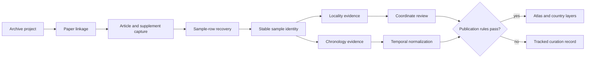

# Animal source intake

An animal ancient-DNA point begins with a project accession, a paper, and often
several supplementary files—not with a finished map row. Bijux Pollenomics
preserves that recovery chain so a published sample can be traced to the
artifact and passage that support its identity, locality, and chronology.

The tracked collection is therefore broader than the atlas. A project may be
important enough to curate while still lacking the evidence needed to place a
sample on a map. Its absence from a map means *not yet admissible at that
resolution*, not *no evidence exists*.

## From project to publishable sample

Each transition has its own evidence requirement. A readable paper does not
prove that its sample table was recovered; a recovered sample label does not
prove an exact site; and a named site does not justify coordinates unless the
coordinate source and resolution are explicit.

## What is captured

| Evidence unit | Preserved information | Why it matters |
| --- | --- | --- |
| Project | archive accession, species scope, project URL, intake status | keeps archive identity separate from later interpretation |
| Paper | DOI, canonical URL, title, journal, year, linked projects | establishes the publication anchor |
| Source artifact | source URL, logical path, storage path, content type, size, fetch status | identifies the exact acquired object |
| Supplement | file family, archive member, parse status, linked paper | exposes whether the usable sample evidence was actually recovered |
| Sample | source-native label, stable repository identifier, source locator and excerpt | prevents project-level evidence from being presented as sample-level evidence |
| Locality | reported place text, site assignment, resolution, provenance, conflicts | controls how precisely a sample may be mapped |
| Chronology | reported date text, normalized interval, basis, precision, provenance | controls whether temporal comparison is defensible |

HTML article and archive captures may be stored as compressed `.html.gz`
payloads. Their logical `article.html` or `archive_metadata.html` identity stays
stable, while companion metadata records the physical path, byte size, and
encoding. Storage optimization therefore does not break provenance locators.

## Recovery states are evidence, too

The intake registry distinguishes incomplete acquisition from incomplete
extraction. These conditions have different remedies and different scientific
meaning:

- **paper capture blocked** — the publication anchor is not readable locally;
- **supplement capture blocked** — the paper is known, but its sample-bearing
  files are unavailable;
- **sample extraction blocked** — readable material exists, but defensible
  sample rows have not been recovered;
- **locality or chronology unresolved** — the sample exists, but a public
  spatial or temporal claim would exceed its evidence;
- **publication ready** — sample identity and the fields used by the output
  satisfy the applicable admission rules.

Expected sample counts are also provenance-bearing claims. When the available
paper or archive surface is too weak, the registry keeps the count unknown
rather than turning an estimate into an apparent fact.

## How to audit a sample

Start with the project registry under
`data/adna/governance/source_library/project_registry.json`, then follow the
project's `source_bundle_path`. The bundle connects project and paper records
to captured artifacts and supplements. A recovered sample continues into the
species-owned surfaces under `data/adna/species/<species-slug>/`:

1. `normalized/sample_master.json` establishes the stable sample identity and
   source lineage;
2. `review/sample_locality_evidence.json` records the reported place evidence
   and any unresolved conflict;
3. `normalized/sample_sites.json` records the admitted spatial representation;
4. `normalized/sample_chronology.json` records chronology only when the source
   supports a defensible temporal representation.

Cross-project audits expose missing captures, ambiguous identities, locality
conflicts, chronology gaps, and manual-curation work without promoting those
records into public points.

## Reading a visible point correctly

A visible point means that the repository can defend the sample at the
published spatial and temporal resolution. It does not mean every source field
was exact, that all samples from the project were recovered, or that every
tracked project reached the same maturity.

For the field-level contracts, continue with [sample records](../evidence/sample-records.md),
[locality evidence](../evidence/localities.md), and
[chronology evidence](../evidence/chronology.md). The final map admission rules
are documented in [point publication rules](../publications/point-rules.md).
