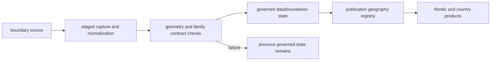
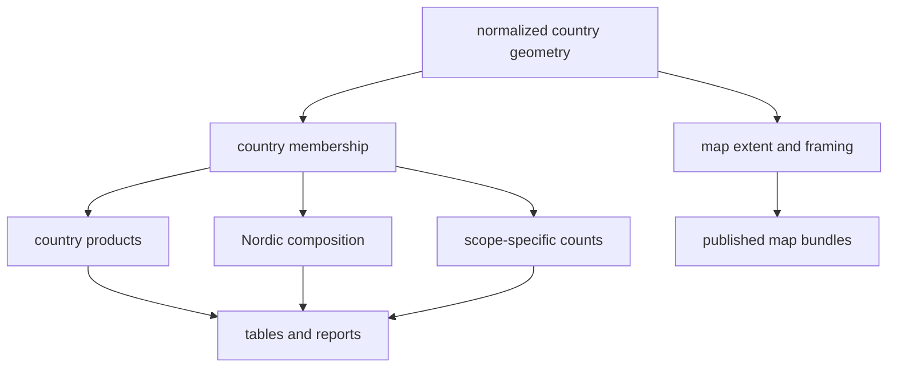
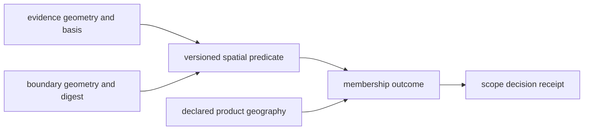

# Boundaries

The boundary family supplies the four country geometries used to define
Sweden, Norway, Finland, Denmark, and their shared Nordic scope. It governs
publication framing and membership tests; it contributes no scientific weight
to a feature inside a polygon.

## Captured State

The collection summary identifies the boundary family as version `v66`,
retrieved on `2026-06-22` through the collector pipeline under public geodata
terms. It records separate SHA-256 digests for the captured and normalized
state, plus a dispute token that identifies the exact snapshot used by
publication.

The normalized artifact is
`data/boundaries/normalized/nordic_country_boundaries.geojson`. It contains one
MultiPolygon feature for each Nordic publication country:

| Country | Governed use |
| --- | --- |
| Sweden | country selection and Nordic composition |
| Norway | country selection and Nordic composition |
| Finland | country selection and Nordic composition |
| Denmark | country selection and Nordic composition |

The normalized geometry is the authority from which scope-specific copies are
published. A copy beside a map is convenient for reuse, but it is not an
independent boundary source. Its meaning depends on the normalized family,
the product registry, and the selection rule that produced the bundle.

## Acquisition And Replacement

Refresh uses a staging swap. The collector prepares a temporary family tree,
validates it, and replaces `data/boundaries/` only after success. A failed
refresh preserves the preceding governed state. This makes a geometry change
reviewable as a collection change rather than an in-place mutation of a
published product.

## How Geometry Changes Propagate

One boundary decision can affect several downstream views even when no pollen,
archaeology, hydrography, or ancient-DNA record changes:

The affected outputs must therefore move together. Updating a displayed
polygon without recomputing membership leaves the map and its counts in
different geographic states. Recomputing membership without preserving the
boundary snapshot makes the cause of a changed count impossible to recover.

## What A Boundary Decision Means

A point selected into a country product intersects the geometry used by that
product under its declared rule. The decision does not establish:

- historical nationality or cultural affiliation;
- locality precision beyond the point's own coordinate evidence;
- temporal overlap with any record in the same country;
- source completeness within the polygon; or
- scientific support from the boundary itself.

Modern framing and historical evidence remain different claims. A broad or
region-only locality cannot acquire exact country membership through an
arbitrary representative point.

## Audit A Scope Change

When a record enters or leaves a country bundle, compare three identities:

1. the evidence record and its coordinate provenance;
2. the boundary collection version and normalized digest; and
3. the product geography registry and selection rule.

An unchanged evidence record with changed boundary membership is a framing
change. An unchanged boundary with revised coordinates is an evidence change.
An unchanged pair with different product membership is a scope or admission
change. Keeping those causes separate prevents geographic filtering from
masquerading as new scientific evidence.

| Observed difference | First authority to inspect | Interpretation |
| --- | --- | --- |
| polygon outline changed | normalized boundary digest | boundary collection changed |
| record moved across an unchanged outline | record coordinate provenance | evidence location changed |
| membership changed while both are stable | product selection rule | publication scope changed |
| map outline changed but counts did not | published bundle lineage | geometry and membership may be out of sync |

Country membership is a reproducible predicate, not a property that upgrades
the underlying record. A point may be inside the current Sweden polygon while
remaining historically ambiguous, coarsely located, or temporally unrelated
to every other point in that product.

### Membership Decision Receipt

Every reusable geography decision retains both sides of the predicate:

| Receipt field | Why it is required |
| --- | --- |
| evidence member | stable object identity and the coordinate or geometry claim evaluated |
| spatial basis | reported, resolved, representative, centroid, or other governed geometry method |
| boundary identity | collection version, normalized digest, country feature, and coordinate reference system |
| predicate | containment or intersection method, including edge handling |
| decision scope | country, Nordic composition, or another named product geography |
| outcome | included, outside scope, spatially unresolved, or refused |
| product effect | affected manifest member, exclusion, count, and parent–child relation |

This receipt prevents a country label copied into a downstream table from
becoming the authority for membership. It also makes edge cases reviewable
without silently moving a source coordinate to force a desired country result.

Continue to [boundary exports](../publications/boundary-exports.md) for reuse,
[maps](../publications/maps.md) for rendering, and
[publication reports](../publications/reports.md) for scope lineage.
