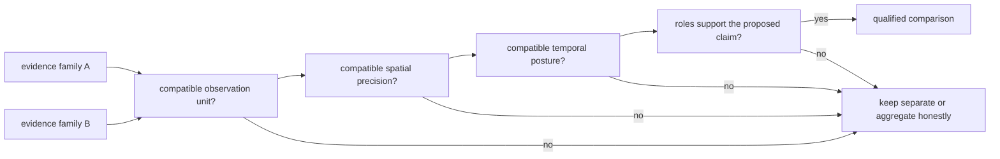

# Cross-Domain Source Roles

Bijux Pollenomics combines evidence families because they answer related
questions, not because they are interchangeable. Each family retains its own
observation unit, authority, spatial precision, temporal posture, and product
role.

## Role Matrix

| Family | Governed unit | Product role | Strongest supported reading |
| --- | --- | --- | --- |
| LandClim | pollen site sequence and REVEALS grid cell | environmental context | time-aware pollen and vegetation-reconstruction coverage |
| Neotoma | pollen site | environmental context | site-level pollen coverage under explicit temporal posture |
| SEAD | environmental-archaeology site inventory row | archaeology context | mapped Nordic inventory context without current numeric time support |
| RAÄ | published heritage record aggregated to density cells | archaeology context | Sweden-specific registry density under a declared classification |
| AADR | release-pinned human aDNA annotation row | direct human evidence | admitted human sample metadata within a versioned product |
| animal ancient DNA | project-owned sample and its claim records | direct or qualified animal evidence | sample identity, locality, chronology, and coordinate claims that pass the product contract |
| SVAR | registered lake | geographic and decision-support input | stable lake identity and hydrographic properties |
| boundaries | country MultiPolygon | geographic framing | reproducible Nordic and country scope selection |

## Comparison Requires A Bridge

Co-location is only the beginning of a comparison. A defensible cross-domain
claim names the bridge between observation units, respects the weakest spatial
precision, uses compatible temporal evidence, and does not promote context or
framing into direct support.

Examples:

- a LandClim sequence and an animal sample can be compared by overlapping
  declared BP intervals, but overlap does not prove causation;
- a RAÄ density cell can describe archaeology registry context near a lake,
  but it cannot supply an event date or site relationship;
- a boundary can select a record into Sweden, but it cannot increase that
  record's evidence strength; and
- an SVAR lake can anchor a ranking unit, but nearby evidence remains owned by
  its original family.

## Null And Absence Semantics

Missing values retain family-specific meaning. A missing SEAD interval means
the current capture does not support numeric comparison. An excluded animal
point can still have a governed sample identity. A lake with no nearby admitted
feature is not evidence that the historical phenomenon was absent. A country
filter can remove a feature without changing its source record.

For any absence claim, distinguish:

1. absent upstream;
2. not captured;
3. captured but unresolved;
4. resolved but outside product scope;
5. excluded by an admission rule; and
6. admitted but hidden by a reader-controlled filter.

## Reuse Contract

A cross-domain extract carries source-family identity, stable record IDs,
observation units, evidence roles, geometry and precision, temporal semantics,
product membership, and caveats. Counts remain partitioned by unit and role;
they are not summed into a synthetic total of “evidence.”

Continue to the [source-family matrix](source-family-matrix.md),
[spatiotemporal posture](spatiotemporal-posture.md), and
[cross-domain evidence matrix](../overview/cross-domain-evidence-matrix.md)
for family-specific maturity and comparison limits.
