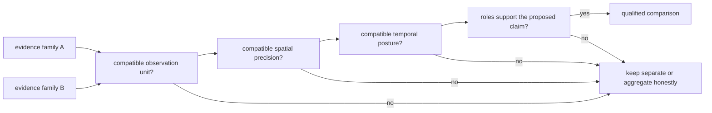
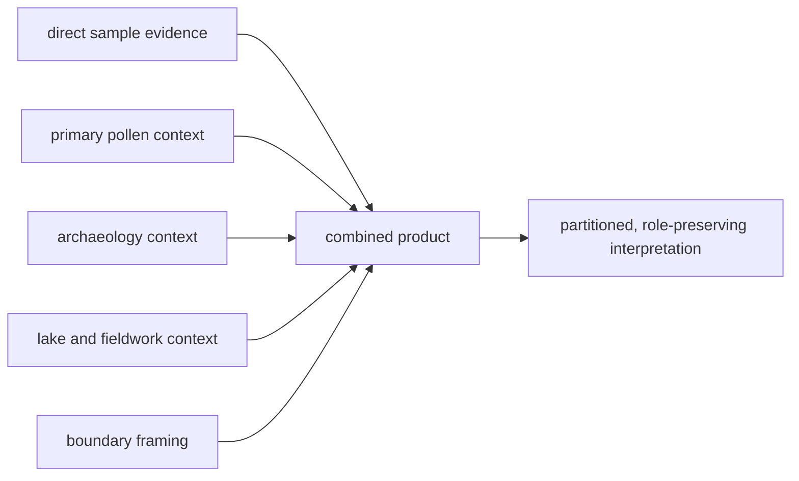

# Cross-Domain Source Roles

Bijux Pollenomics combines evidence families because they answer related
questions, not because they are interchangeable. Each family retains its own
observation unit, authority, spatial precision, temporal posture, and product
role.

An evidence role is an authority boundary, not a display category. It governs
which assertions a record may contribute before any map styling, proximity
calculation, or ranking is applied. A downstream product can narrow that
authority, but cannot promote it.

## Role Matrix

| Family | Governed unit | Product role | Strongest supported reading |
| --- | --- | --- | --- |
| LandClim | pollen site sequence and REVEALS grid cell | environmental context | time-aware pollen and vegetation-reconstruction coverage |
| Neotoma | pollen site | environmental context | site-level pollen coverage under explicit temporal posture |
| SEAD | environmental-archaeology site inventory row | archaeology context | mapped Nordic inventory context without current numeric time support |
| RAÄ | published heritage record aggregated to density cells | archaeology context | Sweden-specific registry density under a declared classification |
| AADR | release-pinned human aDNA annotation row | direct human evidence | admitted human sample metadata within a versioned product |
| animal ancient DNA | project-owned sample and its claim records | direct or qualified animal evidence | sample identity, locality, chronology, and coordinate claims that pass the product contract |
| SVAR | registered lake | geographic and decision-support input | stable lake identity and hydrographic properties |
| boundaries | country MultiPolygon | geographic framing | reproducible Nordic and country scope selection |

### Role And Workflow Are Independent

Evidence role describes what a family may support. Intake workflow describes
how its governed material reaches the repository. The two dimensions remain
separate:

| Family boundary | Intake pattern | Why the distinction matters |
| --- | --- | --- |
| seven collector-managed families | release, API, or registry capture into a family-owned tree | executable support is visible through `source-support`, but presence and fitness require separate state evidence |
| animal ancient-DNA family | paper, archive, supplement, and sample-owned recovery | no synthetic collection adapter can replace project-by-project evidence lineage |

This is why the eight-family portfolio has seven collection adapters. The
difference is part of the scientific model, not an incomplete count.

## Comparison Requires A Bridge

Co-location is only the beginning of a comparison. A defensible cross-domain
claim names the bridge between observation units, respects the weakest spatial
precision, uses compatible temporal evidence, and does not promote context or
framing into direct support.

Examples:

- a LandClim sequence and an animal sample can be compared by overlapping
  declared BP intervals, but overlap does not prove causation;
- a RAÄ density cell can describe archaeology registry context near a lake,
  but it cannot supply an event date or site relationship;
- a boundary can select a record into Sweden, but it cannot increase that
  record's evidence strength; and
- an SVAR lake can anchor a ranking unit, but nearby evidence remains owned by
  its original family.

## Roles Do Not Escalate Through Combination

Combining several contextual layers does not produce direct evidence. A
derived product inherits the role of each contribution and may make only the
claim supported by the declared bridge:

| Combination outcome | Defensible statement | Overclaim |
| --- | --- | --- |
| direct sample near pollen site | a governed sample and pollen site meet the declared spatial rule | pollen explains the sample |
| lake near dense registry cells | the lake lies near recorded archaeology context | the lake has high archaeological potential |
| several context families agree spatially | multiple contextual layers are present under the same scope | independent confirmation of one historical event |
| country boundary contains features | those features enter the declared geographic product | the country sample is representative |

Independence must also be demonstrated rather than assumed. Two records derived
from the same upstream source or one copied citation are not independent
corroboration merely because they appear in separate layers.

## Null And Absence Semantics

Missing values retain family-specific meaning. A missing SEAD interval means
the current capture does not support numeric comparison. An excluded animal
point can still have a governed sample identity. A lake with no nearby admitted
feature is not evidence that the historical phenomenon was absent. A country
filter can remove a feature without changing its source record.

For any absence claim, distinguish:

1. absent upstream;
2. not captured;
3. captured but unresolved;
4. resolved but outside product scope;
5. excluded by an admission rule; and
6. admitted but hidden by a reader-controlled filter.

## Reuse Contract

A cross-domain extract carries source-family identity, stable record IDs,
observation units, evidence roles, geometry and precision, temporal semantics,
product membership, and caveats. Counts remain partitioned by unit and role;
they are not summed into a synthetic total of “evidence.”

Any derived row should retain the member identities on both sides of the
bridge, the rule and parameters, the governing source versions, the result
posture, and the reason for refusal when no result was produced. Otherwise the
row can be displayed but cannot be independently re-evaluated.

### Governing Authority Survives The Join

The product record carries a small authority ledger for every derived claim:

| Ledger field | Purpose |
| --- | --- |
| member identities | recover the exact source-native records on every side of the relation |
| evidence roles | prevent a contextual or framing contribution from being presented as direct support |
| bridge rule and parameters | state whether the relation is containment, distance, time overlap, identifier linkage, or another declared operation |
| precision posture | cap the result at the weakest relevant place and time precision |
| source versions | make the result reproducible against the releases actually reviewed |
| disposition and reason | distinguish admitted, qualified, excluded, deferred, and refused results |

A derived score is not this ledger. Scores can order candidates within an
already governed decision surface; they cannot erase missing evidence,
manufacture independence, or transfer authority between families.

Continue to the [source-family matrix](source-family-matrix.md),
[spatiotemporal posture](spatiotemporal-posture.md), and
[cross-domain evidence matrix](../overview/cross-domain-evidence-matrix.md)
for family-specific maturity and comparison limits.
