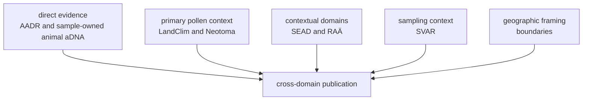

# Source Families

Pollenomics combines eight contracted source families. Their records can share
a publication, but the source contract preserves what each family measures,
where it applies, how it was acquired, and which claims it can support.

## Contracted Sources

| Family | Evidence role | Suitable questions | Principal limit |
| --- | --- | --- | --- |
| [LandClim](landclim.md) | primary pollen context | pollen sequences and modelled vegetation context | model grids and observed sites have different semantics |
| [Neotoma](neotoma.md) | primary pollen context | palaeoecological site and pollen comparison | temporal coverage and resolution vary by site |
| [SEAD](sead.md) | environmental archaeology context | archaeological and environmental context | access, normalization, and chronology require explicit review |
| [RAÄ](raa.md) | Swedish archaeology context | heritage and archaeological context in Sweden | national coverage cannot be generalized beyond Sweden |
| [Boundaries](boundaries.md) | geographic framing | country selection, clipping, and map extent | boundaries are not scientific evidence |
| SMHI SVAR | lake and hydrography context | registered Swedish waters and lake-oriented filtering | registry presence does not establish sampling suitability |
| [AADR](aadr.md) | human ancient-DNA evidence | release-versioned sample metadata | current scope excludes genotype processing |
| [Animal source intake](animal-source-intake.md) | sample-owned animal aDNA evidence | project, paper, supplement, sample, locality, and chronology recovery | source completeness varies by project and sample |

## Source Identity

Every collected family is bound to repository evidence that includes:

- a source key and display name;
- selected version and retrieval date;
- acquisition method and output root;
- source-specific license posture;
- hashes for captured and normalized content;
- provenance linking the source to its repository representation; and
- replacement rules describing how refreshes affect tracked data.

The current bindings are recorded in `data/collection_summary.json`. A hash
identifies bytes; it does not certify scientific completeness, temporal
comparability, or publication fitness.

## Direct Evidence, Context, And Framing

Co-publication does not make these roles equivalent. For example, a boundary
can determine whether a point appears in a country view, but it cannot validate
the point's date or coordinate. A lake record can support candidate discovery,
but not a coring recommendation without further evidence.

## Animal Source Recovery

Animal aDNA is not acquired as one uniform release. The source library links
papers, archive projects, supplements, sample identifiers, sites, locality
statements, and chronology claims while retaining their separate provenance.

A project can remain tracked even when it is not publishable. Missing
supplements, ambiguous identifiers, unresolved localities, and conflicting
dates enter recovery queues and review ledgers. This preserves the difference
between “no evidence exists” and “the necessary evidence has not yet been
recovered.”

## Infrastructure Is Not Evidence

[PalaeOpen](palaeopen.md) and similar collaboration or interoperability
networks can help align metadata and reuse practices. They are not direct
source families unless a specific governed dataset is acquired, versioned,
licensed, and admitted through the source contract.

## Compare And Inspect

- [Source comparison](source-comparison.md) compares the questions each family
  can answer.
- [Source-family matrix](source-family-matrix.md) compares role, reach,
  publication use, and limits.
- [Refresh policy](refresh-policy.md) describes source replacement and review.
- [Shared normalization](shared-normalization.md) describes common fields
  without erasing source-specific semantics.
- [Spatiotemporal posture](spatiotemporal-posture.md) compares place and time
  meaning across domains.
- [Evidence](../evidence/index.md) follows curated claims beyond acquisition.
