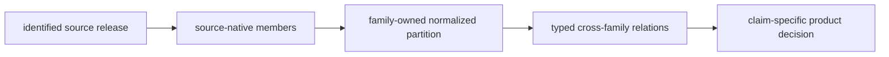
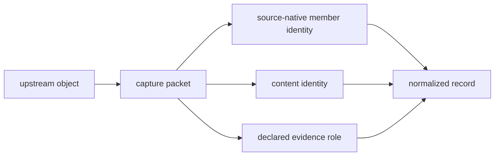
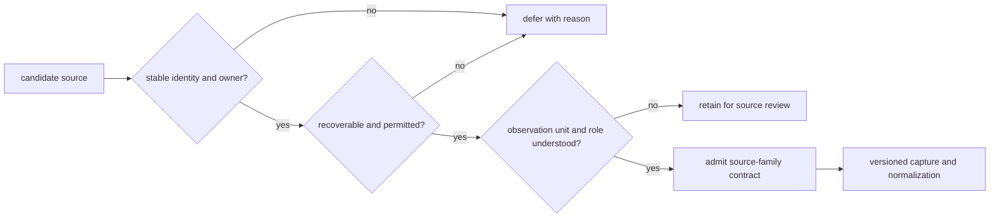
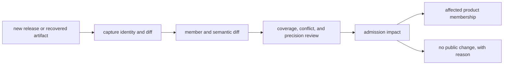
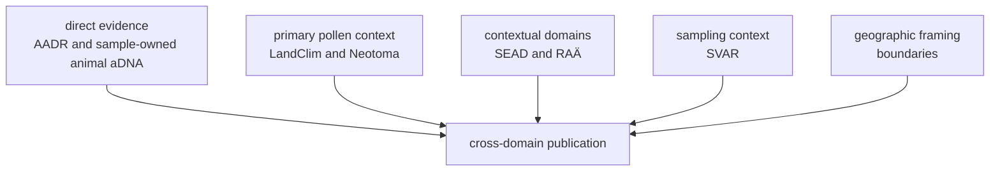

# Source Families

Pollenomics combines eight contracted source families. Their records can share
a publication, but the source contract preserves what each family measures,
where it applies, how it was acquired, and which claims it can support.

The portfolio and the collection command have deliberately different
boundaries. Seven families have collectors and appear in `source-support`:
AADR, boundaries, LandClim, Neotoma, RAÄ, SEAD, and SVAR. Animal ancient-DNA
evidence is the eighth contracted family, but it enters through a
literature-and-archive intake workflow because there is no single upstream
release to collect. A support-matrix row therefore means that a collection
adapter exists; it does not mean that a capture is present, complete, current,
or admitted to a product.

## Contracted Sources

| Family | Evidence role | Suitable questions | Principal limit |
| --- | --- | --- | --- |
| [LandClim](landclim.md) | primary pollen context | pollen sequences and modelled vegetation context | model grids and observed sites have different semantics |
| [Neotoma](neotoma.md) | primary pollen context | palaeoecological site and pollen comparison | temporal coverage and resolution vary by site |
| [SEAD](sead.md) | environmental archaeology context | archaeological and environmental context | access, normalization, and chronology require explicit review |
| [RAÄ](raa.md) | Swedish archaeology context | heritage and archaeological context in Sweden | national coverage cannot be generalized beyond Sweden |
| [Boundaries](boundaries.md) | geographic framing | country selection, clipping, and map extent | boundaries are not scientific evidence |
| [SMHI SVAR](svar.md) | lake and hydrography context | registered Swedish waters and lake-oriented filtering | registry presence does not establish sampling suitability |
| [AADR](aadr.md) | human ancient-DNA evidence | release-versioned sample metadata | current scope excludes genotype processing |
| [Animal source intake](animal-source-intake.md) | sample-owned animal aDNA evidence | project, paper, supplement, sample, locality, and chronology recovery | source completeness varies by project and sample |

## Choose By Question And Observation Unit

The most convenient layer is not necessarily the right evidence. Select a
family by the object it observes and the claim it is allowed to support.

| Intended question | Appropriate starting family | Observation unit | Required qualification |
| --- | --- | --- | --- |
| What pollen or vegetation context is represented? | LandClim or Neotoma | sequence, site, or model grid | state whether the value is observed or modelled and retain its time basis |
| What archaeological context is registered nearby? | SEAD or RAÄ | environmental-archaeology site or Swedish heritage record | preserve national reach, registration bias, and chronology limits |
| Which geography contains a record? | boundaries | administrative polygon | use only for framing or selection, never evidential weight |
| Which registered lake is being considered? | SVAR | water-body registry record | distinguish registry identity from sampling suitability |
| Which human aDNA metadata record is represented? | AADR | release-versioned sample row | retain release and metadata precision; genotype analysis is separate |
| Which animal specimen supports a claim? | animal source library | project-owned sample with paper lineage | require sample-owned place, time, and coordinate evidence for exact publication |

If no family observes the required unit, combining nearby layers does not
repair the gap. The valid outcome is a contextual statement, a recovery item,
or a refusal.

## Source Identity

Every collected family is bound to repository evidence that includes:

- a source key and display name;
- selected version and retrieval date;
- acquisition method and output root;
- source-specific license posture;
- hashes for captured and normalized content;
- provenance linking the source to its repository representation; and
- replacement rules describing how refreshes affect tracked data.

The current bindings are recorded in `data/collection_summary.json`. A hash
identifies bytes; it does not certify scientific completeness, temporal
comparability, or publication fitness.

### A Family Writes A Bounded Database Partition

Collection does not pour unlike records into one undifferentiated table. Each
family owns a partition whose keys, observation unit, native fields, spatial
and temporal meaning, and evidence role remain visible after normalization.

The partition boundary prevents a common field name from becoming common
scientific meaning. A `site_id` in Neotoma and a `site_id` in SEAD belong to
different identity domains. Coordinates from either family can participate in
a declared proximity relation, but do not authorize an identity join.

| Database responsibility | Family contract must preserve |
| --- | --- |
| member identity | source-native key, repository key, release, and collision posture |
| observation unit | site, sequence, grid cell, registry record, sample, or polygon |
| field meaning | native value, units, nulls, parsing or normalization rule, and precision |
| lifecycle roots | captured, normalized, reviewed, and published surfaces |
| evidence role | direct, primary context, contextual, sampling, or framing |
| replacement behavior | staged root, final root, failure preservation, and semantic review |

### Minimum Capture Packet

A captured member is usable evidence only when the repository can recover the
object and the context in which it was acquired:

| Packet field | Required meaning |
| --- | --- |
| source identity | family, upstream owner, dataset or archive name, and release or accession |
| member identity | source-native key and repository key without relying on row order |
| acquisition | canonical locator, retrieval method, retrieval time, and access outcome |
| content identity | physical or logical artifact path, media type, size, and digest |
| reuse posture | licence or terms evidence and any redistribution limit |
| intended role | observation unit, geographic and temporal reach, and permitted evidence role |
| preparation lineage | parser or extraction rule, normalized destination, and unresolved fields |

A DOI without the recovered table, an API URL without a release or response
identity, or a copied row without its source-native key is an incomplete
capture packet. Such material can remain in recovery state, but cannot silently
enter the normalized population.

## Source Contract As Scientific Interface

A family contract defines the stable boundary between an upstream ecosystem
and every repository consumer. It is more than an acquisition recipe.

| Contract dimension | Evidence retained | Promise to consumers |
| --- | --- | --- |
| identity | owner, dataset or archive identity, release, and source locator | records can be attributed to the intended upstream object |
| observation unit | site, sequence, sample, registry record, polygon, or project relation | counts and joins preserve what was actually observed |
| semantics | source-native fields, units, nulls, geometry, and time meaning | normalization does not silently strengthen the source |
| acquisition | retrieval method, date, license posture, payload identity, and replacement rule | a capture can be reproduced or challenged |
| role | direct evidence, primary context, contextual domain, sampling context, or framing | publication cannot promote context into direct proof |
| fitness | coverage, precision, conflict, and product-specific review | consumers can distinguish captured data from admitted evidence |

A source-name match is not enough to preserve this interface. A release that
changes observation unit, schema meaning, licensing, geographic reach, or time
semantics requires renewed interpretation before old publication assumptions
can be reused.

## Source Admission

Admission requires more than topical relevance. The system needs a stable
source identity, an acquisition route, a reuse posture, a defined observation
unit, a geographic and temporal interpretation, and an explicit role in the
publication model. A source that fails one requirement may remain documented
for recovery without being presented as a collected evidence family.

An admission decision is auditable only when its evidence can be separated
from the source itself. The decision packet names the proposed family owner,
upstream authority, selected release or accession, acquisition route, reuse
posture, observation unit, evidence role, known biases, normalization owner,
and the products allowed to consume the result. It also records rejected
alternatives and the condition that would trigger demotion or renewed review.
This makes selection policy inspectable instead of hiding it in downloader
code or repository history.

Refresh does not repeat admission blindly. A new release can change schema,
licence terms, endpoints, coverage, or semantics; those changes require review
even when the source name remains stable.

### Contract, Capability, State, And Fitness

Four surfaces answer different questions and must not be read as substitutes:

| Surface | Question answered | What it does not prove |
| --- | --- | --- |
| source-family contract | What kind of evidence is this family allowed to contribute? | that software can currently acquire it |
| `source-support` | Which collector adapters and declared country scopes exist? | that any bytes were captured or validated |
| collection and evidence-state matrices | What governed material is present and which checks passed? | that a record is fit for a particular product |
| product admission ledger | Which members satisfy one named publication contract, and why? | that excluded or unresolved evidence is scientifically irrelevant |

The separation matters most for partial recovery. A family can be contracted
and supported while its current capture is incomplete; a complete capture can
still contain unresolved members; and a resolved member can remain outside a
product because its place, time, role, or precision does not meet that
product's policy.

### Admission Has Three Separate Decisions

Source-family admission, record capture, and product admission answer different
questions. Conflating them makes a large collection look more publishable than
its evidence warrants.

| Decision | Question | Durable outcome |
| --- | --- | --- |
| family contract | Is the upstream object identifiable, recoverable, interpretable, and legally usable for a declared role? | admitted family or documented deferral |
| record capture | Which source-native members were actually retrieved and normalized? | captured member, rejected row, or unresolved member with reason |
| product admission | Does this reviewed member satisfy one named product's identity, spatial, temporal, and role requirements? | admitted, qualified, excluded, or deferred membership |

A family may be fully contracted while some records remain unresolved. A
record may be captured correctly yet excluded from every public product. A
member admitted to a spatial inventory may remain ineligible for time-aware
analysis. Each state is meaningful and remains queryable.

### Source Substitution Is Forbidden

A source may fill only the claim dimension it owns. Boundaries can decide
spatial membership but cannot validate a sample coordinate. SEAD can supply
environmental archaeology context but cannot date a nearby specimen. SVAR can
identify a registered water body but cannot establish coring feasibility. AADR
cannot resolve animal sample identity, and animal project metadata cannot stand
in for sample-owned locality evidence.

Cross-domain products therefore join governed claims; they do not merge source
authority. When one required dimension is absent, the product must qualify,
defer, or refuse the claim instead of borrowing certainty from another family.

## Change Propagation

The last branch is important: collection and curation are products even when a
record remains outside public scope. A refresh is trustworthy when its lack of
publication impact is explained, not merely when regenerated maps happen to
look unchanged.

### Portfolio Breadth Is Not Claim Coverage

Eight contracted families do not imply eight independent witnesses for every
question. Coverage is evaluated per claim dimension and observation unit:

| Proposed claim | Families that may contribute | Families that cannot fill the decisive gap |
| --- | --- | --- |
| pollen context around a locality | LandClim and Neotoma | boundaries can frame scope but cannot supply pollen evidence |
| sample-owned animal chronology | animal literature and archive evidence | nearby SEAD, RAÄ, or AADR records cannot date the animal sample |
| country publication membership | governed evidence geometry and boundaries | country labels cannot repair unresolved coordinate precision |
| lake decision support | SVAR identity and geometry plus role-aware context layers | high context density cannot establish bathymetry, access, or coring suitability |
| temporally aligned cross-domain comparison | families with compatible reviewed intervals | contextual labels and unresolved time cannot be promoted into numeric overlap |

Count families only when the question is portfolio inventory. For scientific
support, count independent governed observations that are eligible for the
specific claim and retain each source role.

## Direct Evidence, Context, And Framing

Co-publication does not make these roles equivalent. For example, a boundary
can determine whether a point appears in a country view, but it cannot validate
the point's date or coordinate. A lake record can support candidate discovery,
but not a coring recommendation without further evidence.

## Animal Source Recovery

Animal aDNA is not acquired as one uniform release. The source library links
papers, archive projects, supplements, sample identifiers, sites, locality
statements, and chronology claims while retaining their separate provenance.

A project can remain tracked even when it is not publishable. Missing
supplements, ambiguous identifiers, unresolved localities, and conflicting
dates enter recovery queues and review ledgers. This preserves the difference
between “no evidence exists” and “the necessary evidence has not yet been
recovered.”

## Infrastructure Is Not Evidence

[PalaeOpen](palaeopen.md) and similar collaboration or interoperability
networks can help align metadata and reuse practices. They are not direct
source families unless a specific governed dataset is acquired, versioned,
licensed, and admitted through the source contract.

## Compare And Inspect

- [Evidence database](../database/index.md) explains how source partitions,
  governed objects, and publication membership fit together.
- [Source comparison](source-comparison.md) compares the questions each family
  can answer.
- [Source-family matrix](source-family-matrix.md) compares role, reach,
  publication use, and limits.
- [Refresh policy](refresh-policy.md) describes source replacement and review.
- [Shared normalization](shared-normalization.md) describes common fields
  without erasing source-specific semantics.
- [Spatiotemporal posture](spatiotemporal-posture.md) compares place and time
  meaning across domains.
- [Evidence](../evidence/index.md) follows curated claims beyond acquisition.
